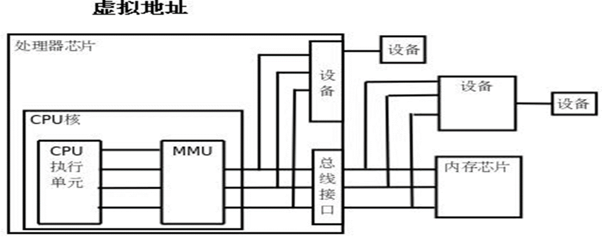

## 一、变量内容

- 变量基础
- 变量说明
- 变量存储类型

## 二、变量基础

变量在程序中用变量名表示。变量名由用户根据其用途任意命名。

**变量名由字母、数字、下划线组成，不能以数字开头，不能和C的关键字重名。 **

在程序运行时，变量占据存储空间的大小由其数据类型决定。

变量在内存空间中的首地址，称为变量的地址。

## 三、变量说明

变量在程序中使用时,必须预先说明它们的存储类型和数据类型。

变量说明的一般形式是：

​    <存储类型>    <数据类型 >    <变量名> ； 

- <存储类型>是关键词auto、register、static和extern

- <数据类型>可以是基本数据类型，也可以是自定义的数据类型

如：

```c
#include <stdio.h>

int main(int argc, char *argv[]) {

    register int a = 10;
    printf("a=%d\n", a);

    return 0;

}
```

## 四、变量存储类型

### 1、auto & register

- auto 

auto说明的变量只能在某个程序范围内使用，通常在函数体内或函数中的复合语句里。（默认是随机值）

在函数体的某程序段内说明auto存储类型的变量时可以省略关键字auto，如下：

```c
 auto int  k ;     

 int  j ;     

 double x;  
```

- register

register称为寄存器型，register变量是想将变量放入CPU的寄存器中，这样可以加快程序的运行速度。

如申请不到就使用一般内存，同auto ;



**注意**：

- register变量必须是能被CPU所接受的类型。这通常意味着register变量必须是一个单个的值，并且长度应该小于或者等于整型的长度。

- 不能用“&”来获取register变量的地址。

由于寄存器的数量有限，真正起作用的register修饰符的数目和类型都依赖于运行程序的机器。

在某些情况下，把变量保存在寄存器中反而会降低程序的运行速度。因为被占用的寄存器不能再用于其它目的；或者变量被使用的次数不够多，不足以装入和存储变量所带来的额外开销。

### 2、static & extern

- static

static变量称为静态存储类型的变量，既可以在函数体内，也可在函数体外说明。(默认是0）

局部变量使用static修饰,有以下特点:

- 在内存中以固定地址存放的，而不是以堆栈方式存放

- 只要程序没结束，就不会随着说明它的程序段的结束而消失，它下次再调用该函数，该存储类型的变量不再重新说明，而且还保留上次调用存入的数值

```c
#include <stdio.h>

int main(int argc, char *argv[]) {

    int i = 1;

    while (i < 5) {
        //int a = 0;  每次循环a被重新赋值为o,所以a=1
        //static int a = 0; 每次循环a上次的值都在，所以a=1,2,3,4，类似全局变量
        a++;
        printf("a=%d\n", a);
        i++;
    }

}
```

- extern

当变量在一个文件中的函数体外说明，所有其他文件中的函数或程序段都可引用这个变量。

extern称为外部参照引用型，使用extern说明的变量是想引用在其它文件中函数体外部说明的变量。

**static修饰的全部变量，其它文件无法使用**

- extern_static1.c

```c
// static int global_a = 100; 这样声明其它文件无法使用

int global_a = 100;
```

- extern_static2.c

```c
#include <stdio.h>

extern int global_a; //外部文件的引用

int main(int argc, char *argv[]) {

    printf("global_a=%d\n", global_a);

    return 0;
}
```

通过命令`gcc extern_static1.c extern_static2.c -Wall `进行编译。


