## 一、运算符内容

- 算术运算符
- 关系运算符
- 逻辑运算符
- 位运算符
- 赋值运算符
- 特殊运算符
- 运算符优先级

## 二、算术运算符

C提供的算术运算符:+，-，*，/，%，++，如下:

**注意**：float/double不能取余 
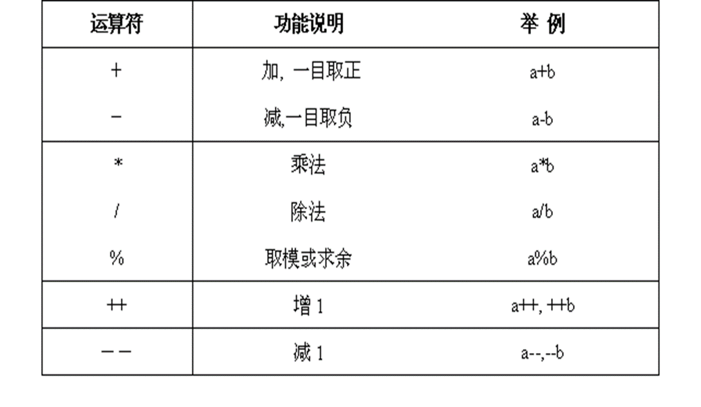
例一：

```c
#include <stdio.h>

int main(int argc, char *argv[]) {

    int a=15, b=8, c;

    c = a + b;
    printf("c=%d\n", c);
    c = a - b;
    printf("c=%d\n", c);
    c = a * b;
    printf("c=%d\n", c);
    c = a / b;
    printf("c=%d\n", c);
    c = a % b;
    printf("c=%d\n", c);

    return 0;
}
```

例二：

```c
#include <stdio.h>

int main(int argc, char *argv[]) {

    int x=5, y=9, z;
    z = ++x;
    printf("z=%d x=%d\n", z, x); // 6 6
    z = x++;
    printf("z=%d x=%d \n", z, x); // 6 7
    z = --x;
    printf("z=%d x=%d\n", z, x); // 6 6
    z = x--;
    printf("z=%d x=%d\n", z, x); // 6 5
    z = ++x + y++; // 6 + 9 = 15  x=6 y=10
    printf("z=%d\n", z); // 15 
    z = --x + y++; // 5 + 10 = 15 x=5 y=11
    printf("z=%d\n", z); // 15
    z = ++x + y--; // 6 + 11 = 17 x=6 y=10
    printf("z=%d\n", z); // 17

    return 0;

}
```

## 三、关系运算符
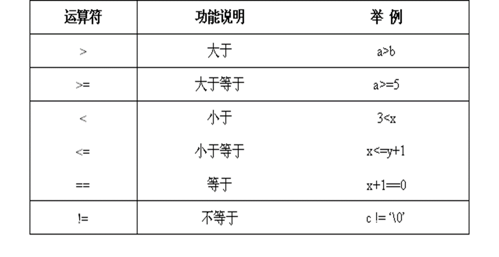
例一：
```c
#include <stdio.h>

int main(int argc, char *argv[]) {

    int a=5, b=6, c;

    c = a > (b-1);
    printf("c=%d\n", c); // 0

    c = (a+1) == b;
    printf("c=%d\n", c); // 1

    c = a >= (b-2);
    printf("c=%d\n", c); // 1

    return 0;

}
```

上述的值可用于布尔值判断：

```c
#include <stdio.h>

int main(int argc, char *argv[]) {

    int a=5, b=6;

    if (a > (b-1))
        printf("true\n");
    else
        printf("false\n"); // false

    return 0;

}

```

## 四、逻辑运算符

c语言的逻辑运算符如下：

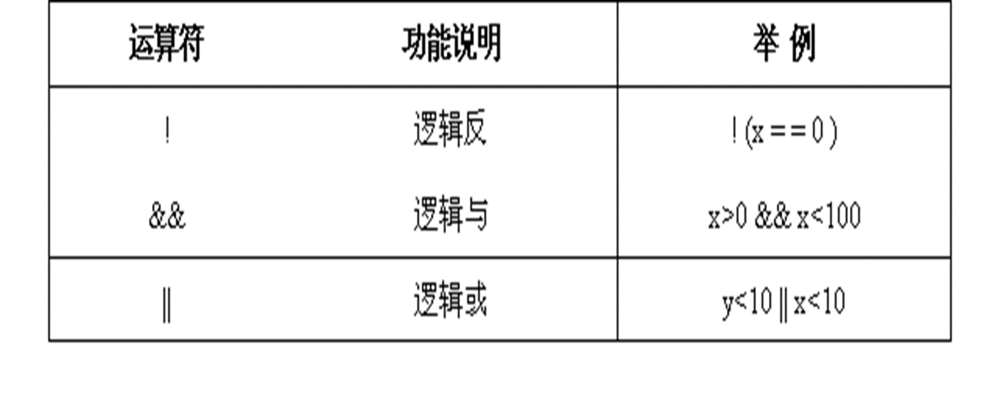

包含：

- 逻辑反
- 逻辑与
- 逻辑或

### （一）逻辑反（逻辑非）

逻辑非“!”运算符的运算律如下：

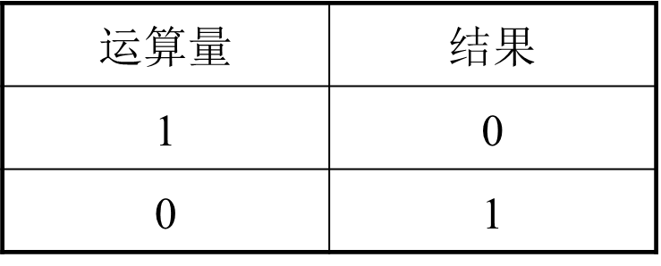
例如：

```c
int  k=8;

! ( k ==0)        结果值为1

! ((k-8) == 0)   结果值为0

! (k<= 0)         结果值为1
```

### （二）逻辑与

逻辑与“&&”运算符的运算规律如下：短路特性-逢0截止
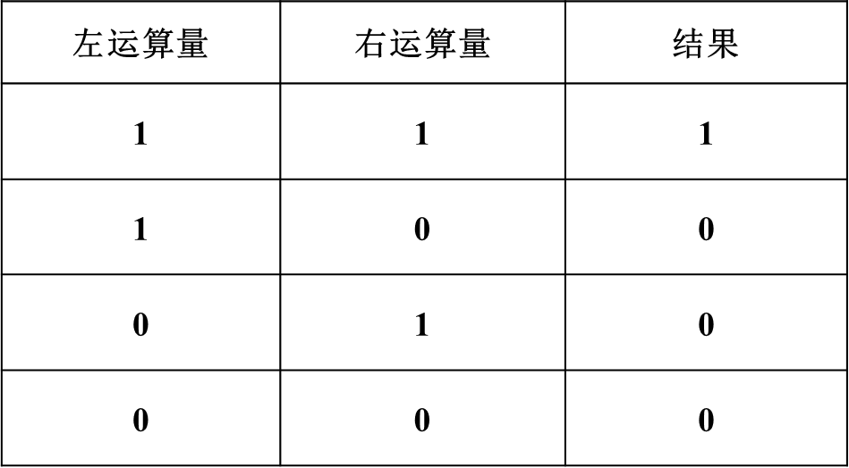
### （三）逻辑或

逻辑或“||”运算符的运算规律如下：短路-逢1截止

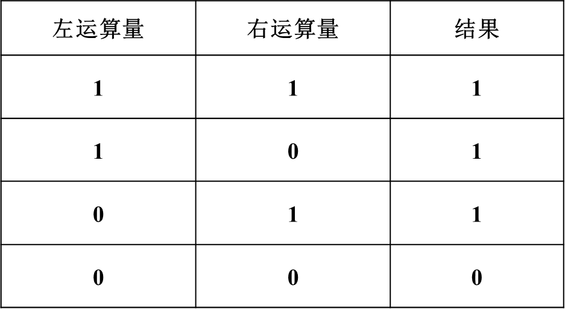
### （四）示例

- 示例1

```c
#include <stdio.h>

int main(int argc, char *argv[]) {

    int a=5, b=6;

    if (! (a > (b-1)))
        printf("false\n"); //false
    else
        printf("true\n");

    return 0;

}
```

- 示例2

```c
#include <stdio.h>


int main(int argc, char *argv[]) {

    int x=5, y=18, z;

    z = (x>=5) && (y<20);
    printf("(x>=5) && (y<20) z=%d\n", z); // 1

    z = ((x+1)>=0) && (y<17);
    printf("z =((x+1)>=0) z=%d\n", z); // 0

    z = ((x-8)>=0) && (y==18);
    printf("((x-8)>=0) && (y==18) z=%d\n", z); // 0

    z = ((x>=5)) || (y<20);
    printf("((x>=5)) || (y<20) z=%d\n", z); //1

    return 0;
}
```

## 五、位运算符

c语言的位运算符如下：

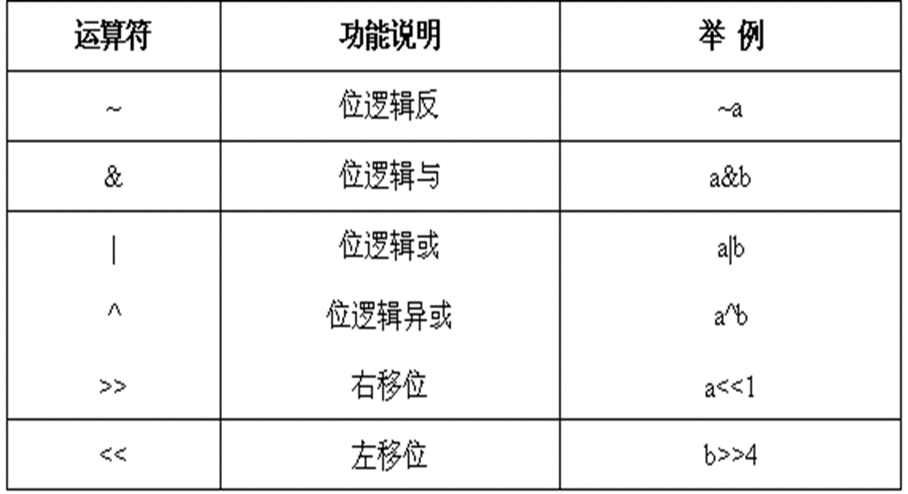

### （一）位逻辑反（~）

例如：

>unsigned char  x=0x17, y;
>
>y = ~x;

无符号`char`类型占用一个字符，`x`是十六进制数：

```c
  1         7
0001      0111
```

`y`是对`x`取反：

```c
 1110      1000
  e          8
```

```c
#include <stdio.h>

int main(int argc, char *argv[]) {

    unsigned char x = 0x17, y;

    y = ~x;
    
    printf("%#x\n", y); // 0xE8

    return 0;

}
```

### （二）位逻辑与（&）

位逻辑与“&”运算符的运算规律如下：

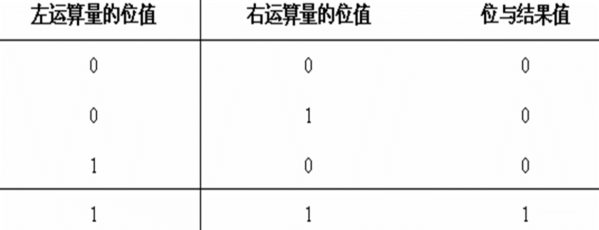

```c
#include <stdio.h>

int main(int argc, char *argv[]) {

    unsigned char x=0126, y=0xac, z;

    z = x & y;

    printf("z=%#x\n",z);

    return 0;

}
/*
x是八进制，3位一个数字
   1    2     6
  001  010   110   八进制-->二进制
       0101  0110  左边补全

y是十六进制，4位一个数字
       a     c
      1010  1100
&计算
      0000  0100
             4         0x4
*/
```

### （三）位逻辑或（|）

位逻辑或“|”运算符的运算规律如下：

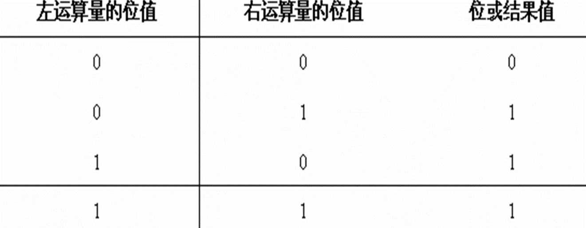


```c
#include <stdio.h>

int main(int argc, char *argv[]) {

    unsigned char x=076, y=0x89, z;

    z = x|y;

    printf("%#x\n", z); //0xbf

    return 0;

}
/*
x是八进制，三位表示
      7      6
     111    110
    0011    1110
y是十六进制，四位表示
     8      9
   1000    1001
运算
   1011    1111
    B       F
*/
```

### （四）位逻辑异或（^）

位逻辑异或“^”运算符的运算规律如下：

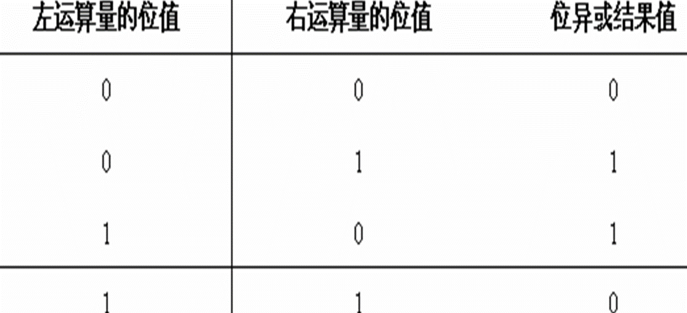


相异为真.

```c
#include <stdio.h>

int main(int argc, char *argv[]) {

    unsigned char x = 75, y = 0173, z;

    z = x ^ y;

    printf("%#x\n", z); // 0x30
    printf("%#o\n", z); // 060

    return 0;

}
/*
 x 十进制
    位权值 128    64   32    16   8   4   2   1
          0      1    0     0    1  0   1   1       64+8+2+1=75

 y 八进制
      1     7   3
   001     111    011
          0111 1011
 异或计算  0011 0000

 转成八进制  00 110 000
            060

*/
```


这里涉及到十进制转二进制，简单的计算方式是：

```c

位权值    128    64   32    16   8   4   2   1 

如 75            1               1      1   1
          0      1    0     0    1  0   1   1
```

### （五）位移运算符（<<、>>）

位移位运算的一般形式:          

<运算量> <运算符> <表达式>其中:

- <运算量> 必须为整型结果数值；
- <运算符>为左移位（<<）或 右移位（>>）运算符；
- <表达式> 也必须为整型结果数值。

```c
#include <stdio.h>


int main(int argc, char *argv[]) {

    unsigned char a=0xe4, b;

    b = a<<3;

    printf("b=%#x\n", b); // 0x20

    return 0;

}

/*

    e   4
   1110   0100
<< a 左移位3位存入b的情况, 前边三个1被移除，后面补0
   0010   0000
    2      0
*/
```

### （六）总结与思考

主要介绍了位运算符，包括位逻辑反、位逻辑与、位逻辑或、位逻辑异或、位逻辑移位。

思考：

- 如何把一个无符号数的某位快速置1？

- 如何把一个无符号数的某位快速清0？

- 如何利用位运算把一个十进制数转化成一个十六进制数？

#### 1、如何把一个无符号数的某位快速置1

使用的是或`|`关系：

```c
#include <stdio.h>

/*
如果将 0x4 倒数第 2 位置为 1

 0x4         0100
 加一个数     0010(1<<(y-1)) <-- 0001 <-- 1(十进制1) <-- (y-1)
 最终结果     0110
*/
int main(int argc, char *argv[]) {

    unsigned char x = 0x4, y = 2;

    x = x | (1<<(y-1));

    printf("x=%#x,y=%#x\n", x, y); // x=0x6,y=0x2

}
```

向左移动就是`乘2`关系。

#### 2、如何把一个无符号数的某位快速清0

使用的是与`|`和非`^`实现：

```c
#include <stdio.h>

/*
如果将 0x4 倒数第 3 位置为 0

 0x4         0100
 加一个数     1011 <-- 0100(~取反) <-- 0001(2<<左移) <-- (y-1)
 最终结果     0000
*/
int main(int argc, char *argv[]) {

    unsigned char x = 0x4, y = 2;

    x = x & (~(2<<(y-1))); // x=0,y=0x2

    printf("x=%#x,y=%#x\n", x, y); // x=0x6,y=0x2

}
```

#### 3、如何利用位运算把一个十进制数转化成一个十六进制数？

使用 `0xf` 和数字做与运算，得到这个数字的最后`4`位二进制数字，也就是一个`十进制数字`

```c
#include <stdio.h>

int main(int argc, char *argv[]) {

    int a = 65, b = 0;

    printf("%#x %d\n", a, a); //0x41 65

    // b = a / 16;
    b = a >> 4;
    printf("%#x %d\n", b, b); //0x4 4

    // b = a % 16;
    b = a & 0xf; //与最后的四位做与运算，取数字的最后四位二进制，也就是一位十进制数字
    printf("%#x %d\n", b, b); //0x1 1 

    return 0;
}
/*

128 64 32 16 8 4 2 1
  0  1  0  0 0 0 0 1

  0  0  0  0 1 1 1 1     0xf
*/
```

## 六、赋值运算符

赋值运算符为“=”，其运算的一般形式如下：

- <左值表达式> = <右值表达式>

赋值复合运算符其运算的一般形式如下: 

- <变量>  <操作符> =  <表达式>

C语言的赋值复合运算符如下：

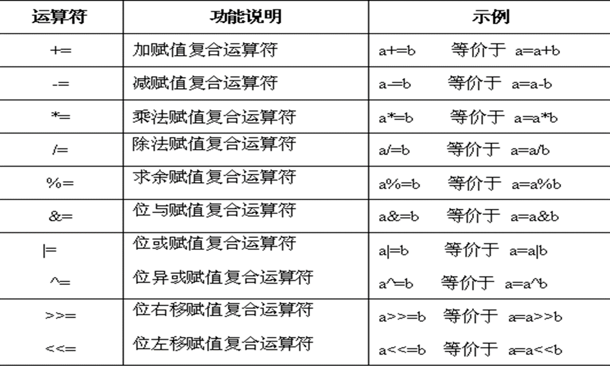

```c
#include <stdio.h>


int main(int argc, char *argv[]) {

    int count=0, sum=0;

    while (count++ < 100) {

       sum += count;

    }
    printf("sum=%d\n", sum); // sum=5050

    return 0;
}
```

## 七、特殊运算符

### （一）三目运算符

条件运算符"? :"   是三目运算符, 其运算的一般形式是:     

- <表达式1>  ?  <表达式2>  :  <表达式3>

相当于：

```c
if(表达式1)
    表达式2
else
	表达式3
```

例如：

```c
int  x=82, y=101;

x >= y ? x+18 : y-100   //运算结果为1

x < (y-11) ? x-22 : y-1  //运算结果为60
```

```c
#include <stdio.h>

int main(int argc, char *argv[]) {

    int x=70, y=25;

    y = x++ > 70 ? 100 : 0;

    printf("x=%d y=%d\n", x,y); //x=71 y=0

    return 0;
}
```

### （二）逗号运算符

逗号分隔符中取最后一个分隔符的值。

```c
#include <stdio.h>

int main() {

    float x=10.5, y=1.8, z=0;

    z = (x+=5,y=x+0.2);
    printf("z=%f\n", z); // z=15.700000

    z = (x=y=5, x+=1);
    printf("z=%f\n", z); // 6.000000

    z = (x=5, y=6, x+y);
    printf("z=%f\n", z); // z=11.000000

    z = (z=8, x=5, y=3);
    printf("z=%f\n", z); // z=3.000000

    return 0;

}
```

### （三）sizeof运算符

   运算的一般形式: sizeof(<类型或变量名>)  

   **注意**：它只针对数据类型，而不针对变量！   

  例如：

```c
  sizeof(double) 

  sizeof(long)   

   ……
```

```c
#include <stdio.h>

int main(int argc, char *argv[]) {

    printf("bool-->%d", sizeof(_Bool));

    printf("char-->%d", sizeof(char));

    printf("int-->%d", sizeof(int));

    printf("short-->%d", sizeof(short));

    printf("long-->%d", sizeof(long));

    printf("float-->%d", sizeof(float));

    printf("double-->%d", sizeof(double));

    return 0;

}
```

## 八、运算符优先级

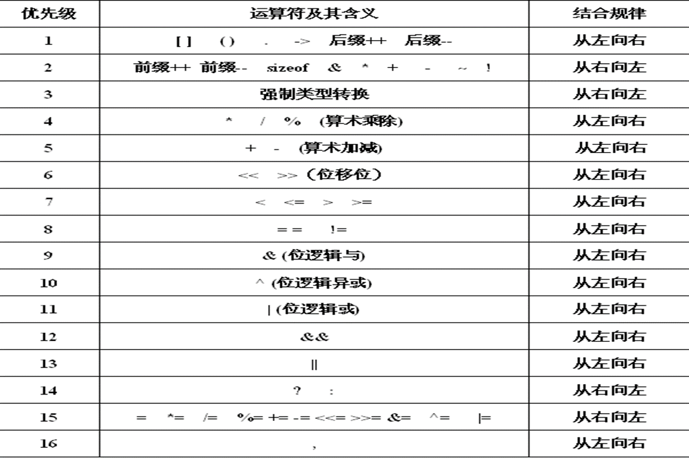

例如：

```c
	int  x=1, y=0, z=0;
	x++  &&  y++ ||  ++z    //结果为 1 (2 1 1) 
	! (x+1>0)  &&  y++  ||  ++z 	//结果为 1 (1 0 1)
	x += y==z, y=x+2, z=x+y+x >0//x为2，y为4 ，z为1
```

