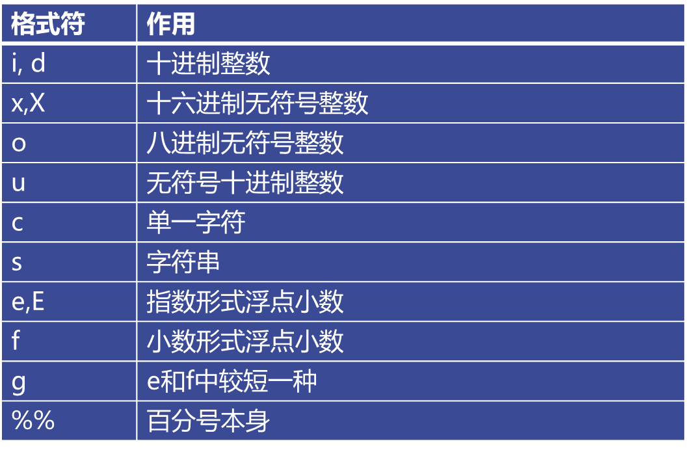
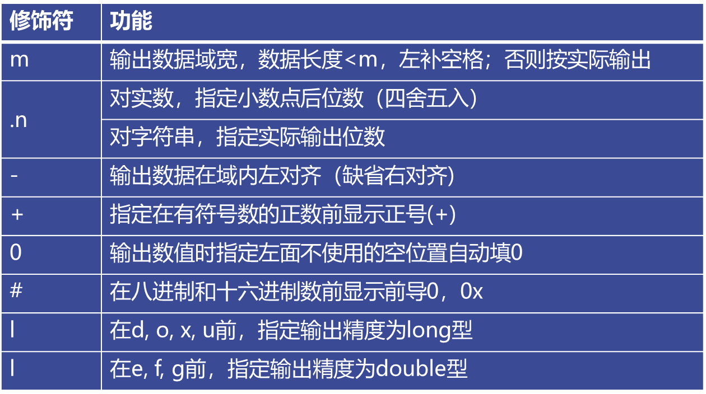
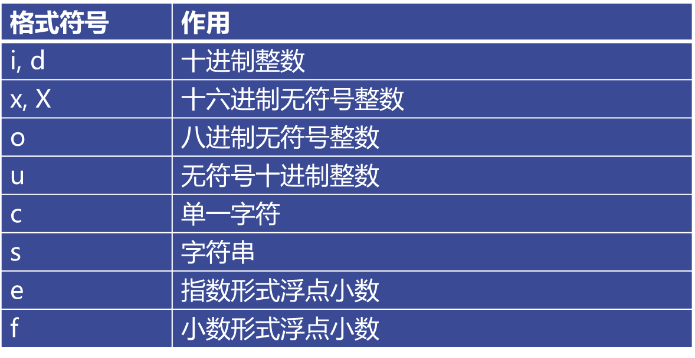
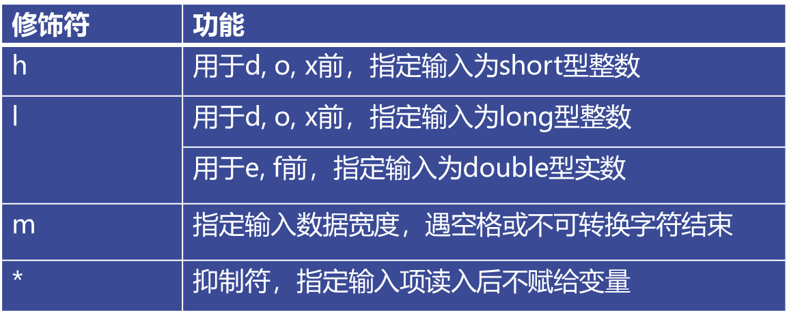

## 一、内容大纲

- 字符输出函数
- 字符输入函数
- 输入函数留下的“垃圾”
- 字符串输入、输出函数

## 二、字符输出函数

### （一）putchar

- C语言无I/O语句，I/O操作由函数实现

```c
#include <stdio.h>
```

- 字符输出函数

格式: putchar( c )

参数: c为字符常量、变量或表达式

功能：把字符c输出到显示器上

返值：正常，为显示的代码值；

```c
#include <stdio.h>

int main(int argc, char *argv[]) {

    int c;
    char a;
    c = 65;
    a = 'B';

    putchar(c);
    putchar('\n');
    putchar(a);

    return 0;
}
/*
输出：
A
B
*/
```

### （二）printf

格式：printf(“格式控制串”，输出表)

功能：按指定格式向显示器输出数据

输出表：要输出的数据

格式控制串：包含两种信息

- 格式说明：%[修饰符]格式字符，用于指定输出格式
- 普通字符：原样输出



```c
#include <stdio.h>

int main(int argc, char *argv[]) {

    int a = 567;
    printf("%d\n", a);

    a = 255;
    printf("%x\n", a);

    a = 65;
    printf("%o\n", a);

    a = 567;
    printf("%u\n", a);

    a = 65;
    printf("%c\n", a);

    return 0;

}
/*
输出：

567
ff
101
567
A

*/
```

附加格式说明：



- 例一

```c
#include <stdio.h>

/*

m.n格式

*/

int main(int argc, char *argv[]) {

    int a = 1234;
    float f = 123.456;
    char ch = 'a';

    printf("%8d, %2d\n", a, a);
    printf("%f, %8f, %8.1f, %.2f\n", f,f,f,f);
    printf("%3c\n", ch);

    return 0;

}
/*
输出：

    1234, 1234
123.456001, 123.456001,    123.5, 123.46
  a

*/
```

- 例二

```c
#include <stdio.h>


int main(int argc, char *argv[]) {

    static char a[] = "Hello, World!";

    printf("%s\n%15s\n%10.5s\n%2.5s\n%.3s\n", a,a,a,a,a);

    return 0;

}
/*
输出：

Hello, World!
  Hello, World!
     Hello
Hello
Hel

*/
```

- 例三

```c
#include <stdio.h>

int main(int argc, char *argv[]) {

    int a = 1234;
    float f = 123.456;

    printf("%08d\n", a);
    printf("%010.2f\n", f);
    printf("%0+8d\n", a);
    printf("%0+10.2f\n", f);

    return 0;

}
/*
输出：

00001234
0000123.46
+0001234
+000123.46

*/
```

## 三、字符输入函数

### （一）getchar

字符输入函数getchar

格式:  getchar( )

功能：从键盘读一字符

返值：正常，返回读取的代码值；出错或结束键盘输入,返回-1 （ctrl   d）

```c
#include <stdio.h>

int main(int argc, char *argv[]) {

    int c;
    printf("Enter a character:");
    c = getchar();
    printf("%c--%d->hex%x\n", c,c,c);

    return 0;

}
/*
输出：

Enter a character:B
B--66->hex42

*/
```

### （二）scanf

格式: scanf(“格式控制串”，地址表）

功能：按指定格式从键盘读入数据，存入地址表指定

存储单元中,并按回车键结束

返值：正常，返回输入数据个数

地址表：变量的地址，常用取地址运算符&

**scanf支持的格式字符很多，如下:**



**scanf函数支持的格式说明符可以带以下修饰符：**



- 例一

```c
#include <stdio.h>

int main(int argc, char *argv[]) {

    int yy, mm, dd;


    scanf("%4d%2d%2d", &yy,&mm,&dd);

    printf("yy=%d, mm=%d, dd=%d\n", yy, mm, dd);

    return 0;

}
/*

输入：20001010
输出：yy=2000, mm=10, dd=10

*/
```

- 例二

```c
#include <stdio.h>

int main(int argc, char *argv[]) {

    int a, b;

    scanf("%2d %*3d %2d", &a, &b);

    printf("a=%d, b=%d\n", a, b);

    return 0;

}

/*

输入：12 345 67
输出：a=12, b=67

*/
```

- 例三

```c
#include <stdio.h>


int main(int argc, char *argv[]) {

    char c1, c2, c3;

    scanf("%c%c%c", &c1, &c2, &c3);

    printf("c1=%c, c2=%c, c3=%c\n", c1, c2, c3);

    return 0;

}

/*

输入：a b c 
输出：c1=a, c2= , c3=b

*/


```

**说明**：用“%c”格式符时，空格和转义字符作为有效字符输入

```c
#include <stdio.h>


int main(int argc, char *argv[]) {

    int a;
    char c;
    float f;

    scanf("%d%c%f", &a,&c,&f);

    printf("a=%d, c=%c f=%f\n", a, c, f);

    return 0;

}
/*

输入：1234a123o.26
输出：a=1234, c=a f=123.000000

*/
```

**说明**：输入数据时，遇以下情况认为该数据结束：

>遇空格、TAB、或回车
>
>遇非法输入
>
>遇宽度结束

## 四、输入函数留下的“垃圾”

使用输入函数可能会留下垃圾：

```c
#include <stdio.h>

int main(int argc, char *argv[]) {

    int x;
    char ch;

    scanf("%d", &x);
    scanf("%c", &ch);

    printf("x=%d, ch=%d\n", x, ch);

    return 0;

}
/*

输入：5
输出：x=5, ch=10

上面输入5后回车，本意是在输入ch的值，但是ch这时会接收回车
程序会直接结束

*/
```

处理上面的问题有如下两种方式：

- getchar()清除，吃掉那个回车字符
- 用格式串中空格或“%*c”来“吃掉”

### （一）getchar()清除

```c
#include <stdio.h>

int main(int argc, char *argv[]) {

    int x;
    char ch;
    
    scanf("%d", &x);
    getchar();
    ch = getchar();

    printf("x=%d, ch=%d\n", x, ch);

    return 0;

}
/*
输入：
5
a
输出：
x=5, ch=97

*/
```

### （二）用格式串中空格或“%*c”来“吃掉”

```c
#include <stdio.h>

int main(int argc, char *argv[]) {
    
    int x;
    char ch;
    
    scanf("%d", &x);
    scanf(" %c", &ch); // 或者 scanf("%*c%c", &ch);

    return 0;
    
}  
```

## 五、字符串输入、输出函数

### （一）字符串输入函数

字符串输入函数gets

格式： char * gets(char  *s)

功能：从键盘输入一以回车结束的字符串放入字符数组中，并自动加‘\0’

说明1：输入串长度应小于字符数组维数

说明2：与scanf函数不同，gets函数并不以空格作为字符串输入结束的标志。

```c
#include <stdio.h>


int main(int argc, char *argv[]) {

    char s[5];

    gets(s);
    printf("s:%s", s);

    return 0;

}
```

### （二）字符串输出函数

字符串输出函数puts

格式：int puts(const char *s)

功能：向显示器输出字符串（输出完，换行）

说明：字符数组必须以‘\0’结束

```c
#include <stdio.h>

int main(int argc, char *argv[]) {

    char s[80] = "Hello World!";
    puts(s);

    return 0;

}
```


