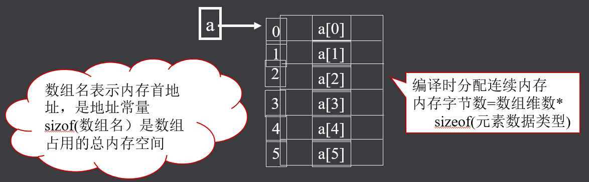
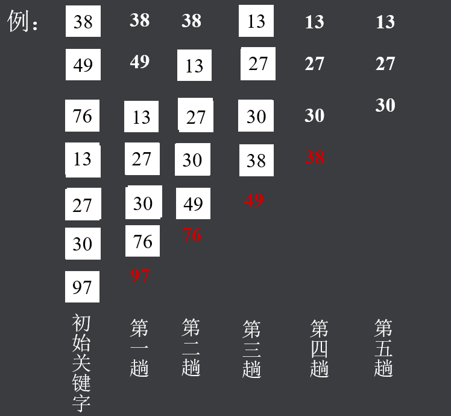
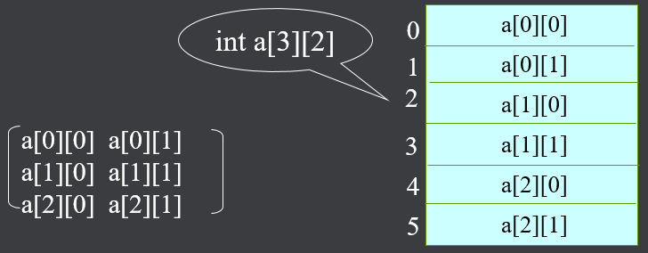
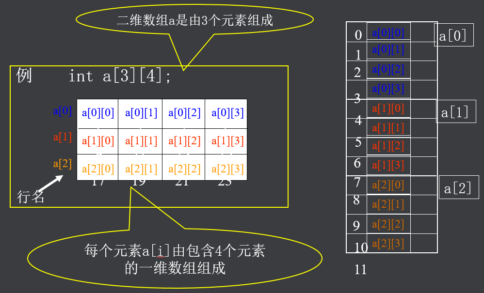
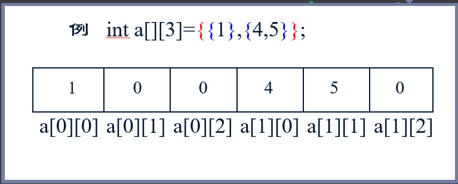
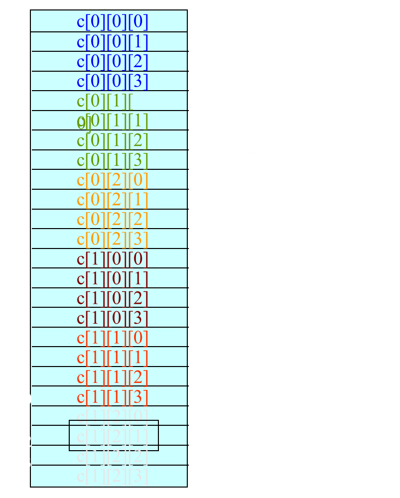
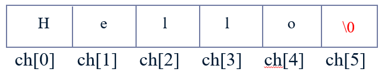
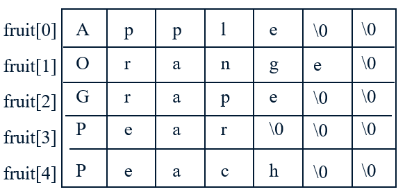
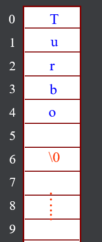

## 一、概述

- 一维数组
- 多维数组
- 字符数组和字符串
- 字符串函数

## 二、一维数组

### （一）数组概述

- 构造数据类型之一

- 数组是具有一定顺序关系的若干个变量的集合，组成数组的各个变量称为数组的元素

- 数组中各元素的数据类型要求相同,用数组名和下标确定。数组可以是一维的，也可以是多维的

### （二）一维数组的定义

所谓一维数组是指只有一个下标的数组。它在计算机的内存中是连续存储的。C语言中，一维数组的说明一般形式如下：

><存储类型>  <数据类型 >  <数组名>[<表达式>] 

例如：int a[6]



**注意**：

- lC语言对数组不作越界检查

>int a[5]; a[5] = 10

- 关于用变量定义数组维数

>int i = 15; int a[i]

### （三）一维数组的引用

- 数组必须先定义，后使用

- 只能逐个引用数组元素，不能一次引用整个数组

- 数组元素表示形式：数组名[下标]

其中，下标可以是常量或整型表达式。

```c
#include <stdio.h>

int main(int argc, char *argv[]) {

    int a[] = {1, 2, 3, 4, 5};

    // printf("%d\n", a);  error

    for(int i = 1; i < 5; i++ ) {
        printf("%d\n", a[i]);
    }

    return 0;

}
```

### （四）一维数组的初始化

初始化方式：在定义数组时，为数组元素赋初值

> int a[5]={1,2,3,4,5};

说明：

- 数组不初始化，其元素值为随机数

- 对static数组元素不赋初值，系统会自动赋以0值

- 只给部分数组元素赋初值（其余元素为0）

#### 1、数组不初始化，其元素值为随机数

```c
#include <stdio.h>

int main(int argc, char *argv[]) {

    int a[5] = {};

    for(int i = 0; i < 5; i++) {

        printf("%d-%d\n", i, a[i]);

    }

    return 0;

}
/*
0--1210312096
1-134513963
2-1
3--1075583164
4--1075583156
*/
```

#### 2、对static数组元素不赋初值，系统会自动赋以0值

```c
#include <stdio.h>

int main(int argc, char *argv[]) {

    static int a[5];

    for(int i = 0; i < 5; i++) {

        printf("%d-%d\n", i, a[i]);

    }

    return 0;

}
/*
0-0
1-0
2-0
3-0
4-0
*/
```

#### 3、只给部分数组元素赋初值 

```c
#include <stdio.h>

int main(int argc, char *argv[]) {

    int a[5] = {};
    int b[5] = {1,2,3};

    for(int i = 0; i < 5; i++) {

        printf("a数组-%d-%d\n", i, a[i]);

    }

    for(int i = 0; i < 5; i++) {

        printf("b数组-%d-%d\n", i, b[i]);

    }

    return 0;

}
/*
a数组-0-0
a数组-1-0
a数组-2-0
a数组-3-0
a数组-4-0

b数组-0-1
b数组-1-2
b数组-2-3
b数组-3-0
b数组-4-0
*/
```

### （五）程序举例

冒泡排序：

>它重复地走访过要排序的数列，一次比较两个元素，如果顺序错误就交换。走访数列的工作是重复地进行直到没有再需要交换，也就是说该数列已经排序完成。



代码：

```c
#include <stdio.h>

int main(int argc, char *argv[]) {

    int a[] = {38, 49, 76, 13, 27, 30, 97};
    int i, j, n, temp;

    n = sizeof(a) / sizeof(int);

    for(i = 0; i < n-1; i++) {

        for(j = 0; j <= n-1-i; j++ ) {

            if(a[j] > a[j+1]) {

                temp = a[j];
                a[j] = a[j+1];
                a[j+1] = temp;

            }

        }

    }

    for(i = 0; i < n-1; i++) {

        printf("%d\n", a[i]);

    }

    return 0;

}
```

## 二、多维数组

### （一）二维数组

#### 1、概述

> 数据类型　数组名\[常量表达式\]\[常量表达式\]

例如：

> int a\[3\]\[4\]
>
> float b\[2\]\[5\]

元素个数：行数 * 列数

**注意**：声明时列数不能省略，行数可以

二维数组的存放顺序是按照行序优先，因为内存是一维的



#### 2、理解


#### 3、元素的引用

- 形式：数组名\[下标\]\[下标\]

- 二维数组元素的初始化

>分行初始化
>
>按元素排列顺序初始化



### （二）多维数组

具有两个或两个以上下标的数组称为多维数组，如：int c\[2\]\[3\]\[4\]


### （三）程序举例

#### 1、打印杨辉三角

打印杨辉三角的前十行

>1
>
>1   1
>
>1   2   1
>
>1   3   3   1
>
>1   4   6   4   1
>
>1   5   10  10  5   1
>
>​        ....

代码：

```c
#include <stdio.h>

/*

思路：
1、打印正方形
2、打印出一半（col <= row）

1 0
1 1 0
1 2 1

*/

int main(int argc, char *argv[]) {


    int row, col;
    int triangle[10][10] = {{0}};

    for(row = 0; row < 10; row++) {

        triangle[row][0] = 1; // 第一列设置为1

        for(col = 1; col <= row ; col++) {

            triangle[row][col] = triangle[row-1][col-1] + triangle[row-1][col];

        }

    }

    for(row = 0; row < 10; row++) {

        for(col = 0; col <= row; col++) {

                printf("%d\t",triangle[row][col]);


        }

        putchar('\n');
    }

    return 0;

}
```

#### 2、求数组元素最大值

有一个3×4的矩阵，要求输出其中值最大的元素的值，以及它的行号和列号。

```c
#include <stdio.h>

int main(int argc, char *argv[]) {


    int a[3][4] = {{1,22,56,2},{33,89,9,25},{31,10,3,8}};
    int n, m, i, j, row, col;

    n = sizeof(a) / sizeof(a[0]);
    m = sizeof(a[0]) / sizeof(int);
    row = 0;
    col = 0;

    for(i = 0 ;i < n; i++) {

        for(j = 0; j < m; j++) {

            if(a[i][j] > a[row][col]) {
                row = i;
                col = j;
            }

        }

    }
    printf("%d-%d-%d\n", row, col,a[row][col]);

    return 0;

}
```

## 三、字符数组和字符串

### （一）概述

字符数组是元素的数据类型为字符类型的数组。

>char c[10], ch\[3\]\[4\];

字符数组的初始化：

- 逐个字符赋值
- 用字符串常量

C语言中无字符串变量，用字符数组处理字符串

字符串结束标志：‘\0’

例1：

>char ch[6]={“Hello”};
>char ch[6]=“Hello”;
>char ch[]=“Hello”;

例  “hello”共5个字符，在内存占6个字节，字符串长度5 



```c
#include <stdio.h>

int main(int argc, char *argv[]) {

    char arr1[] = {'a', 'b', 'c'};
    char arr2[] = {'d', 'e', 'f'};
    char arr3[] = {'a', 'b', 'c', '\0'};
    char arr4[] = {'d', 'e', 'f', '\0'};

    printf("arr1:%s %p\n", arr1, &arr1[2]);
    printf("arr2:%s %p\n", arr2, arr2);

    printf("arr3:%s %p\n", arr3, &arr3[2]);
    printf("arr4:%s %p\n", arr4, arr4);

    return 0;
}
/*
arr1:abcdefabc 0xbfff6730
arr2:defabc 0xbfff6731

arr3:abc 0xbfff6736
arr4:def 0xbfff6738
*/
```

例2：

>char fruit[][7]={“Apple”,”Orange”,”Grape”,”Pear”,”Peach”};



```c
#include <stdio.h>

int main(int argc, char *argv[]) {

    char fruits[][20] = {"banana", "apple", "pear"};

    int i, n;

    n = sizeof(fruits) / sizeof(fruits[0]);

    for(i = 0; i < n; i++) {

        printf("%s\n", fruits[i]);

    }

    return 0;

}

/*

banana
apple
pear

*/
```

本质：

```c
#include <stdio.h>

int main(int argc, char *argv[]) {

    char fruits[][20] = {"banana", "apple", "pear"};

    int i, j, n, m;

    n = sizeof(fruits) / sizeof(fruits[0]);
    m = sizeof(fruits[0]) / sizeof(char);

    for(i = 0; i < n; i++) {

        for(j = 0; j < m; j++) {

            putchar(fruits[i][j]);

        }

        putchar('\n');

    }


    return 0;

}
```

### （二）程序举例

逆序输出：输入一个字符串，然后将其逆序输出

- 方法1

```c
#include <stdio.h>
#include <string.h>

#define N 20

int main(int argc, char *argv[]) {

    char arr[N] = {0};

    int i, n;

    printf("Please input a string:");

//    gets(arr);
    scanf("%s", &arr);
    n = strlen(arr);

    for(i = n-1; i >= 0; i--) {

        putchar(arr[i]);

    }

    putchar('\n');

    return 0;

}
```

- 方法2

```c
#include <stdio.h>
#include <string.h>

#define N 20

int main(int argc, char *argv[]) {

    char arr[N] = {0};

    int i, j, n, temp;

    printf("Please input a string:");

//    gets(arr);
    scanf("%s", &arr);
    n = strlen(arr);
    i = 0;
    j = n - 1;

    while(i <= j) {

        temp = arr[i];
        arr[i] = arr[j];
        arr[j] = temp;
        i++;
        j--;
    }

    printf("%s\n", arr);

    return 0;

}
```

## 四、字符串函数

- 常用函数
- 其它函数

### （一）常用函数

- 字符串长度的函数strlen
- 字符串拷贝函数strcpy
- 字符串连接函数strcat
- 字符串比较函数strcmp

#### 1、字符串长度的函数strlen

- 格式：strlen(字符数组)

- 功能：计算字符串长度

- 返值：返回字符串实际长度，不包括‘\0’在内

- \xhh表示十六进制数代表的符号

- \ddd表示8进制的

例：对于以下字符串，strlen(s)的值为：

```c
#include <stdio.h>
#include <string.h>

int main(int argc, char *argv[]) {

    char s[10] = {'A','\0','B','C','D','\0','E'};
    char s1[] = "\t\v\\\0we\n";
    char s2[] = "\x69\141\n";

    printf("s:%d,s1:%d,s2:%d\n", strlen(s), strlen(s1), strlen(s2));

    return 0;

}
/*
s:1,s1:3,s2:3
*/

```

#### 2、字符串拷贝函数strcpy

- 格式：strcpy(字符数组1,字符串2)

- 功能：将字符串2，拷贝到字符数组1中去

- 返值：返回字符数组1的首地址
  

**说明**：

- 字符数组1必须足够大
-  拷贝时‘\0’一同拷贝

```c
#include <stdio.h>
#include <string.h>

#define N 30

int main(int argc, char *argv[]) {

    char src[] = "hello";
    char dest[N];
/*
    strcpy(dest, src);

    printf("%s\n", dest);
*/

    int i, n;
    i = 0;
    n = sizeof(src) / sizeof(char);

    while (i < n) {

        dest[i] = src[i];
        i++;

    }
    puts(dest);

    return 0;

}
```

#### 3、字符串连接函数strcat

- 格式：strcat(字符数组1,字符数组2)

- 功能：把字符数组2连到字符数组1后面

- 返值：返回字符数组1的首地址

**说明**：

- 字符数组1必须足够大

- 连接前,两串均以‘\0’结束;连接后,串1的  ‘\0’取消,新串最后加‘\0’

```c
#include <stdio.h>
#include <string.h>

#define N 30

int main(int argc, char *argv[]) {

    char s1[N] = {'A','B','\0'};
    char s2[] = "Turbo", s3[]="";

    strcpy(s1, s2);
    strcat(s1, s3);

    puts(s1);

    return 0;

}

/*
Turbo
*/
```


#### 4、字符串比较函数strcmp

- 格式：strcmp(字符串1,字符串2)

- 功能：比较两个字符串

- 比较规则：对两串从左向右逐个字符比较  

​                    （ASCII码），直到遇到不同字符或‘\0’为止                                          

- 返值：返回int型整数

>a. 若字符串1< 字符串2， 返回负整数
>
>b. 若字符串1> 字符串2， 返回正整数
>
>c. 若字符串1== 字符串2， 返回零

```c
#include <stdio.h>
#include <string.h>

int main(int argc, char *argv[]) {

    char s1[] = "abc";
    char s2[] = "ad";

    printf("%d\n", strcmp(s1, s2)); // -1

    return 0;

}
```

### （二）其它函数

- strncpy(p, p1, n) 复制指定长度字符串 

- strncat(p, p1, n) 附加指定长度字符串 

- strcasecmp(p, p1) 忽略大小写比较字符串

- strncmp(p, p1, n) 比较指定长度字符串 

- strchr(p, c) 在字符串中查找指定字符 

- strstr(p, p1) 查找字符串 

```c
#include <stdio.h>
#include <string.h>

#define N 10

int main(int argc, char *argv[]) {

    char src[] = "world";
    char dest[] = "HELLO";
    // char usrc[] = "World";
    //char ch = 'o';
    char subs[] = "rld";

    // strncpy(dest, src, 3);
    // printf("%s\n", dest); // worLO

    // strncat(dest, src, 3);
    // puts(dest); // HELLOwor

    // printf("%d\n", strcasecmp(src, usrc)); // 0
    // printf("%d\n", strncmp(src, usrc, 3)); // 1

    //printf("%d\n",strchr(src, ch)-src);

    printf("%d\n",strstr(src, subs)-src);

    return 0;

}

```


