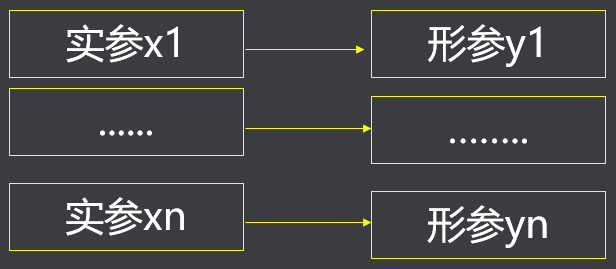

## 一、函数概述

- 函数的基本用法
- 函数的参数传递
- 数组在函数间传参
- 指针函数
- 递归函数
- 函数指针
- 编程题

## 二、函数的基本用法

函数是一个完成特定功能的代码模块，其程序代码独立，通常要求有返回值，也可以是空值。

一般形式如下:

><数据类型>  <函数名称>( <形式参数说明> ) {
>
>​            语句序列；
>
>​            return[(<表达式>)];
>
>} 

- <数据类型>是整个函数的返回值类型。return[(<表达式>)]语句中表达式的值，要和函数的<数据类型>保持一致。如无返回值应该写为void型
- <形式参数说明>是逗号”，”分隔的多个变量的说明形式
- 大括弧对 {<语句序列> }，称为函数体；<语句序列>是大于等于零个语句构成的

函数的说明就是指函数原型 ，其中，<形式参数说明>可以缺省说明的变量名称，但类型不能缺省，例如：

```c
double  Power(double x, int n) ;
double  Power(double, int);
```

函数的使用也叫函数的调用,形式如下：

> 函数名称（〈实际参数〉）

- 实参就是在使用函数时，调用函数传递给被调用函数的数据。需要确切的数据

- 函数调用可以作为一个运算量出现在表达式中，也可以单独形成一个语句。对于无返回值的函数来讲，只能形成一个函数调用语句。

```c
#include <stdio.h>

double cal(double, int)；

double cal(double x, int n) {

    double res = 1;
    for (int i = 1; i <= n;  i++) {
        res *= res * x;
    }
    return res;

}


int main(int argc, char *argv[]) {

    double x = 2, res;
    int n =2;
    res = cal(x, n);

    printf("res=%lf\n", res);

}
```

## 三、函数的参数传递

函数之间的参数传递方式：

- 全局变量

- 复制传递方式

- 地址传递方式

### （一）全局变量

全局变量就是在函数体外说明的变量，它们在程序中的每个函数里都是可见的

全局变量一经定义后就会在程序的任何地方可见。函数调用的位置不同，程序的执行结果可能会受到影响。不建议使用

```c
#include <stdio.h>

// 全局变量
double y = 2;
int m =2;

double cal()；

double cal(double x, int n) {

    double res = 1;
    for (int i = 1; i <= n;  i++) {
        res *= res * x;
    }
    return res;

}

int main(int argc, char *argv[]) {

    double res;

    res = cal(y, m);

    printf("res=%lf\n", res);

}
```

### （二）复制传递方式



```c
#include <stdio.h>

double cal(double, int);

int main(int argc, char *argv[]) {

    double x = 2, res;
    int n =2;

    printf("main &x=%p, &n=%p\n", &x, &n); // &x=0xbf81f9e8, &n=0xbf81f9e4

    res = cal(x, n);

    printf("res=%lf\n", res);

}

double cal(double x, int n) { // double x = x; int n =n;

    double res = 1;
    printf("cal &x=%p, &n=%p\n", &x, &n); // &x=0xbf81f998, &n=0xbf81f9c8
    for (int i = 1; i <= n;  i++) {
        res *= res * x;
    }
    return res;

}

```

传递的`x`、`n`参数的地址值不一样，不是同一个变量。

### （三）地址传递方式

按地址传递,实参为变量的地址，而形参为同类型的指针

被调用函数中对形参的操作，将直接改变实参的值（被调用函数对指针的目标操作，相当于对实参本身的操作）

#### 1 、编程一

编程：写一个函数，实现两个数据的交换

```c
#include <stdio.h>

void swap(int *, int *);

int main(int argc, char *argv[]) {

    int a = 1, b = 2;

    swap(&a, &b);

    printf("a=%d, b=%d\n", a, b); // a=2, b=1

}

void swap(int * a, int * b) {

    int t;

    t = *a;
    *a = *b;
    *b = t;

}
```

#### 2、编程二

编写一个函数，统计字符串中小写字母的个数，并把字符串中的小写字母转化成大写字母

```c
#include <stdio.h>

int str_func(char *);


int main(int argc, char *argv[]) {
    char s[] = "Hello";
    int n;

    n = str_func(s);
    printf("n=%d %s\n", n, s);

    return 0;
}

int str_func(char * p) { // char * p = s;
    int num = 0;

    while (*p != '\0') { // while (*p)

        if (*p <= 'z' && *p >= 'a') {
            num++;
            *p -= ' ';
        }

        p++;
    }
    return num;
}


```

## 四、数组在函数间传参

- 全局数组传递方式
- 复制传递方式 (实参为数组的指针，形参为数组名 (本质是一个指针变量) )
- 地址传递方式 (实参为数组的指针，形参为同类型的指针变量)

### （一）编程一

编写函数，计算一个一维整形数组的所有元素的和

#### 1、复制传递方式

```c
#include <stdio.h>

int array_sum(int data[], int n);

int main(int argc, char *argv[]) {

    int a[] = {10, 2, 5, 89, 36, 6};
    int sum = 0;

    sum = array_sum(a, sizeof(a)/sizeof(int));

    printf("sum=%d\n", sum);

    return 0;

}

int array_sum(int data[], int n) { // int data[] = a;error  int * data = a;

    int ret = 0;

    for(int i = 0; i < n; i++) {
        ret += data[i];
    }

    return ret;

}
```

#### 2、地址传递方式

```c
#include <stdio.h>

int array_sum(int data[], int n);

int main(int argc, char *argv[]) {

    int a[] = {10, 2, 5, 89, 36, 6};
    int sum = 0;

    sum = array_sum(a, sizeof(a)/sizeof(int));

    printf("sum=%d\n", sum);

    return 0;

}

int array_sum(int * data, int n) { // int * data = a

    int ret = 0;

    for(int i = 0; i < n; i++) {
        ret += *(data+i); // ret += data[i];
    }

    return ret;

}
```

### （二）编程二

编写函数，删除字符串中的空格

```c
#include <stdio.h>

void del_space(char * s1);

int main(int argc, char *argv[]) {

    char s[] = "s lk h n";

    del_space(s);

    puts(s);

}

void del_space(char * s1) {

    char * s2 = s1;

    while (*s1) {
        if (*s1 == ' ') {
            s1++;
        } else {
            *s2 = *s1;
            s1++;
            s2++;
        }

    }
    *s2 = '\0';

}
```

## 五、指针函数

### （一）什么是指针函数

指针函数是指一个函数的返回值为地址量的函数

指针函数的定义的一般形式如下：

><数据类型>  *  <函数名称>(<参数说明>) {
>
>​      语句序列；}

返回值：全局变量的地址/static变量的地址/字符串常量的地址/堆的地址

```c
#include <stdio.h>

char * getStr();

int main(int argc, char *argv[]) {

    char * r;

    r = getStr();

    printf("---%s---\n", getStr());

    puts(r);

    return 0;

}

char * getStr() {

    char * str = "hello";

    return str;

}


```

### （二）编程

#### 1、编程一

编写一个指针函数, 删除一个字符串中的空格

```c
#include <stdio.h>

char * del_space(char * s);

int main(int argc, char * argv[]) {

    char * r;
    char str[] = "hello world !";

    r = del_space(str);

    printf("---%s---", r);
}

char * del_space(char * s) {

    char * p = s;
    char * s1 = s; // s1记住初始位置

    while (*s) {

        if (*s == ' ') {

            s++;

        } else {
            *p = *s;
            s++;
            p++;
        }

    }

    *p = '\0';
    return s1;
}
```

#### 2、编程二

l编写一个指针函数, 实现字符串连接

```c
#include <stdio.h>

char * mstrcat(char *, const char *);

int main(int argc, char *argv[]) {


    char dest[50] = "welcome";
    char src[] = "hello";

    puts(mstrcat(dest, src));
    puts(dest);

    return 0;
}

char * mstrcat(char * dest, const char * src) {

    char * r = dest;

    while (*dest) {
        dest++;
    }

    while (*src) {
        *dest = *src;
        dest++;
        src++;
    }

    *dest = '\0';

    return r;

}
```

#### 3、编程三

编写一个指针函数，把整数123转化成字符串”123”

```c
#include <stdio.h>

char * itoa(int n);

int main(int argc, char *argv[]) {

    int n;
    char * s;

    printf("input:");
    scanf("%d", &n);

    s = itoa(n);

    puts(s);

    return 0;

}

char * itoa(int n) {

    int r, i = 0, j;
    static char p[50]; // 或者在main函数中定义一个p数组，然后传递指针过来

    while (n) {
        r = n % 10;
        n /= 10;

        p[i] = r + '0';
        i++;

    }

    p[i] = '\0';

    // 反转
    j = i - 1;
    i = 0;

    while (i < j) {

        r = p[i];
        p[i] = p[j];
        p[j] = r;
        i++;
        j--;

    }

    return p;


}
```

## 六、递归函数

### （一）什么是递归函数

递归函数是指一个函数的函数体中直接或间接调用了该函数自身

递归函数调用的执行过程分为两个阶段： 

- 递推阶段：从原问题出发，按递归公式递推从未知到已知，最终达到递归终止条件
- 回归阶段：按递归终止条件求出结果，逆向逐步代入递归公式，回归到原问题求解

### （二）编程

编写一个递归函数，计算n!

```c
#include <stdio.h>

int power(int);

int main(int argc, char * argv[]) {

    int n, ret;

    printf("请输入：");
    scanf("%d", &n);

    ret = power(n);

    printf("ret=%d\n", ret);


}

int power(int n) {

    int ret = 1;

    while (n) {

        ret *= n;
        n -= 1;

    }

    return ret;

}
```

## 七、函数指针

### （一）什么是函数指针

函数指针用来存放函数的地址，这个地址是一个函数的入口地址

函数名代表了函数的入口地址

函数指针变量说明的一般形式如下：

><数据类型>（*<函数指针名称>)（<参数说明列表>)；

- <数据类型>是函数指针所指向的函数的返回值类型

- <参数说明列表>应该与函数指针所指向的函数的形参说明保持一致

- （*\<函数指针名称>）中，\*说明为指针（）不可缺省，表明为函数的指针

```c
#include <stdio.h>

int add(int a, int b) {

    return a + b;

}

int sub(int a, int b) {

    return a - b;

}

int mul(int a, int b) {

    return a * b;

}


int main(int argc, char * argv[]) {


    int m = 10, n = 20;

    int (* p)(int, int);

    p = add;
    // printf("%d\n", add(m, n));
    printf("%d\n", (*p)(m, n));

    p = sub;
    printf("%d\n", (*p)(m, n));

    return 0;
    
}
```

### （二）什么是函数指针数组

函数指针数组是一个保存若干个函数名的数组

一般形式如下：

><数据类型>  (*<函数指针数组名称> [<大小>] ) (<参数说明列表>)；

其中：

- <大小>是指函数指针数组元数的个数

- 其它同普通的函数指针

```c
#include <stdio.h>

int add(int a, int b) {

    return a + b;

}

int sub(int a, int b) {

    return a - b;

}

int mul(int a, int b) {

    return a * b;

}


int main(int argc, char * argv[]) {


    int m = 10, n = 20;

    int (* p[2])(int, int);

    p[0] = add;
    // printf("%d\n", add(m, n));
    printf("%d\n", (*p[0])(m, n));

    p[1] = sub;
    printf("%d\n", (*p[1])(m, n));

    return 0;

}
```

## 八、编程题

调用C库中的qsort函数来实现整形数组的排序。

```c
#include <stdio.h>
#include <stdlib.h>

int compare(const void *, const void *);

int main(int argc, char *argv[]) {


    int s[] = {89, 23, 56, 3, 10};
    int n, i;

    n = sizeof(s)/sizeof(int);

    qsort(s, n, sizeof(int), compare);

    for (i = 0; i < n; i++) {

        printf("%d ", s[i]);

    }
    puts("");

    return 0;

}

int compare(const void * p, const void * q) {

    return (*(int *)p - *(int *)q);

}
```

