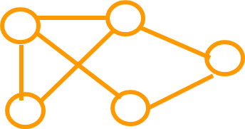

## 一、基本概念

#### 1、数据

数据即信息的载体，是能够输入到计算机中并且能被计算机识别、存储和处理的符号总称。

#### 2、数据元素

数据元素是数据的基本单位，又称之为记录（Record）。一般，数据元素由若干基本项（或称字段、域、属性）组成。

| 产品编号 | 产品名称 | 规   格 | 出厂日期 | ……   |
| -------- | -------- | ------- | -------- | ---- |
| 0001     | TV       | 29      | 1999/09  | ……   |

## 二、数据的逻辑结构

表示数据运算之间的抽象关系

按每个元素可能具有的直接前趋数和直接后继数将逻辑结构分为“线性结构”和“非线性结构”两大类。

#### 1、集合

数据元素间除“同属于一个集合”外，无其它关系

#### 2、线性结构

一个对一个，如线性表、栈、队列

#### 3、树形结构

一个对多个，如树

#### 4、图状结构

多个对多个，如图

## 三、数据的存储结构

存储结构：逻辑结构在计算机中的具体实现方法。

存储结构是通过计算机语言所编制的程序来实现的，因而是依赖于具体的计算机语言的。

#### 1、顺序存储

将数据结构中各元素按照其逻辑顺序存放于存储器一片连续的存储空间中

如c语言的一维数组，如表 L=(a1,a2，……,an)的顺序结构

#### 2、链式存储

将数据结构中各元素分布到存储器的不同点，用地址（或链指针）方式建立它们之间的联系

数据结构中元素之间的关系在计算机内部很大程度上是通过地址或指针来建立的。 

#### 3、索引存储

在存储数据的同时，建立一个附加的索引表，即索引存储结构=数据文件+索引表。

#### 4、散列存储

根据数据元素的特殊字段(称为关键字key)，计算数据元素的存放地址，然后数据元素按地址存放

## 四、总结

数据结构的三个方面：

