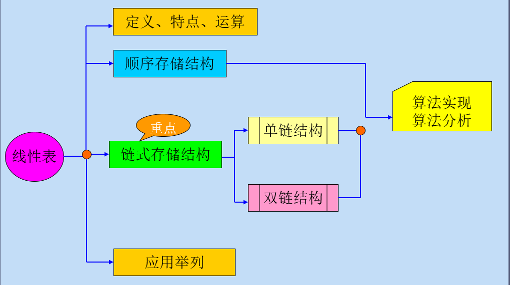
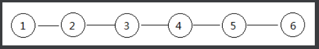
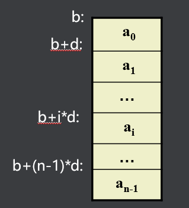
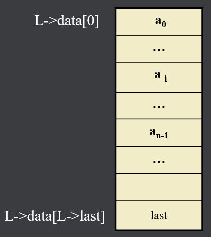

## 一、什么是线性表
#### 1、概述



#### 2、定义

线性表是包含若干数据元素的一个线性序列

记为： L=(a0, ...... ai-1, ai, ai+1 ...... an-1)

- L为表名，ai (0≤i≤n-1)为数据元素；

- n为表长,n>0 时，线性表L为非空表，否则为空表。

#### 3、描述

线性表L可用二元组形式描述：

  L= (D,R)

即线性表L包含数据元素集合D和关系集合R

  D={ai | ai∈datatype ,i=0,1,2, ∙∙∙∙∙∙∙∙∙n-1 ,n≥0}

  R={<ai , ai+1> | ai , ai+1∈D, 0≤i≤n-2}

- 关系符<ai, ai+1>在这里称为有序对
- 表示任意相邻的两个元素之间的一种先后次序关系
- ai是ai+1的直接前驱, ai+1是ai的直接后继

设有一个顺序表L={1,2,3,4,5,6};  他们的关系如图:




使用二元组描述L=(D,R), 则：

  D={1 , 2 , 3 , 4 , 5 , 6}(n=6)

  R={<1,2> , <2,3> , <3,4> , <4,5> , <5,6>}

#### 4、特征

线性表的特征：

1) 对非空表,a0是表头,无前驱；

2) an-1是表尾,无后继；

3) 其它的每个元素ai有且仅有一个直接前驱ai-1和一个直接后继ai+1

## 二、顺序存储
#### 1、顺序存储结构的表示
若将线性表L=(a0,a1, ……,an-1)中的各元素依次存储于计算机一片连续的存储空间。

设Loc(ai)为ai的地址，Loc(a0)=b，每个元素占d个单元 则：Loc(ai)=b+i*d             



在C语言中，可借助于一维数组类型来描述线性表的顺序存储结构：

```c
#define  N 100       
typedef   int  data_t;
typedef  struct                     
{   data_t data[N]； //表的存储空间
     int last;   
}   sqlist, *sqlink;   
```



**顺序存储的不足**：对表的插入和删除等运算的时间复杂度较差。


#### 2、顺序存储结构的特点

- 逻辑上相邻的元素 ai, ai+1，其存储位置也是相邻的

- 对数据元素ai的存取为随机存取或按地址存取
- 存储密度高（存储密度D=(数据结构中元素所占存储空间)/（整个数据结构所占空间））


