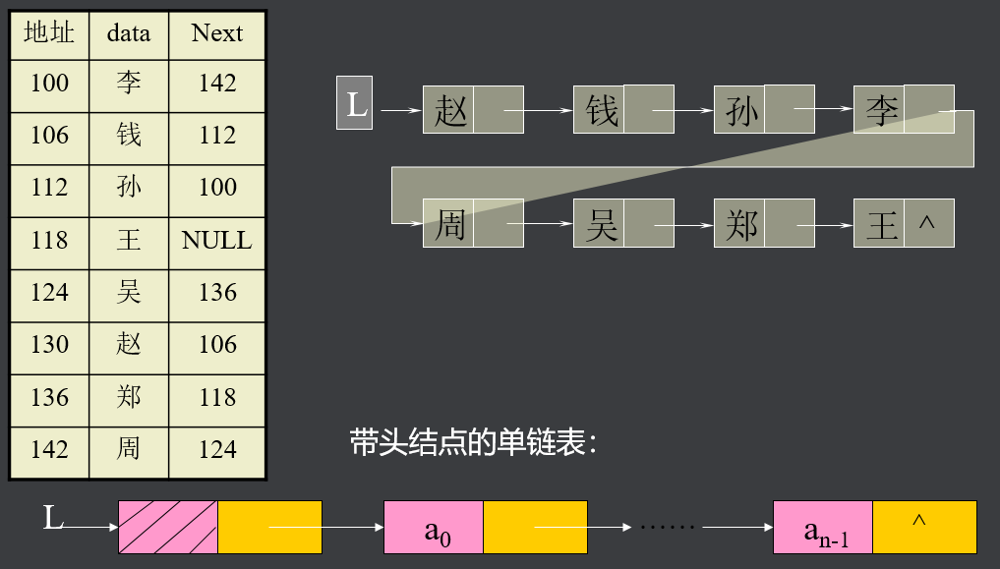
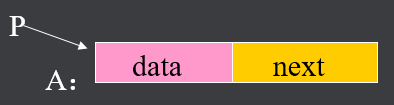
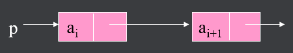
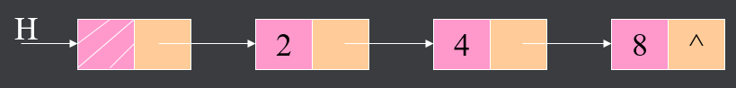
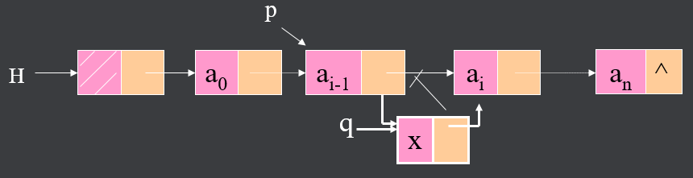
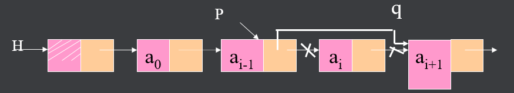

## 一、链式存储结构

将线性表L=(a0,a1,……,an-1)中各元素分布在存储器的不同存储块，称为结点，通过地址或指针建立元素之间的联系 


结点的data域存放数据元素ai，而next域是一个指针，指向ai的直接后继ai+1所在的结点。


设线性表L=(赵，钱，孙，李，周，吴，郑，王)，各元素在存储器中的分布如图 :




## 二、语法描述

结点类型描述： 

```c
typedef   struct  node
{   data_t   data;   //结点的数据域//
 struct node *next;  //结点的后继指针域//
}listnode, *linklist; 
```
说明：



- listnode A;
- linklist p = &A; 

设p指向链表中结点ai：



获取ai，写作：p->data；
而取ai+1,写作：p->next->data
若指针p的值为NULL，则它不指向任何结点, 此时取p->data或p->next是错误的。  

可调用C语言中malloc()函数向系统申请结点的存储空间

```c
linklist  p;     
p = (linklist)malloc(sizeof(listnode));
```

则创建一个类型为linklist的结点，且该结点的地址已存入指针变量p中：


## 三、链表的实现

#### 1、建立单链表

依次读入表L=(a0,.....,an-1)中每一元素ai(假设为整型)，若ai≠结束符（-1），则为ai创建一结点，然后插入表尾，最后返回链表的头结点指针H。

设L=(2，4，8，-1)，则建表过程如下：



链表的结构是动态形成的，即算法运行前，表结构是不存在的

#### 2、链表查找  

1）按序号查找：实现GetLinklist(h, i)运算。

算法思路：从链表的a0起，判断是否为第i结点，若是则返回该结点的指针，否则查找下一结点,依次类推。

2）按值查找（定位）：即实现Locate(h, x)。

算法思路：从链表结点a0起，依次判断某结点是否等于x,若是，则返回该结点的地址，若不是，则查找下一结点a1,依次类推。若表中不存在x,则返回NULL。

#### 3、链表插入

即实现InsertLinklist(h,x, i,)。将x插入表中结点ai之前的情况。

算法思路：调用算法GetLinklist(h,
i-1)，获取结点ai-1的指针p(ai 之前驱)，然后申请一个q结点，存入x，并将其插入p指向的结点之后。



#### 4、链表删除

即实现DeleteLinklist(h, i)， 算法对应的链表结构如图所示。

算法思路：同插入法，先调用函数GetLinklist(h, i-1),找到结点ai的前驱，然后将结点ai删除之。

