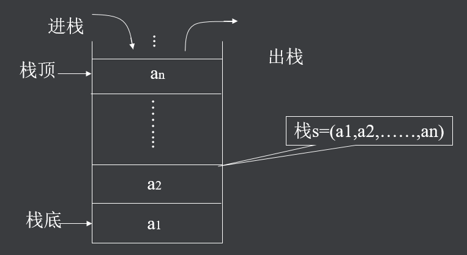
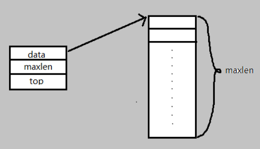
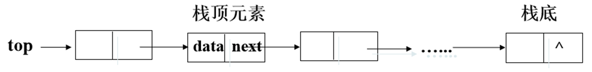

## 一、什么是栈

栈是限制在一端进行插入操作和删除操作的线性表（俗称堆栈），允许进行操作的一端称为“栈顶”，另一固定端称为“栈底”，当栈中没有元素时称为“空栈”。特点 ：后进先出（LIFO）。 




## 二、顺序栈

它是顺序表的一种，具有顺序表同样的存储结构，由数组定义，配合用数组下标表示的栈顶指针top（相对指针）完成各种操作。

```c
typedef  int  data_t ; /*定义栈中数据元素的数据类型*/
typedef struct 
{	
       data_t  *data ; 	/*用指针指向栈的存储空间*/
       int  maxlen;	/*当前栈的最大元素个数*/
       int  top ; 	/*指示栈顶位置(数组下标)的变量*/
  } sqstack; 		/*顺序栈类型定义*/
```



- 创建栈

```c
sqstack *stack_create (int len)
{
sqstack *ss;
ss = (seqstack *)malloc(sizeof(sqstack));
ss->data = (data_t *)malloc(sizeof(data_t) * len);
ss->top = -1;
ss->maxlen = len;	
return ss;
}
```

- 清空栈

```c
stack _clear(sqstack  *s)
{
	 s-> top = -1 ;
} 
```

- 判断栈是否空

```c
int  stack_empty (sqstack  *s)
{ 
	return   (s->top ==  -1  ?  1 : 0);
}
```

- 进栈

```c
void  stack_push (sqstack  *s ,  data_t  x)
{	if （s->top = = N - 1）{
	     printf ( “overflow !\n”) ; 
           return  ;
	}
	else  { 
		s->top ++  ;
		s->data[s->top] = x ;
	 }
	 return  ;
}

```

- 出栈

```c
datatype  stack_pop(sqstack *s)
{
 s->top--;
	return  (s->data[s->top+1]);
}	

```

- 取栈顶元素

```c
datatype  get_top(sqstack  *s)
{
      return (s->data[s->top]);
}

```

## 三、链式栈

插入操作和删除操作均在链表头部进行，链表尾部就是栈底，栈顶指针就是头指针。

```c
typedef  int  data_t ;	 /*定义栈中数据元素数据类型*/
typedef  struct  node_t {
    data_t data ;		   /*数据域*/
	struct  node_t  *next ;   /*链接指针域*/
}  linkstack_t ; 		  /*链栈类型定义*/

```



- 创建空栈

```c
linkstack_t  *CreateLinkstack() { 
     linkstack_t  *top;
     top  =  (linkstack_t  *)malloc(sizeof(linkstack_t));
     top->next = NULL;
     return  top;  
}

```

- 判断是否空栈

```c
int  EmptyStack (linkstack_t *top)  
{	
	return  (top->next  == NULL  ?   1  :  0);
}

```

- 入栈

```c
void   PushStack(linkstack_t *top,  data_t  x)
{	
linkstack_t  *p ;		
p = (linkstack_t *)malloc ( sizeof (linkstack_t) ) ; 
p->data = x ; 	
p->next = top->next;
top->next  =  p;   
return;	
}

```


