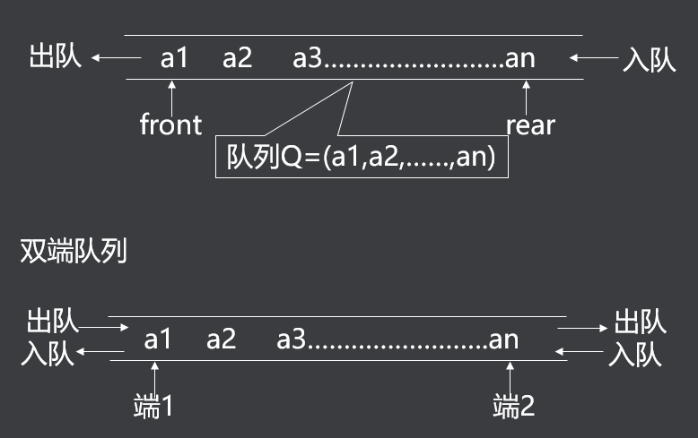
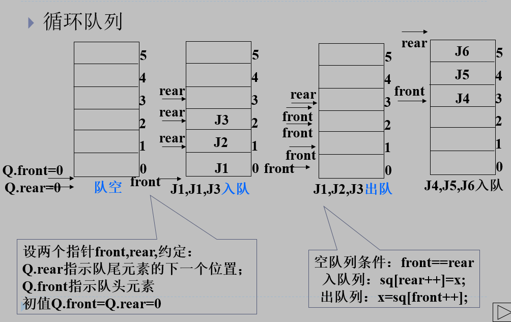
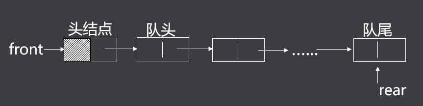
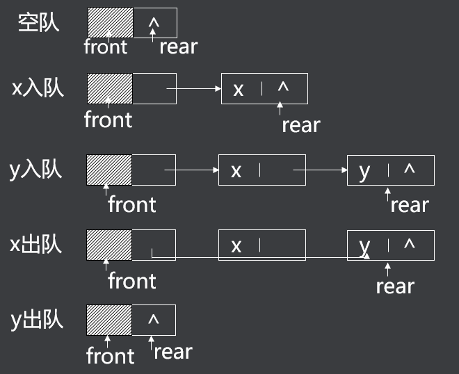

## 一、什么是顺序队列

队列是限制在两端进行插入操作和删除操作的线性表

允许进行存入操作的一端称为“队尾”

允许进行删除操作的一端称为“队头”

当线性表中没有元素时，称为“空队”

特点 ：先进先出（FIFO）



## 二、顺序队列设计

创建队列 ：CreateQueue ()

清空队列 ：ClearQueue (Q)

判断队列空 ：EmptyQueue(Q)

判断队列满 ：FullQueue(Q)

入队 ：EnQueue (Q , x)

出队 ：DeQueue(Q)

```c
typedef  int  data_t ;    /*定义队列中数据元素的数据类型*/
#define  N  64	    /*定义队列的容量*/
typedef  struct {
      data_t  data[N] ;   /*用数组作为队列的储存空间*/
      int  front, rear ;     /*指示队头位置和队尾位置的指针*/
} sequeue_t ; 	     /*顺序队列类型定义*/

```

- front指向队头元素的位置
-  rear指向队尾元素的下一个位置

在队列操作过程中，为了提高效率，以调整指针代替队列元素的移动，并将数组作为循环队列的操作空间。

为区别空队和满队，满队元素个数比数组元素个数少一个。



## 三、什么是链式队列

插入操作在队尾进行，删除操作在队头进行，由队头指针和队尾指针控制队列的操作。

```c
typedef  int  data_t;  

typedef  struct  node_t
{   data_t data ;		
   struct node_t   *next; 	
 } linknode_t,  *linklist_t;   

typedef  struct
{  linklist_t  front,  rear; 
} linkqueue_t; 		
```




- 创建空队列

```c
linkqueue_t  *CreateQueue()
{ 
      linkqueue_t  *lq  =  (linkqueue_t  *)malloc(sizeof(linkqueue_t));
      lq->front = lq->rear = (linklist_t)malloc(sizeof(linknode_t));
      lq->front->next = NULL ;	  /*置空队*/
          return  lq;     /*返回队列指针*/
}

```

- 判断队列空

```c
int   EmptyQueue(linkqueue_t  *lq)  { 
   return ( lq->front  = =  lq->rear) ;
} 

```

- 入队

```c
void  EnQueue (linkqueue_t *lq, data_t x)
{
      lq->rear->next = (linklist_t)malloc(sizeof(linknode_t)) ; 
      lq->rear = lq->rear->next; 	     /*修改队尾指针*/
      lq->rear->data = x ;		     /*新数据存入新节点*/
	lq->rear->next = NULL ;	     /*新节点为队尾*/
           return;
}

```

- 出队

```c
data_t  DeQueue(linkqueue_t  *lq)
{
       data_t   x;
	linklist_t   p;	       /*定义一个指向队头结点的辅助指针*/
	p = lq->front->next ;    /*将它指向队头结点*/
	lq->front->next ＝ p->next ;     /*删除原先队头结点
       x = p->data;
	 free(p) ; 	/*释放原队头结点*/
       if  (lq->front->next  ==  NULL)  lq->rear  =  lq->front;
       return  x;
}

```

