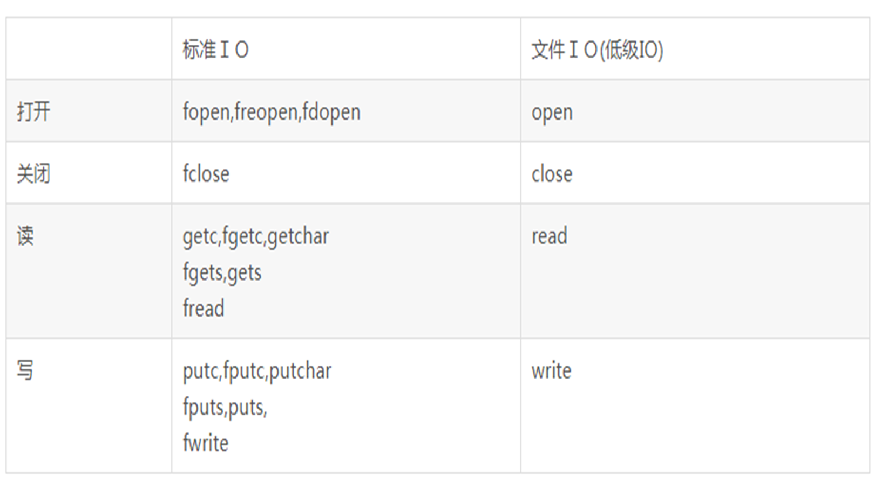
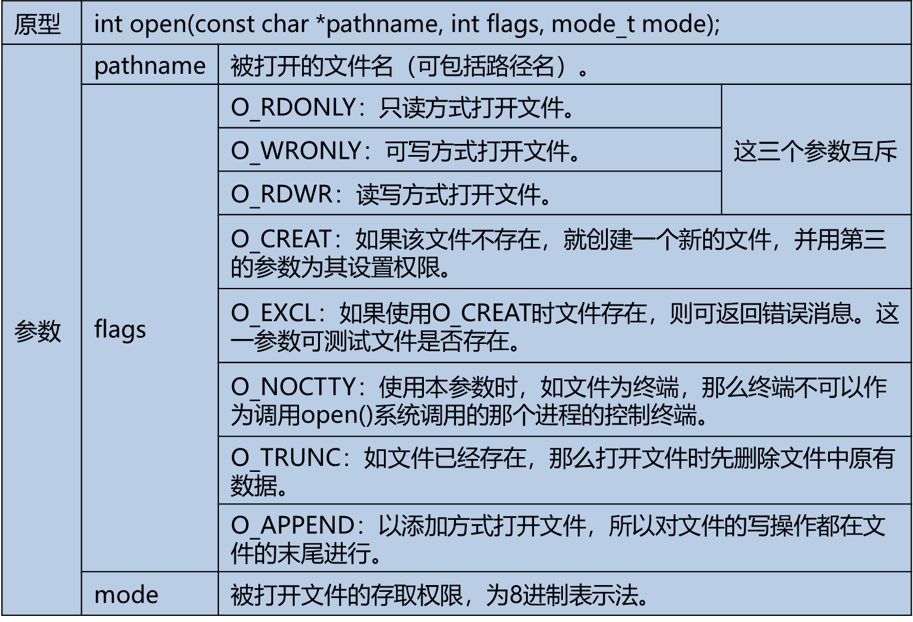

## 一、文件的概念和类型

文件是一组相关数据的有序集合，包含以下类型：

- 常规文件    r  
- 目录文件    d
- 字符设备文件    c
- 块设备文件    b
- 管道文件    p
- 套接字文件    s
- 符号链接文件    l

## 二、标准IO

### （一）介绍

标准I/O由ANSI C标准定义，主流操作系统上都实现了C库，标准I/O通过缓冲机制减少系统调用，实现更高的效率。

C库函数适配了各种操作系统的差异，建立在系统调用之上。


### （二）流（FILE）

#### 1、介绍

标准IO用一个结构体类型来存放打开的文件的相关信息，标准I/O的所有操作都是围绕FILE来进行，FILE又被称为流(stream)，文本流/二进制流。

对于流需要注意的是在Windows和Linux操作系统中换行符的不同：

- Windows

>二进制流：   换行符      ‘\n’ 
>
>文本流：   换行符     ‘\r’ ‘\n’

- Linux

>换行符      ‘\n’ 

#### 2、流的缓冲

流的缓冲有三种类型：全缓冲、行缓冲、无缓冲

- 全缓冲

当流的缓冲区无数据或无空间时才执行实际I/O操作

- 行缓冲

当在输入和输出中遇到换行符(‘\n’)时，进行I/O操作，当流和一个终端关联时，典型的行缓冲

- 无缓冲

数据直接写入文件，流不进行缓冲

#### 3、预定义流

标准I/O预定义3个流，程序运行时自动打开，分别为：stdin、stdout、stderr


stdin、stdout 默认是行缓冲，stderr没有缓冲

#### 4、代码

- 代码一

```c
#include <stdio.h>
#include <unistd.h>

int main(int argc, char *argv[]) {

    int i = 0;
    printf("a"); // 没有输出任何内容
    while (1) {
    sleep(1);
    }

    return 0;

}
```

只有程序正常结束才会刷新缓存，输出内容

如果加入换行符会进行行刷新，输出内容：

```c
...
printf("a\n");
...
```

- 代码二

```c
#include <stdio.h>
#include <unistd.h>

int main(int argc, char *argv[]) {

    int i;
    for(i = 0; i < 1025; i++) {
         printf("a"); //缓冲区满了，会刷新进行内容输出
    }

    while (1) {
    sleep(1);
    }

    return 0;

}
```

缓冲区满了，会刷新缓冲区，进行内容输出，即是全缓冲的无空间情况。

### （三）文件

#### 1、文件的打开

下列函数可用于打开一个标准I/O流：

```c
FILE *fopen (const char *path, const char *mode);
```

成功时返回流指针；出错时返回NULL

- mode参数


- 新建文件权限

fopen() 创建的文件访问权限是0666(rw-rw-rw-)

Linux系统中umask设定会影响文件的访问权限，其规则为(0666 & ～umask)

Root用户是 022 普通用户是002

用户可以通过umask函数或者命令修改相关设定

#### 2、文件的关闭

```c
int fclose(FILE *stream)；
```

- fclose()调用成功返回0，失败返回EOF，并设置errno
- 流关闭时自动刷新缓冲中的数据并释放缓冲区
- 当一个程序正常终止时，所有打开的流都会被关闭。
- 流一旦关闭后就不能执行任何操作

#### 3、处理错误信息

```c
extern int  errno; // #include <errno.h>
void perror(const char *s); // #include <stdio.h>
char *strerror(int errno); // #include <string.h>
```

- errno 存放错误号，由系统生成

- perror先输出字符串s，再输出错误号对应的错误信息

- strerror根据错误号返回对应的错误信息

#### 4、代码

```c
#include <stdio.h>
#include <errno.h>
#include <string.h>

int main(int argc, char *argv[]) {

    FILE *fp;
    int fpret;

    if ((fp = fopen("1.txt", "r")) == NULL) {

        perror("fopen");
        printf("errno: %d fopen:%s\n", errno, strerror(errno));
        
        return -1;
        
    } else {
        printf("fopen success\n");
        if ((fpret = fclose(fp)) == 0) {
            printf("fclose success\n");
        } else {
            perror("fclose");
        }
    }

    return 0;

}

```

### （四）读写流

流支持不同的续写方式：

- 读写一个字符：fgetc()/fputc()一次读/写一个字符

- 读写一行：fgets()和fputs()一次读/写一行

- 读写若干个对象：fread()/fwrite() 每次读/写若干个对象，而每个对象具有相同的长度

流的输入、输出是针对缓冲区来讲的，比如：`fgetc`是字符输入，是从其它的地方对缓冲区输入

#### 1、字符的输入和输出

##### 1.1 字符输入

下列函数用来输入一个字符:

```c
 #include  <stdio.h>

 int  fgetc(FILE *stream);
 int  getc(FILE *stream);   //宏
 int  getchar(void);
```

- 成功时返回读取的字符；若到文件末尾或出错时返回EOF（-1），

- getchar()等同于fgetc(stdin)

- getc和fgetc区别是一个是宏一个是函数

**代码**：

```c
#include <stdio.h>

int main(int argc, char *argv[]) {
    int ch;
    FILE *fp;
    if ((fp = fopen("1.txt", "r")) == NULL) {
        perror("fopen");
        return -1;
    }
    while ((ch = fgetc(fp)) != EOF) {
        printf("ch=%c\n", ch);
    }
    return 0;
}
```

>知识点：
>
>  ch = fgetc(stdin);
>
>  printf(“%c\n”, ch);

##### 1.2 字符输出

下列函数用来输出一个字符:

```c
#include  <stdio.h>
int  fputc(int c, FILE *stream);
int  putc(int c, FILE *stream);
int  putchar(int c);
```

- 成功时返回写入的字符；出错时返回EOF

- putchar(c)等同于fputc(c, stdout)

```c
#include <stdio.h>

int main(int argc,  char * argv[]) {

    FILE *fp;
    int ch;

    if ((fp = fopen("1.txt", "w")) == NULL) {

        perror("fopen");
        return -1;

    }

    for (ch = 'a'; ch <= 'z'; ch++) {

        fputc(ch, fp);

    }

    return 0;

}
```

>知识点：
>
>fputc(‘a’, stdout);
>
>putchar(‘\n’);

#### 2、行输入和输出

##### 2.1 行输入

下列函数用来输入一行:

```c
#include  <stdio.h>
char  *gets(char *s);
char *fgets(char *s, int size, FILE *stream);
```

- 成功时返回s，到文件末尾或出错时返回NULL

- gets不推荐使用，容易造成缓冲区溢出

- 遇到’\n’或已输入size-1个字符时返回，总是包含’\0’

```c
#include <stdio.h>

/*
* 从文件中读出字符
*/
int main(int argc, char *argv[]) {

    FILE *fp;
    char *ret;
    char buff[100];

    if ((fp = fopen("1.txt", "a+")) == NULL) {
        perror("fopen");
        return -1;
    }

    if ((ret = fgets(buff, 5, fp)) == NULL) {
        perror("fgets");
        fclose(fp);
        return -1;
    }

    printf("buff=%s\n", buff);

    return 0;

}
```

从输入流读入：

>char buf[N];
>
>fgets(buf, N, stdin);
>
>printf(“%s”, buf);

##### 2.2 行输出

下列函数用来输出字符串:

```c
#include  <stdio.h>
int  puts(const char *s);
int fputs(const char *s,  FILE *stream);
```

- 成功时返回非负整数；出错时返回EOF

- puts将缓冲区s中的字符串输出到stdout，并追加’\n’

- fputs将缓冲区s中的字符串输出到stream,不追加  ‘\n’

```c
#include <stdio.h>

/*
* 将缓冲区内容写入到文件
*/
int main(int argc, char *argv[]) {

    FILE *fp;
    int ret;
    char buff[] = "hello world";
    if ((fp = fopen("1.txt", "a+")) == NULL) {
        perror("fopen");
        return -1;
    }

    if ((ret = fputs(buff, fp)) == -1) {
        perror("fputs");
        fclose(fp);
        return -1;
    }

    printf("fputs success\n");

    return 0;

}
```

**注意**：输出的字符串中可以包含’\n’，也可以不包含

#### 3、对象读写

下列函数用来从流中读写若干个对象:

```c
#include  <stdio.h>
size_t fread(void *ptr, size_t size, size_t n, FILE *fp);
size_t fwrite(const void *ptr, size_t size, size_t n, FILE *fp);
```

- 成功返回读写的对象个数；出错时返回EOF
- 既可以读写文本文件，也可以读写数据文件
- 效率高

##### 3.1 fwrite

```c
#include <stdio.h>
#include <stdlib.h>
#include <string.h>

struct student {
    char name[16];
    int age;
    char sex[8];
};

int main(int argc, char *argv[]) {

    FILE *fp;
    size_t ret;

    struct student stu;
    struct student stu2;

    if((fp=fopen("1.bin", "w")) == NULL) {
        perror("fopen");
        return 0;
    }

    strcpy(stu.name, "zhangsan");
    stu.age = 49;
    strcpy(stu.sex, "male");

    ret = fwrite(&stu, sizeof(stu), 1, fp);
    if(ret == -1) {
        perror("fwrite");
        goto end;
    }
    printf("name=%s, age=%d, sex=%s\n", stu2.name, stu2.age, stu2.sex);

end:
    fclose(fp);

}

```

##### 3.2 fread

- 实例一

```c
#include <stdio.h>
#include <stdlib.h>
#include <string.h>

struct student {
    char name[16];
    int age;
    char sex[8];
};

int main() {

    FILE *fp;
    size_t ret;

    struct student stu2;

    if((fp = fopen("1.bin", "r")) == NULL) {
        perror("fopen");
        return 0;
    }

    ret = fread(&stu2, sizeof(stu2), 1, fp);
    if(ret == -1) {
        perror("fread");
        goto end;
    }

    printf("name=%s, age=%d, sex=%s\n", stu2.name, stu2.age, stu2.sex);

end:
    fclose(fp);

}
```

- 实例二

```c
#include <stdio.h>
#include <stdlib.h>


int main(int argc, char *argv[]) {

    FILE *fp;
    char *buff;
    size_t ret;

    if((fp=fopen("1.txt", "r")) == NULL) {
        perror("fopen");
        return 0;
    }

    if((buff = (char*)malloc(100)) == NULL) {
        perror("malloc failed");
        return 0;
    }

    ret = fread(buff, 10, 1, fp);
    if(ret == -1) {
        perror("fread");
        goto end;
    }
    printf("buff=%s\n", buff);

end:
    free(buff);
    fclose(fp);

}
```

### （五）流的刷新和定位

#### 1、流的刷新

```c
#include <stdio.h>

int fflush(FILE *fp);
```

- 成功时返回0；出错时返回EOF

- 将流缓冲区中的数据写入实际的文件

- Linux下只能刷新输出缓冲区,输入缓冲区丢弃

```c
#include <stdio.h>
#include <unistd.h>

int main(int argc, char *argv[]) {

    FILE *fp;
    if((fp = fopen("1.txt", "w")) == NULL) {
        perror("fopen");
        return 0;
    }

    fwrite("abcdef", 7, 1, fp);
    fflush(fp);

    while(1) {
        sleep(1);
    }

    return 0;

}
```

#### 2、流的定位

```c
#include  <stdio.h>

long ftell(FILE *stream);
long fseek(FILE *stream, long offset,  int whence);
void rewind(FILE *stream);
```

- ftell() 成功时返回流的当前读写位置，出错时返回EOF

- fseek()定位一个流，成功时返回0，出错时返回EOF 

- whence参数：SEEK_SET/SEEK_CUR/SEEK_END

- SEEK_SET 从距文件开头 offset 位移量为新的读写位置

- SEEK_CUR：以目前的读写位置往后增加 offset 个位移量

- SEEK_END：将读写位置指向文件尾后再增加 offset 个位移量

- offset参数：偏移量，可正可负

- 打开a模式 fseek无效

- rewind()将流定位到文件开始位置

- 读写流时，当前读写位置自动后移

```c
#include <stdio.h>

int main(int argc, char *argv[]) {

    FILE *fp;

    if((fp=fopen("1.txt", "w")) == NULL) {
        perror("fopen");
        return 0;
    }

    fwrite("abcdef", 6, 1, fp);
    printf("current position fp=%d\n", (int)ftell(fp)); // abcd
    //fseek(fp,3,SEEK_SET);
    rewind(fp);
    printf("after rewind fp=%d\n", (int)ftell(fp));
    fwrite("jkl", 3, 1, fp); // jklabcd

    return 0;

}
```

#### 3、判断流是否出错和结束

```c
#include  <stdio.h>

int ferror(FILE *stream);
int feof(FILE *stream);
```

- ferror()返回1表示流出错；否则返回0

- feof()返回1表示文件已到末尾；否则返回0

### （六）格式化输出、输入

#### 1、格式化输出

```c
#include  <stdio.h>

int printf(const char *fmt, …);
int fprintf(FILE *stream, const char *fmt, …);
int sprintf(char *s, const char *fmt, …);
```

- 成功时返回输出的字符个数；出错时返回EOF

- 使用起来很方便

##### 1.1 fprintf

```c
#include <stdio.h>

int main(int argc, char *argv[]) {

    FILE *fp;
    int year=2024;
    int month=9;
    int day=15;

    if((fp=fopen("ftest.txt", "w")) == NULL) {
        perror("fopen");
        return 0;
    }
    fprintf(fp, "%d-%d-%d\n", year, month, day);

    fclose(fp);
    
    return 0;

}
```

##### 1.2 sprintf

```c
#include <stdio.h>

int main(int argc, char *argv[]) {

    char buf[100] = {0};
    int year=2024;
    int month=9;
    int day=15;

    int syear;
    int smonth;
    int sday;

    sprintf(buf, "%d-%d-%d", year, month, day);
    printf("%s\n", buf);

    sscanf(buf, "%d-%d-%d", &syear, &smonth, &sday);
    printf("%d %d %d\n", syear, smonth, sday);

    return 0;

}
```

#### 2、格式化输入

```c
int fscanf(FILE *stream, const char *format, ...);
int sscanf(const char *str, const char *format, ...);
```

```c
#include <stdio.h>

int main(int argc, char *argv[]) {

    FILE *fp;
    int year;
    int month;
    int day;

    if((fp=fopen("ftest.txt", "r")) == NULL) {
        perror("fopen");
        return 0;
    }

    fscanf(fp, "%d-%d-%d", &year, &month, &day);
    printf("%d %d %d\n", year, month, day);

    fclose(fp);

    return 0;

}
```

#### 3、案例

>每隔1秒向文件test.txt中写入当前系统时间，格式如下： 
>
>
>
>1,  2014-10-15 15:16:42
>
>2,  2014-10-15 15:16:43
>
>该程序无限循环，直到按Ctrl-C中断程序
>
>每次执行程序时，系统时间追加到文件末尾，序号递增
>
>
>
>1,  2014-10-15 15:16:42
>
>2,  2014-10-15 15:16:43
>
>3,  2014-10-16 11:35:07
>
>4,  2014-10-16 11:35:08
>
>
>
>time()用来获取系统时间(秒数)
>
>time_t time(time_t *seconds) 1970.1.1 0:0:0
>
>localtime()将系统时间转换成本地时间
>
>struct tm *localtime(const time_t *timer)
>
>struct tm {
>
>   int tm_sec;         /* 秒，范围从 0 到 59                */
>
>   int tm_min;         /* 分，范围从 0 到 59                */
>
>   int tm_hour;        /* 小时，范围从 0 到 23                */
>
>   int tm_mday;        /* 一月中的第几天，范围从 1 到 31                    */
>
>   int tm_mon;         /* 月份，范围从 0 到 11                */
>
>   int tm_year;        /* 自 1900 起的年数                */
>
>   int tm_wday;        /* 一周中的第几天，范围从 0 到 6                */
>
>   int tm_yday;        /* 一年中的第几天，范围从 0 到 365                    */
>
>   int tm_isdst;       /* 夏令时                        */    
>
>};

```c
#include <stdio.h>
#include <string.h>
#include <time.h>
#include <unistd.h>


int main(int argc, char *argv[]) {

    FILE *fp;
    time_t ctime;
    struct tm *ctimestr;
    int linecount;
    char buf[32];

    if((fp=fopen("test.txt", "a+")) == NULL) {

        perror("fopen");
        return 0;

    }

    while(fgets(buf, 32, fp) != NULL) {

        if(buf[strlen(buf)-1] == '\n') {
            linecount++;
        }

    }

    while(1) {
        ctime = time(NULL);
        ctimestr = localtime(&ctime);
        fprintf(fp, "%d, %04d-%02d-%02d %02d:%02d:%02d\n", linecount,
        ctimestr->tm_year+1900, ctimestr->tm_mon+1, ctimestr->tm_mday,
        ctimestr->tm_hour, ctimestr->tm_min, ctimestr->tm_sec);
        fflush(fp);
        linecount++;
        sleep(1);

    }

    fclose(fp);

}
```

## 三、文件IO

### （一）什么是文件IO

- posix(可移植操作系统接口)定义的一组函数

- 不提供缓冲机制，每次读写操作都引起系统调用

- 核心概念是文件描述符

- 访问各种类型文件

- Linux下, 标准IO基于文件IO实现

与标准IO的区别：



- 每个打开的文件都对应一个文件描述符。

- 文件描述符是一个非负整数。Linux为程序中每个打开的文件分配一个文件描述符。

- 文件描述符从0开始分配，依次递增。

- 文件IO操作通过文件描述符来完成。

0, 1, 2 的含义？

### （二）文件打开与关闭

#### 1、open

 open函数用来创建或打开一个文件:

```c
 #include <fcntl.h>

 int open(const char *pathname, int flags);
 int open(const char *pathname, int flags, mode_t mode);
```

 成功时返回文件描述符；出错时返回EOF

- 打开文件时使用两个参数

- 创建文件时第三个参数指定新文件的权限，（只有在建立新文件时有效）此外真正建文件时的权限会受到umask 值影响，实际权限是mode-umaks

- 可以打开设备文件，但是不能创建设备文件（创建设备mknode 驱动部分会讲）



> r  O_RDONLY
>
> r+  O_RDWR
>
> w  O_WRONLY | O_CREAT | O_TRUNC, 0664
>
>w+  O_RDWR | O_CREAT | O_TRUNC, 0664
>
>a  O_WRONLY | O_CREAT | O_APPEND, 0664
>
>a+  O_RDWR | O_CREAT | O_APPEND, 0664

- umask用来设定文件或目录的初始权限

- 文件和目录的真正初始权限

- 文件或目录的初始权限 = 文件或目录的最大默认权限 - umask权限

#### 2、close

 close函数用来关闭一个打开的文件:

```c
#include  <unistd.h>

int  close(int fd);
```

- 成功时返回0；出错时返回EOF

- 程序结束时自动关闭所有打开的文件

- 文件关闭后，文件描述符不再代表文件

#### 3、案例

```c
#include <stdio.h>
#include <sys/types.h>
#include <sys/stat.h>
#include <fcntl.h>
#include <unistd.h>

int main(int argc, char *argv[]) {

    int fd;
    int ret;

    if((fd=open("test.txt", O_WRONLY|O_CREAT|O_TRUNC, 0666)) < 0) {
        perror("open error");
        return -1;

    }

    printf("success, fd=%d\n", fd);

    if((ret=close(fd)) < 0) {
    perror("close error");
    return -1;
    }

    return 0;

}
```

### （三）文件读写

#### 1、read

read函数用来从文件中读取数据:

```c
 #include  <unistd.h>

 ssize_t  read(int fd, void *buf, size_t count);
```

- 成功时返回实际读取的字节数；出错时返回EOF

- 读到文件末尾时返回0

- buf是接收数据的缓冲区

- count不应超过buf大小

```c
#include <stdio.h>
#include <sys/types.h>
#include <sys/stat.h>
#include <fcntl.h>
#include <unistd.h>

int main(int argc, char *argv[]) {

    int fd, n, total = 0;
    char buf[64];

    if((fd = open("test.txt", O_RDONLY)) < 0) {
        perror("open");
        return -1;
    }

    while((n = read(fd, buf, 64)) > 0) {
        total += n;
    }

    printf("buf:%s\n", buf);

    return 0;

}
```

#### 2、write

 write函数用来向文件写入数据:

```c
 #include  <unistd.h>

 ssize_t  write(int fd, void *buf, size_t count);
```

- 成功时返回实际写入的字节数；出错时返回EOF

- buf是发送数据的缓冲区

- count不应超过buf大小

```c
#include <stdio.h>
#include <unistd.h>
#include <sys/types.h>
#include <sys/stat.h>
#include <sys/fcntl.h>
#include <string.h>

int main(int argc, char * argv[]) {

    int fd;
    char buf[20];

    if((fd = open("test.txt", O_WRONLY|O_CREAT|O_TRUNC, 0666)) < 0) {
        perror("open error");
        return -1;
    }

    while(fgets(buf, 20, stdin) != NULL) {
        if(strcmp(buf, "quit\n") == 0) break;
        write(fd, buf, strlen(buf));
    }

    return 0;

}

```

#### 3、文件定位

lseek函数用来定位文件:

```c
 #include  <unistd.h>

 off_t  lseek(int fd, off_t offset, intt whence);
```

- 成功时返回当前的文件读写位置；出错时返回EOF

- 参数offset和参数whence同fseek完全一样

```c
#include <stdio.h>
#include <sys/types.h>
#include <sys/stat.h>
#include <unistd.h>
#include <fcntl.h>
#include <string.h>

int main() {

    int fd, ret;
    char buf[32] = "hello world!";
    char buf2[32] = {0};

    if((fd = open("test.txt", O_RDWR | O_CREAT | O_APPEND, 0666)) < 0) {
        perror("open");
        return -1;
    }

    if((ret = write(fd, buf, strlen(buf))) < 0) {
        perror("write");
        goto END;
    }

    lseek(fd, 0, SEEK_SET); //将指针定位到第一个，因为写完数据后指针在末尾

    if((ret = read(fd, buf2, 32)) < 0) {
        perror("read");
        goto END;
    }

    buf2[31] = 0; //buf2写满字符串后\0结尾，为了不继续读取成乱码，手动加一个0

    printf("read buf2=%s\n", buf2);


END:
    close(fd);

    return 0;

}
```

### （四）文件属性、目录操作

#### 1、打开目录

 opendir函数用来打开一个目录文件:

```c
 #include  <dirent.h>

 DIR  *opendir(const char *name);
 DIR *fdopendir(int fd);  // 使用文件描述符，要配合open函数使用
```

- DIR是用来描述一个打开的目录文件的结构体类型

- 成功时返回目录流指针；出错时返回NULL

#### 2、关闭目录

 closedir函数用来关闭一个目录文件:

```c
 #include  <dirent.h>

 int closedir(DIR *dirp);
```

- 成功时返回0；出错时返回EOF

#### 3、访问目录

readdir函数用来读取目录流中的内容:

```c
 #include  <dirent.h>

 struct  dirent *readdir(DIR *dirp);
```

- struct dirent是用来描述目录流中一个目录项的结构体类型

- 包含成员char  d_name[256]   参考帮助文档

- 成功时返回目录流dirp中下一个目录项；

- 出错或到末尾时时返回NULL

```c
#include <stdio.h>
#include <dirent.h>

int main(int argc, char *argv[]) {

    DIR* dp;
    struct dirent *dt;

    if((dp = opendir("/home/linux/embedded-dev-from-zero/04.c_file_io/code/")) < 0) {
        perror("opendir");
        return -1;

    }

    while((dt = readdir(dp)) != NULL) {
        printf("%s\n", dt->d_name);
    }

    closedir(dp);

}
```

#### 4、修改文件权限

chmod/fchmod函数用来修改文件的访问权限:

```c
 #include  <sys/stat.h>

 int  chmod(const char *path, mode_t mode);
 int  fchmod(int fd, mode_t mode);
```

- 成功时返回0；出错时返回EOF

- root和文件所有者能修改文件的访问权限

**示例：** chmod(“test.txt”, 0666)

```c
#include "stdio.h"
#include "sys/stat.h"

int main(int argc, char *argv[]) {

    int ret;
    if((ret = chmod("chmod_test.txt", 0666)) < 0) {
        perror("chmod");
        return -1;
    }

    return 0;

}
```

#### 5、获取文件属性

stat/lstat/fstat函数用来获取文件属性:

```c
 #include  <sys/stat.h>

 int  stat(const char *path, struct stat *buf);
 int  lstat(const char *path, struct stat *buf);
 int  fstat(int fd, struct stat *buf);
```

- 成功时返回0；出错时返回EOF

- 如果path是符号链接stat获取的是目标文件的属性；而lstat获取的是链接文件的属性

**struct stat是存放文件属性的结构体类型:**

```c
mode_t  st_mode; // 类型和访问权限
uid_t  st_uid; // 所有者id
uid_t  st_gid; // 用户组id
off_t  st_size; // 文件大小
time_t  st_mtime; // 最后修改时间
```

**stat 结构体:**

```c
struct stat {
    dev_t         st_dev;       //文件的设备编号
    ino_t         st_ino;       //节点
    mode_t        st_mode;      //文件的类型和存取的权限
    nlink_t       st_nlink;     //连到该文件的硬连接数目，刚建立的文件值为1
    uid_t         st_uid;       //用户ID
    gid_t         st_gid;       //组ID
    dev_t         st_rdev;      //(设备类型)若此文件为设备文件，则为其设备编号
    off_t         st_size;      //文件字节数(文件大小)
    unsigned long st_blksize;   //块大小(文件系统的I/O 缓冲区大小)
    unsigned long st_blocks;    //块数
    time_t        st_atime;     //最后一次访问时间
    time_t        st_mtime;     //最后一次修改时间
    time_t        st_ctime;     //最后一次改变时间(指属性)
};
```

**通过系统提供的宏来判断文件类型:**

```c
S_IFMT      0170000     文件类型的位遮罩
S_ISREG(st_mode)           0100000     是否常规文件
S_ISDIR(st_mode)             0040000    是否目录
S_ISCHR(st_mode)           0020000    是否字符设备
S_ISBLK(st_mode)            0060000    是否块设备
S_ISFIFO(st_mode)           0010000    是否FIFO文件
S_ISLNK(st_mode)            0120000    是否链接文件
S_ISSOCK(st_mode)         0140000    是否SOCKET文件
```

**通过系统提供的宏来获取文件访问权限:**

```c
S_IRUSR           00400                     bit:8    所有者有读权限
S_IWUSR          00200                          7    所有者拥有写权限
S_IXUSR           00100                          6    所有者拥有执行权限S_IRGRP           00040                          5   群组拥有读权限
S_IWGRP          00020                          4   群组拥有写权限
S_IXGRP           00010                          3   群组拥有执行权限
S_IROTH           00004                          2   其他用户拥有读权限
S_IWOTH          00002                          1   其他用户拥有写权限
S_IXOTH           00001                          0   其他用户拥有执行权限
```

**练习：获取并显示文件属性 **

```c
#include <stdio.h>
#include <sys/types.h>
#include <sys/stat.h>
#include <unistd.h>
#include <time.h>

int main(int argc, char **argv) {

    struct stat buf;
    int ret;

    if((ret = stat("23.chmod.c", &buf)) < 0) {
        perror("stat");
        return -1;
    }

       if(S_ISREG(buf.st_mode)){
       printf("-");
   }

   if(S_ISDIR(buf.st_mode)){
       printf("d");
   }
   if(S_ISCHR(buf.st_mode)){
       printf("c");
   }
   if(S_ISBLK(buf.st_mode)){
       printf("b");
   }
   if(S_ISFIFO(buf.st_mode)){
       printf("p");
   }
   if(S_ISSOCK(buf.st_mode)){
       printf("s");
   }

    for(int i=8; i>= 0; i-- ) {
        if(buf.st_mode & (1<<i)) {
            switch(i%3) {
                case 2:
                    printf("r");
                    break;
                case 1:
                    printf("w");
                    break;
                case 0:
                    printf("x");
                    break;
            }
        } else {
                printf("-");
        }
    }

    printf(" %d", (int)buf.st_size);

   struct tm *t;
   t = localtime(&buf.st_ctime);
   printf(" %d-%d-%d %d:%d",t->tm_year+1900,t->tm_mon+1,t->tm_mday,t->tm_hour,t->tm_min);

   printf(" chmod_t.c\n");

   return 0;

}
```

**效果：**

```shell
linux@linux:~/embedded-dev-from-zero/04.c_file_io/code$ ./24.stat                                           
-rw-rw-r-- 223 2024-9-16 16:13 chmod_t.c 
```

## 四、程序库

### （一）静态库

#### 1、库的概念

库是一个二进制文件，包含的代码可被程序调用，像标准C库、数学库、线程库…… ，另外库有源码，可下载后编译；也可以直接安装二进制包，如：/lib   /usr/lib

库是事先编译好的，可以复用的代码。在OS上运行的程序基本上都要使用库。使用库可以提高开发效率。Windows和Linux下库文件的格式不兼容。

Linux下包含静态库和共享库。

#### 2、静态库的特点

- 编译(链接)时把静态库中相关代码复制到可执行文件中

- 程序中已包含代码，运行时不再需要静态库

- 程序运行时无需加载库，运行速度更快

- 占用更多磁盘和内存空间

- 静态库升级后，程序需要重新编译链接

#### 3、创建静态库

##### 3.1 编写库文件hello.c

```c
#include <stdio.h>

void hello() {
    printf("hello world!\n");
}
```

##### 3.2 编写主文件test.c

```c
#include <stdio.h>

void hello();

int main(int argc, char *argv[]) {
    hello();
    return 0;
}
```

##### 3.3 库文件编译成.o目标文件

```shell
gcc -c hello.c -o hello.o
```

##### 3.4 ar命令创建libxxx.a文件

```shell
ar -rsv libhello.a hello.o
```

- 静态库名字要以lib开头，后缀名为.a

- 没有main函数的.c 文件不能生成可执行文件。

##### 3.5 链接静态库

```shell
gcc -o test test.c -L. -lhello 
```

- -L  表示库所在的路径

- -l 后面跟库的名称

#### 4、静态库说明

##### 4.1 ar参数说明

```c
c  禁止在创建库时产生的正常消息
r  如果指定的文件已经存在于库中，则替换它
s  无论 ar 命令是否修改了库内容都强制重新生成库符号表
v  将建立新库的详细的逐个文件的描述写至标准输出
q  将指定的文件添加到库的末尾
t  将库的目录写至标准输出
```

##### 4.2 查看库中符号信息

```shell
$ nm libhello.a 

hello.o:
00000000 T hello
         U puts
```

- nm: 显示指定文件中的符号信息

- -a: 显示所有符号

### （二）共享库

#### 1、什么是共享库

- 编译(链接)时仅记录用到哪个共享库中的哪个符号，不复制共享库中相关代码

- 程序不包含库中代码，尺寸小

- 多个程序可共享同一个库

- 程序运行时需要加载库

- 库升级方便，无需重新编译程序

- 使用更加广泛

#### 2、创建共享库

##### 2.1 确定库源码

- hello.c

```c
#include <stdio.h>

void hello() {
    printf("hello world!\n");
}
```

- bye.c

```c
#include <stdio.h>

void bye() {
    printf("bye\n");
}
```

##### 2.2 编译生成目标文件

```shell
$ gcc -c -fPIC hello.c bye.c -Wall
```

##### 2.3 创建共享库

```shell
$ gcc -shared -o libcommon.so.1 hello.o bye.o
```

##### 2.4 准备可执行程序

- test.c

```c
#include <stdio.h>

void hello();
void bye();

int main(int argc, char *argv[]) {
    hello();
    bye();
    return 0;
}
```

- 编译test.c并链接共享库libcommon.so

```shell
$ gcc -o test test.c -L. -lcommon
```

##### 2.5 加载共享库

如果直接执行程序：

```shell
$ ./test 
./test: error while loading shared libraries: libcommon.so: cannot open shared object file: No such file or directory
```

表明需要添加共享库的加载路径：

```shell
$  export  LD_LIBRARY_PATH=$LD_LIBRARY_PATH:.
$ ./test 
hello world!
bye
```

#### 3、加载共享库

为了让系统能找到要加载的共享库，有三种方法 ：

- 把库拷贝到/usr/lib和/lib目录下 

- 在LD_LIBRARY_PATH环境变量中添加库所在路径（加入到.bashrc文件，然后source永久生效）

- 添加/etc/ld.so.conf.d/*.conf文件，执行ldconfig刷新

#### 4、查看可行文件使用的动态库

使用`ldd`命令查看：

```shell
$ ldd test
        linux-gate.so.1 =>  (0xb7f2a000)
        libcommon.so => ./libcommon.so (0xb7f23000)
        libc.so.6 => /lib/i386-linux-gnu/libc.so.6 (0xb7d56000)
        /lib/ld-linux.so.2 (0xb7f2c000)
```

