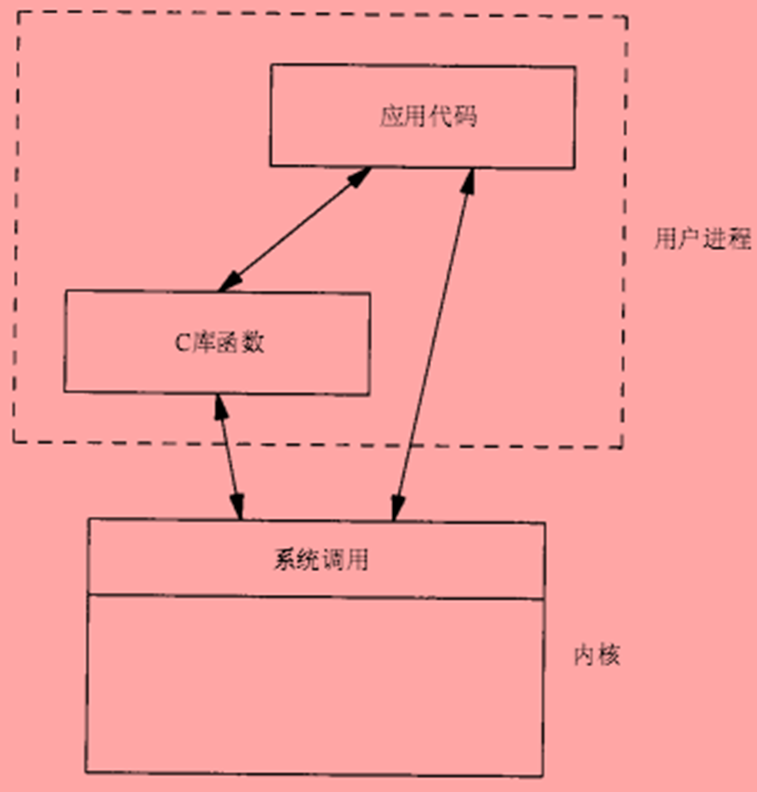
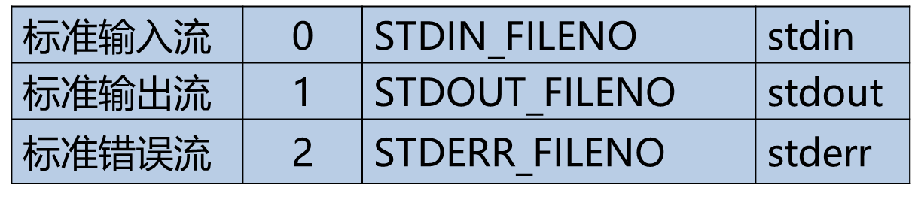
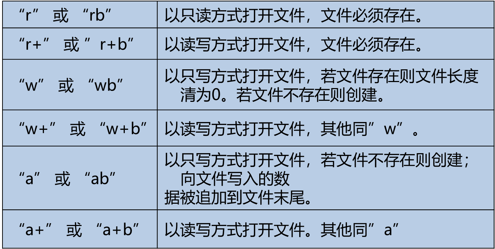
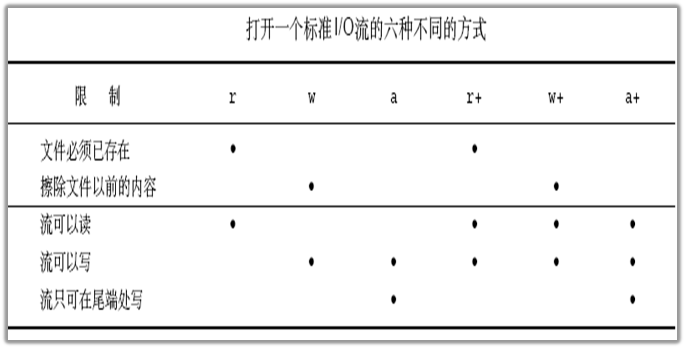

## 一、文件的概念和类型

文件是一组相关数据的有序集合，包含以下类型：

- 常规文件    r  
- 目录文件    d
- 字符设备文件    c
- 块设备文件    b
- 管道文件    p
- 套接字文件    s
- 符号链接文件    l

## 二、标准IO

### （一）介绍

标准I/O由ANSI C标准定义，主流操作系统上都实现了C库，标准I/O通过缓冲机制减少系统调用，实现更高的效率。

C库函数适配了各种操作系统的差异，建立在系统调用之上。



### （二）流（FILE）

#### 1、介绍

标准IO用一个结构体类型来存放打开的文件的相关信息，标准I/O的所有操作都是围绕FILE来进行，FILE又被称为流(stream)，文本流/二进制流。

对于流需要注意的是在Windows和Linux操作系统中换行符的不同：

- Windows

>二进制流：   换行符      ‘\n’ 
>
>文本流：   换行符     ‘\r’ ‘\n’

- Linux

>换行符      ‘\n’ 

#### 2、流的缓冲

流的缓冲有三种类型：全缓冲、行缓冲、无缓冲

- 全缓冲

当流的缓冲区无数据或无空间时才执行实际I/O操作

- 行缓冲

当在输入和输出中遇到换行符(‘\n’)时，进行I/O操作，当流和一个终端关联时，典型的行缓冲

- 无缓冲

数据直接写入文件，流不进行缓冲

#### 3、预定义流

标准I/O预定义3个流，程序运行时自动打开，分别为：stdin、stdout、stderr



stdin、stdout 默认是行缓冲，stderr没有缓冲

#### 4、代码

- 代码一

```c
#include <stdio.h>
#include <unistd.h>

int main(int argc, char *argv[]) {

    int i = 0;
    printf("a"); // 没有输出任何内容
    while (1) {
    sleep(1);
    }

    return 0;

}
```

只有程序正常结束才会刷新缓存，输出内容

如果加入换行符会进行行刷新，输出内容：

```c
...
printf("a\n");
...
```

- 代码二

```c
#include <stdio.h>
#include <unistd.h>

int main(int argc, char *argv[]) {

    int i;
    for(i = 0; i < 1025; i++) {
         printf("a"); //缓冲区满了，会刷新进行内容输出
    }

    while (1) {
    sleep(1);
    }

    return 0;

}
```

缓冲区满了，会刷新缓冲区，进行内容输出，即是全缓冲的无空间情况。

### （三）文件

#### 1、文件的打开

下列函数可用于打开一个标准I/O流：

```c
FILE *fopen (const char *path, const char *mode);
```

成功时返回流指针；出错时返回NULL

- mode参数





- 新建文件权限

fopen() 创建的文件访问权限是0666(rw-rw-rw-)

Linux系统中umask设定会影响文件的访问权限，其规则为(0666 & ～umask)

Root用户是 022 普通用户是002

用户可以通过umask函数或者命令修改相关设定

#### 2、文件的关闭

```c
int fclose(FILE *stream)；
```

- fclose()调用成功返回0，失败返回EOF，并设置errno
- 流关闭时自动刷新缓冲中的数据并释放缓冲区
- 当一个程序正常终止时，所有打开的流都会被关闭。
- 流一旦关闭后就不能执行任何操作

#### 3、处理错误信息

```c
extern int  errno; // #include <errno.h>
void perror(const char *s); // #include <stdio.h>
char *strerror(int errno); // #include <string.h>
```

- errno 存放错误号，由系统生成

- perror先输出字符串s，再输出错误号对应的错误信息

- strerror根据错误号返回对应的错误信息

#### 4、代码

```c
#include <stdio.h>
#include <errno.h>
#include <string.h>

int main(int argc, char *argv[]) {

    FILE *fp;
    int fpret;

    if ((fp = fopen("1.txt", "r")) == NULL) {

        perror("fopen");
        printf("errno: %d fopen:%s\n", errno, strerror(errno));
        
        return -1;
        
    } else {
        printf("fopen success\n");
        if ((fpret = fclose(fp)) == 0) {
            printf("fclose success\n");
        } else {
            perror("fclose");
        }
    }

    return 0;

}

```

### （四）读写流

流支持不同的续写方式：

- 读写一个字符：fgetc()/fputc()一次读/写一个字符

- 读写一行：fgets()和fputs()一次读/写一行

- 读写若干个对象：fread()/fwrite() 每次读/写若干个对象，而每个对象具有相同的长度

流的输入、输出是针对缓冲区来讲的，比如：`fgetc`是字符输入，是从其它的地方对缓冲区输入

#### 1、字符的输入和输出

##### 1.1 字符输入

下列函数用来输入一个字符:

```c
 #include  <stdio.h>

 int  fgetc(FILE *stream);
 int  getc(FILE *stream);   //宏
 int  getchar(void);
```

- 成功时返回读取的字符；若到文件末尾或出错时返回EOF（-1），

- getchar()等同于fgetc(stdin)

- getc和fgetc区别是一个是宏一个是函数

**代码**：

```c
#include <stdio.h>

int main(int argc, char *argv[]) {
    int ch;
    FILE *fp;
    if ((fp = fopen("1.txt", "r")) == NULL) {
        perror("fopen");
        return -1;
    }
    while ((ch = fgetc(fp)) != EOF) {
        printf("ch=%c\n", ch);
    }
    return 0;
}
```

>知识点：
>
>  ch = fgetc(stdin);
>
>  printf(“%c\n”, ch);

##### 1.2 字符输出

下列函数用来输出一个字符:

```c
#include  <stdio.h>
int  fputc(int c, FILE *stream);
int  putc(int c, FILE *stream);
int  putchar(int c);
```

- 成功时返回写入的字符；出错时返回EOF

- putchar(c)等同于fputc(c, stdout)

```c
#include <stdio.h>

int main(int argc,  char * argv[]) {

    FILE *fp;
    int ch;

    if ((fp = fopen("1.txt", "w")) == NULL) {

        perror("fopen");
        return -1;

    }

    for (ch = 'a'; ch <= 'z'; ch++) {

        fputc(ch, fp);

    }

    return 0;

}
```

>知识点：
>
>fputc(‘a’, stdout);
>
>putchar(‘\n’);

#### 2、行输入和输出

##### 2.1 行输入

下列函数用来输入一行:

```c
#include  <stdio.h>
char  *gets(char *s);
char *fgets(char *s, int size, FILE *stream);
```

- 成功时返回s，到文件末尾或出错时返回NULL

- gets不推荐使用，容易造成缓冲区溢出

- 遇到’\n’或已输入size-1个字符时返回，总是包含’\0’

```c
#include <stdio.h>

/*
* 从文件中读出字符
*/
int main(int argc, char *argv[]) {

    FILE *fp;
    char *ret;
    char buff[100];

    if ((fp = fopen("1.txt", "a+")) == NULL) {
        perror("fopen");
        return -1;
    }

    if ((ret = fgets(buff, 5, fp)) == NULL) {
        perror("fgets");
        fclose(fp);
        return -1;
    }

    printf("buff=%s\n", buff);

    return 0;

}
```

从输入流读入：

>char buf[N];
>
>fgets(buf, N, stdin);
>
>printf(“%s”, buf);

##### 2.2 行输出

下列函数用来输出字符串:

```c
#include  <stdio.h>
int  puts(const char *s);
int fputs(const char *s,  FILE *stream);
```

- 成功时返回非负整数；出错时返回EOF

- puts将缓冲区s中的字符串输出到stdout，并追加’\n’

- fputs将缓冲区s中的字符串输出到stream,不追加  ‘\n’

```c
#include <stdio.h>

/*
* 将缓冲区内容写入到文件
*/
int main(int argc, char *argv[]) {

    FILE *fp;
    int ret;
    char buff[] = "hello world";
    if ((fp = fopen("1.txt", "a+")) == NULL) {
        perror("fopen");
        return -1;
    }

    if ((ret = fputs(buff, fp)) == -1) {
        perror("fputs");
        fclose(fp);
        return -1;
    }

    printf("fputs success\n");

    return 0;

}
```

**注意**：输出的字符串中可以包含’\n’，也可以不包含

#### 3、对象读写

