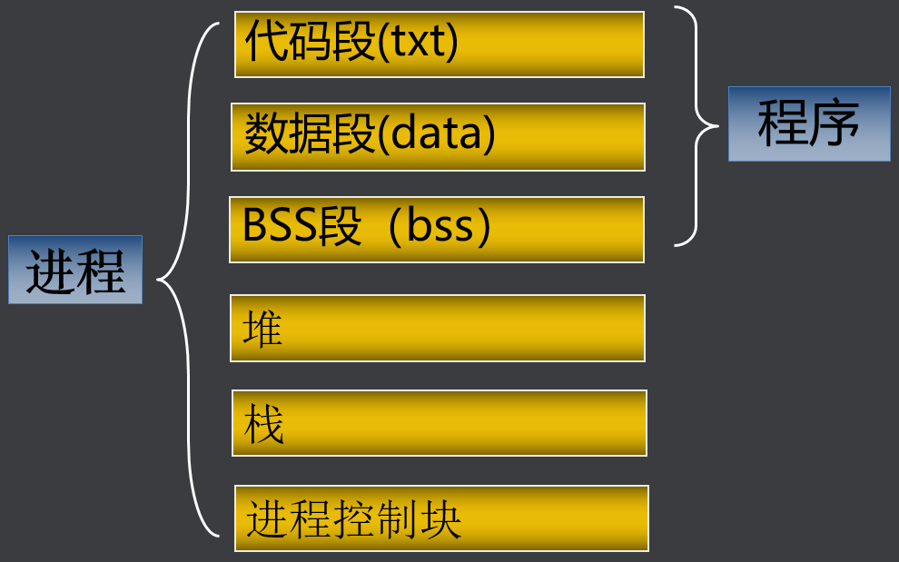
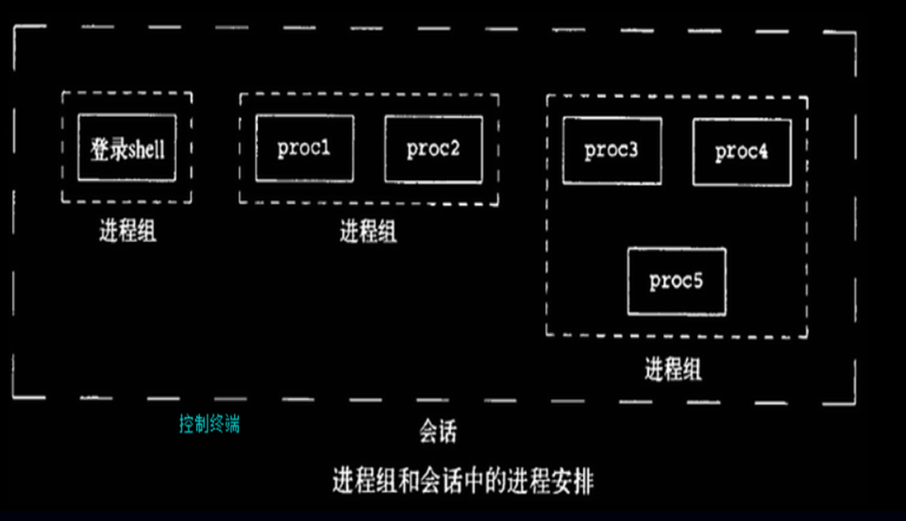

## 一、基本概念

### （一）进程含义

#### 1、什么是程序

存放在磁盘上的指令和数据的有序集合（文件） 静态的

#### 2、什么是进程

执行一个程序所分配的资源的总称，进程是程序的一次执行过程，动态的，包括创建、调度、执行和消亡

### （二）进程内容



- BSS段：BSS段通常是指用来存放程序中未初始化的全局变量的一块内存区域。BSS是英文Block Started by Symbol的简称。

- 数据段：数据段通常是指用来存放程序中已初始化的全局变量的一块内存区域。

- 代码段：代码段通常是指用来存放程序执行代码的一块内存区域。这部分区域的大小在程序运行前就已经确定，在代码段中，也有可能包含一些只读的常数变量，例如字符串常量等。

- 堆（heap）：堆是用于存放进程运行中被动态分配的内存段，当进程调用malloc等函数分配内存时，新分配的内存就被动态添加到堆上（堆被扩张）；当利用free等函数释放内存时，被释放的内存从堆中被剔除（堆被缩减）

- 栈(stack)：栈又称堆栈， 是用户存放程序临时创建的局部变量，（但不包括static声明的变量，static意味着在数据段中存放变量）。除此以外，在函数被调用时，其参数也会被压入发起调用的进程栈中，并且待到调用结束后，函数的返回值也会被存放回栈中。由于栈的先进后出特点，所以栈特别方便用来保存/恢复调用现场。从这个意义上讲，我们可以把堆栈看成一个寄存、交换临时数据的内存区。
- 进程控制块（pcb) ：进程标识PID、 进程用户进程状态、优先级、文件描述符表

### （三）进程类型

- 交互进程：在shell下启动。以在前台运行，也可以在后台运行
- 批处理进程：和在终端无关，被提交到一个作业队列中以便顺序执行
- 守护进程：和终端无关，一直在后台运行

### （四）进程状态

- 运行态：进程正在运行，或者准备运行
- 等待态：进程在等待一个事件的发生或某种系统资源。可中断、不可中断
- 停止态：进程被中止，收到信号后可继续运行
- 死亡态：已终止的进程，但pcb没有被释放


## 二、进程基础

### （一）查看进程信息

>ps     查看系统进程快照
>
>top    查看进程动态信息
>
>/proc  查看进程详细信息
>
> 
>
>ps 命令详细参数：
>
>-e：显示所有进程
>
>-l：长格式显示更加详细的信息
>
>-f 全部列出，通常和其他选项联用

| **表头** | **含义**                                                     |
| -------- | ------------------------------------------------------------ |
| F        | 进程标志，说明进程的权限，常见的标志有两个:   ·           1：进程可以被复制，但是不能被执行；   ·           4：进程使用超级用户权限； |
| S        | 进程状态。进程状态。常见的状态有以下几种：   1.        -D：不可被唤醒的睡眠状态，通常用于 I/O 情况。   2.        -R：该进程正在运行。   3.        -S：该进程处于睡眠状态，可被唤醒。   4.        -T：停止状态，可能是在后台暂停或进程处于除错状态。   5.        -W：内存交互状态（从 2.6 内核开始无效）。   6.        -X：死掉的进程（应该不会出现）。   7.        -Z：僵尸进程。进程已经中止，但是部分程序还在内存当中。   8.        -<：高优先级（以下状态在 BSD 格式中出现）。   9.        -N：低优先级。   10.  -L：被锁入内存。   11.  -s：包含子进程。   12.  -l：多线程（小写 L）。   13.  -+：位于后台。 |
| UID      | 运行此进程的用户的 ID；                                      |
| PID      | 进程的 ID；                                                  |
| PPID     | 父进程的 ID；                                                |
| C        | 该进程的 CPU 使用率，单位是百分比；                          |
| PRI      | 进程的优先级，数值越小，该进程的优先级越高，越早被 CPU 执行； |
| NI       | 进程的优先级，数值越小，该进程越早被执行；                   |
| ADDR     | 该进程在内存的哪个位置；                                     |
| SZ       | 该进程占用多大内存；                                         |
| WCHAN    | 该进程是否运行。"-"代表正在运行；                            |
| TTY      | 该进程由哪个终端产生；                                       |
| TIME     | 该进程占用 CPU 的运算时间，注意不是系统时间；                |
| CMD      | 产生此进程的命令名；                                         |

>top    查看进程动态信息
>
>shift +> 后翻页
>
>shift +< 前翻页
>
>top -p PID  查看某个进程

### （二）改变进程优先级

nice   按用户指定的优先级运行进程

> nice [-n NI值] 命令

NI 范围是 -20~19。数值越大优先级越低

普通用户调整 NI 值的范围是 0~19，而且只能调整自己的进程。

普通用户只能调高 NI 值，而不能降低。如原本 NI 值为 0，则只能调整为大于 0。

只有 root 用户才能设定进程 NI 值为负值，而且可以调整任何用户的进程。

renice   改变正在运行进程的优先级

> renice [优先级] PID

### （三）查看进程

>jobs  查看后台进程
>
>bg    将挂起的进程在后台运行
>
>fg     把后台运行的进程放到前台运行

ctrl+z  把运行的前台进程转为后台并停止。

./test &  把test程序后台运行

## 三、进程的创建与结束

### （一）创建子进程

#### 1、创建单进程

```c
#include  <unistd.h>
 pid_t  fork(void);

```

>创建新的进程，失败时返回-1
>成功时父进程返回子进程的进程号，子进程返回0
>通过fork的返回值区分父进程和子进程

```c
#include <stdio.h>
#include <unistd.h>

int main() {

    pid_t pid;
    printf("before fork\n");
    pid = fork();
    if(pid > 0) {
        printf("This is father process\n");
        printf("pid=%d\n", getpid());
        printf("father after fork");
        while(1) {
            sleep(1);
            printf("father sleep\n");
        }
    }else if(pid == 0) {
            printf("this is child process\n");
            printf("pid=%d\n", getpid());
            while(1) {

                sleep(1);
                printf("child sleep");

            }
        } else if(pid<0){
            perror("fork");
            return 0;
        }

}
```

#### 2、创建多进程

```c
#include <stdio.h>
#include <unistd.h>

int main() {

    pid_t pid;
    int i;

    for(i=0; i<5; i++) {

        pid = fork();
        if(pid < 0) {
            perror("fork");
            return 0;
        } else if( pid==0 ) {
            printf("child process\n");
            sleep(5);
            break;
        } else {
            printf("father process\n");
            sleep(5);
        }

    }

    sleep(100);

}
```

### （二）父子进程

- 子进程继承了父进程的内容

- 父子进程有独立的地址空间，互不影响

- 若父进程先结束
  - 子进程成为孤儿进程，被init进程收养
  - 子进程变成后台进程

- 若子进程先结束
  - 父进程如果没有及时回收，子进程变成僵尸进程

### （三）进程结束

- exit
- _exit

```c
#include <stdlib.h> 
#include <unistd.h>
 void  exit(int  status);
 void  _exit(int  status);
 void  _Exit(int  status);

```

- 结束当前的进程并将status返回
- exit结束进程时会刷新(流)缓冲区

```c
#include <stdio.h>
#include <stdlib.h>

int main(void) {

    printf("this process will exit");
    exit(0);
    printf("never be displayed");

}
```

- return 和exit的区别

main函数结束时会隐式地调用exit函数，普通函数return是返回上一级。

### （四）进程回收(wait & waitpid)

子进程结束时由父进程回收，孤儿进程由init进程回收，若没有及时回收会出现僵尸进程

```c
  #include <sys/wait.h>
  pid_t wait(int *status); 

```

>成功时返回回收的子进程的进程号；失败时返回EOF
>
> 若子进程没有结束，父进程一直阻塞
>
> 若有多个子进程，哪个先结束就先回收
>
> status 指定保存子进程返回值和结束方式的地址
>
> status为NULL表示直接释放子进程PCB,不接收返回值

```c
#include  <unistd.h>
pid_t waitpid(pid_t pid, int *status, int option);

```

>参数：
>pid
>pid>0时，只等待进程ID等于pid的子进程，不管其它已经有多少子进程运行结束退出了，只要指定的子进程还没有结束，waitpid就会一直等下去。
>pid=-1时，等待任何一个子进程退出，没有任何限制，此时waitpid和wait的作用一模一样。
>pid=0时，等待同一个进程组中的任何子进程，如果子进程已经加入了别的进程组，waitpid不会对它做任何理睬。
>pid<-1时，等待一个指定进程组中的任何子进程，这个进程组的ID等于pid的绝对值。
>
>pid可用于指定回收哪个子进程或任意子进程
>
>
>
>options
>
>options提供了一些额外的选项来控制waitpid，目前在Linux中只支持WNOHANG和WUNTRACED两个选项，这是两个常数，可以用"|"运算符把它们连接起来使用
>
>WNOHANG ：若由pid指定的子进程未发生状态改变(没有结束)，则waitpid()不阻塞，立即返回0
>
>WUNTRACED： 返回终止子进程信息和因信号停止的子进程信息
>
> wait(wait_stat) 等价于waitpid(-1,wait_stat,0) 

```c
#include <stdio.h>
#include <stdlib.h>
#include <unistd.h>
#include <sys/wait.h>

int main(void) {

    int status;
    pid_t pid;
    pid_t rpid;
    pid = fork();

    if(pid < 0) {
        perror("fork");
        exit(1);
    } else if(pid == 0) {
        sleep(10);
        printf("child will exit\n");
        exit(0);
    } else if(pid > 0) {
//        wait(&status);
        waitpid(-1,&status,WNOHANG);
        sleep(20);
        printf("Get child status=%x\n", WEXITSTATUS(status));
    }

    while(1) {
        sleep(1);
    }

}
```

## 四、exec函数族

### （一）execl & execlp

fork创建进程之后，子进程和父进程执行相同的代码，但是在实际开发当中，我们希望父子进程执行不同的代码。

- 进程调用exec函数族执行某个程序

- 进程当前内容被指定的程序替换

- 实现让父子进程执行不同的程序

  - 父进程创建子进程

  - 子进程调用exec函数族

  - 父进程不受影响

```c
#include  <unistd.h>
int execl(const char *path, const char *arg, …);
int execlp(const char *file, const char *arg, …);
```

-  成功时执行指定的程序；失败时返回EOF

- path   执行的程序名称，包含路径

- arg…  传递给执行的程序的参数列表

- file   执行的程序的名称，在PATH中查找

注意：两个函数区别execlp不需要写文件名全路径，在PATH查找

>最后一个参数必须用空指针(NULL)作结束
>
>进程当前内容被指定的程序替换，但进程号不变
>
>第0个参数必须要写，虽然它没有使用

**execlp**:

```c
#include <stdio.h>
#include <unistd.h>

int main(void) {

    printf("before exec\n");
    if(execlp("/bin/ls", "ls", "-a", "-l", "./", NULL) < 0) {
        perror("execlp");
    }

}
```

**execl**:

```c
#include <stdio.h>
#include <unistd.h>

int main() {

    pid_t pid;
    printf("before exec\n");
    pid = fork();
    if(pid == 0) {
        if(execl("/bin/ls", "-a", "-l", "./", NULL) < 0) {
            perror("execl");
        }
    }
    printf("after execl\n");

}
```

### （二）execv & execvp

```c
#include  <unistd.h>
int execv(const char *path, char *const argv[]);
int execvp(const char *file, char *const argv[]);

```

- 成功时执行指定的程序；失败时返回EOF

- arg… 封装成指针数组的形式

```c
#include <stdio.h>
#include <unistd.h>

int main(void) {

    char *argv[] = {"ls", "-a", "-l", "./", NULL};

//    if(execv("/bin/ls", argv) < 0) {
//        perror("execv");
//    }
      if(execvp("ls", argv) < 0) {
        perror("execv");
    }

}
```

### （三）system

```c
#include  <stdlib.h>
int system(const char *command);

```

- 成功时返回命令command的返回值；失败时返回EOF
- 当前进程等待command执行结束后才继续执行

```c
#include <stdio.h>
#include <stdlib.h>

int main(void) {

    system("ls -a -l ./");

}
```

## 五、守护进程

### （一）基本内容

守护进程(Daemon Process)是Linux三种进程类型之一，是 Linux 中的后台服务进程，是一个生存期较长的进程，通常独立于控制终端并且周期性地执行某种任务或等待处理某些发生的事件

**特点**：

- 始终在后台运行
- 独立于任何终端
- 周期性的执行某种任务或等待处理特定事件

**相关概念**：

进程组（Process Group）：进程集合，每个进程组有一个组长（Leader），其进程 ID 就是该进程组 ID。

会话（Session）： 进程组集合，每个会话有一个组长，其进程 ID 就是该会话组 ID。

控制终端（Controlling Terminal）：每个会话可以有一个单独的控制终端，与控制终端连接的 Leader 就是控制进程（Controlling Process）。



**举例**：

http 服务的守护进程叫 httpd，mysql 服务的守护进程叫 mysqld。

更简便地创建守护进程： nohup 命令

```c
nohup  xxxx  &
```

**函数介绍**：

- setsid函数：

pid_t setsid(void);

成功：返回调用进程的会话ID；失败：-1，设置errno。
调用了setsid函数的进程，既是新的会长，也是新的组长

- getsid函数

pid_t getsid(pid_t pid)

成功：返回调用进程的会话ID；失败：-1，设置errno

>1.pid为0表示察看当前进程session ID
>
>2.ps ajx命令查看系统中的进程。参数a表示不仅列当前用户的进程,也列出所有其他用户的进程,参数x表示不仅列有控制终端的进程,也列出所有无控制终端的进程,参数j表示列出与作业控制相关的信息。
>
>3.组长进程不能成为新会话首进程,新会话首进程必定会成为组长进程。

getpid：pid_t getpid(void);       获取进程id

getpgid：pid_t getpgid(pid_t pid);   获取进程组id

### （二）守护进程创建

- 创建子进程，父进程退出

```c
if (fork() > 0)  {
    exit(0);
}

```

>子进程变成孤儿进程，被init进程收养
>
>子进程在后台运行

- 子进程创建新会话

```c
if (setsid() < 0)  {
        exit(-1);
     }

```

>子进程成为新的会话组长
>
>子进程脱离原先的终端

- 更改当前工作目录

```c
chdir(“/”);
chdir(“/tmp”);
```

>守护进程一直在后台运行，其工作目录不能被卸载
>
> 重新设定当前工作目录cwd

- 重设文件权限掩码

```c
if (umask(0) < 0)  {
        exit(-1);
     }
```

>文件权限掩码设置为0
>
>只影响当前进程

- 关闭打开的文件描述符

```c
int  i;
     for(i=0; i<3; i++) {
        close(i);
     }

```

>关闭所有从父进程继承的打开文件
>
>已脱离终端，stdin / stdout / stderr无法再使用

```c
#include <stdio.h>
#include <unistd.h>
#include <stdlib.h>
#include <sys/stat.h>

int main(void) {

    pid_t pid;
    pid = fork();
    if(pid < 0) {
        perror("fork");
        return 0;
    } else if(pid > 0) {
        exit(0);
    }
    printf("I am daemon\n");
    printf("sid=%d,pid=%d,pgid=%d\n",getsid(getpid()),getpid(),getpgid(getpid()));

    if(setsid() < 0) {
        perror("setsid");
        exit(0);
    }

    printf("after sid=%d,pid=%d,pgid=%d\n",getsid(getpid()),getpid(),getpgid(getpid()));
    chdir("/");

    if(umask(0) < 0) {
        perror("umask");
        exit(0);
    }

    close(0);
    close(1);
    close(2);

    printf("after close \n");

    sleep(100);

}
```

## 六、GDB调试多进程

set follow-fork-mode child     设置GDB调试子进程

set follow-fork-mode parent   设置GDB调试父进程

set detach-on-fork  on/off    设置GDB跟踪调试单个进程或多个

on: 只调试父进程或子进程的其中一个，(根据follow-fork-mode来决定)，这是默认的模式

off：父子进程都在gdb的控制之下，其中一个进程正常调试(根据follow-fork-mode来决定),另一个进程会被设置为暂停状态。

info inferiors    显示GDB调试的进程

inferiors  进程序号（1,2,3....）  切换GDB调试的进程


