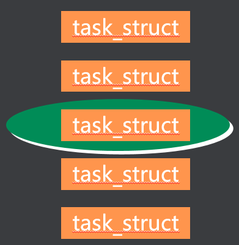
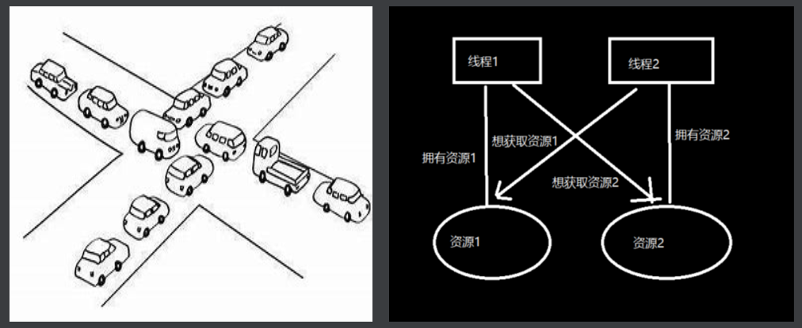

## 一、线程概念

进程有独立的地址空间，Linux为每个进程创建`task_struct`，每个进程都参与内核调度，互不影响，但是进程在切换时系统开销大，所以很多操作系统引入了轻量级进程LWP，同一进程中的线程共享相同地址空间，Linux不区分进程、线程。

**线程特点**：

- 通常线程指的是共享相同地址空间的多个任务
- 使用多线程的好处
  - 大大提高了任务切换的效率
  - 避免了额外的TLB & cache的刷新



**线程共享资源**：

一个进程中的多个线程共享以下资源：

- 可执行的指令
- 静态数据
- 进程中打开的文件描述符
- 当前工作目录
- 用户ID
- 用户组ID

**线程私有资源**：

每个线程私有的资源包括：

- 线程ID (TID)
- PC(程序计数器)和相关寄存器
- 堆栈
- 错误号 (errno)
- 优先级
- 执行状态和属性

## 二、线程创建

#### 1、Linux线程库

**pthread线程库中提供了如下基本操作**：

- 创建线程
- 回收线程
- 结束线程

**同步和互斥机制**：

- 信号量
- 互斥锁

#### 2、线程创建– pthread_create
```c
#include  <pthread.h>
 int  pthread_create(pthread_t *thread, const
       pthread_attr_t *attr, void *(*routine)(void *), void *arg);

```

成功返回0，失败时返回错误码

- thread 线程对象

- attr 线程属性，NULL代表默认属性

- routine 线程执行的函数

- arg 传递给routine的参数 ，参数是void * ，注意传递参数格式

**单线程创建**：

```c
#include <stdio.h>
#include <pthread.h>
#include <unistd.h>

void *testThread(void *arg) {
    printf("this is thread test, pid=%d, tid=%lu\n", getpid(), pthread_self());
    printf("input arg=%d\n",(int)arg);
    pthread_exit(NULL);
    printf("after pthread exit\n");
}

int main() {

    pthread_t tid;
    int ret;
    int arg = 5;

    ret = pthread_create(&tid, NULL, testThread, (void *)arg);

    printf("this is main thread, tid=%lu\n", tid);

    sleep(10);

}
```

**多线程创建**：

```c
#include <pthread.h>
#include <stdio.h>
#include <unistd.h>

void *testThread(void *arg){

    printf("this is thread test, pid=%d, tid=%lu\n", getpid(), pthread_self());
    printf("this is %d thread\n", (int)arg);
    while(1) {
        sleep(1);
    }

}

int main() {

    pthread_t tid[5];
    int ret;
    int arg = 5;
    int i;

    for(i=0; i<5;i++) {
        ret = pthread_create(&tid[i], NULL, testThread, (void *)i);
        printf("this is main thread, tid=%lu\n", tid[i]);
    }

    while(1) {

        sleep(1);

    }

}
```

#### 3、线程结束– pthread_exit
```c
#include  <pthread.h>
 void  pthread_exit(void *retval);

```

- 结束当前线程

- retval可被其他线程通过pthread_join获取

- 线程私有资源被释放

#### 4、线程查看– tid函数

```c
pthread_t  pthread_self(void)   //查看自己的TID
#include <pthread.h>
pthread_t pthread_self(void);

```

#### 5、线程回收– pthread_join

```c
#include  <pthread.h>
 int  pthread_join(pthread_t thread, void **retval);

```

对于一个默认属性的线程 A来说，线程占用的资源并不会因为执行结束而得到释放 。

- 成功返回0，失败时返回错误码

- thread 要回收的线程对象

- 调用线程阻塞直到thread结束

- *retval 接收线程thread的返回值

```c
#include <stdio.h>
#include <pthread.h>
#include <unistd.h>

void *func(void *arg) {

    printf("this is child thread\n");
    sleep(25);
    pthread_exit("thread return");

}


int main() {

    pthread_t tid[100];
    void *retv;
    int i;

    for(i=0; i<100; i++) {
        pthread_create(&tid[i], NULL, func, NULL);
    }

    for(i=0; i<100; i++) {

        pthread_join(tid[1], &retv);
        printf("thread ret=%s\n", (char *)retv); //ret=thread return

    }

    while(1) {
        sleep(1);
    }

}
```

#### 6、线程分离– pthead_detach(线程回收的第二种方式)

**方式一**：

```c
int pthread_detach(pthread_t thread);    //成功：0；失败：错误号

```

指定该状态，线程主动与主控线程断开关系。线程结束后（不会产生僵尸线程）

```c
#include <stdio.h>
#include <pthread.h>
#include <unistd.h>


void *func() {

    pthread_detach(pthread_self());
    printf("this is child thread\n");
    sleep(25);
    pthread_exit("thread return!");

}

int main() {

    pthread_t tid[100];
    void *retv;
    int i;

    for(i=0; i<100; i++) {

        pthread_create(&tid[i], NULL, func, NULL);

    }
    while(1) {
        sleep(1);
    }

}
```

**方式二**：

**设置线程属性为分离**：

>pthread_attr_t attr;       //通过线程属性来设置游离态（分离态）
>
>pthread_attr_init(&attr);
>
>pthread_attr_setdetachstate(&attr, PTHREAD_CREATE_DETACHED);

```c
#include <pthread.h>
#include <stdio.h>
#include <unistd.h>

void *func(void *arg) {
    printf("this is child thread\n");
    sleep(25);
    pthread_exit("thread return");
}

int main() {

    pthread_t tid[1000];
    void *retv;
    int i;
    pthread_attr_t attr;
    pthread_attr_init(&attr);
    pthread_attr_setdetachstate(&attr, PTHREAD_CREATE_DETACHED);

    for(i=0; i<1000; i++) {

        pthread_create(&tid[i], &attr, func, NULL);

    }

    while(1) {

        sleep(1);

    }


}
```

#### 7、取消一个线程

- int pthread_cancel(pthread_t thread);     杀死一个线程
- void pthread_testcancel(void);
- int pthread_setcancelstate(int state, int *oldstate);
- PTHREAD_CANCEL_ENABLE
- PTHREAD_CANCEL_DISABLE
- int pthread_setcanceltype(int type, int *oldtype);
- PTHREAD_CANCEL_DEFERRED                
- PTHREAD_CANCEL_ASYNCHRONOUS     

>意义：随时杀掉一个线程
>
>int pthread_cancel(pthread_t thread);
>
>注意：线程的取消要有取消点才可以，不是说取消就取消，线程的取消点主要是阻塞的系统调用
>
>
>
>如果没有取消点，手动设置一个
>
>void pthread_testcancel(void);
>
>
>
>设置取消使能或禁止
>
>int pthread_setcancelstate(int state, int *oldstate);
>
>PTHREAD_CANCEL_ENABLE
>
>PTHREAD_CANCEL_DISABLE
>
>
>
>设置取消类型
>
>int pthread_setcanceltype(int type, int *oldtype);
>
>PTHREAD_CANCEL_DEFERRED                等到取消点才取消
>
>PTHREAD_CANCEL_ASYNCHRONOUS           目标线程会立即取消

```c
#include <stdio.h>
#include <pthread.h>
#include <unistd.h>

void *func(void *arg) {
    printf("This is child thread\n");
    pthread_setcancelstate(PTHREAD_CANCEL_DISABLE, NULL);
    {
        sleep(5);
        pthread_testcancel();
    }
    pthread_setcancelstate(PTHREAD_CANCEL_ENABLE, NULL);
    while(1) {
        sleep(1);
    }
    pthread_exit("thread return");
}

int main() {

    pthread_t tid;
    void *retv;
    int i;
    pthread_create(&tid, NULL,func, NULL);
    sleep(1);
    pthread_cancel(tid);
    pthread_join(tid, &retv);
    while(1) {
        sleep(1);
    }

}
```

#### 8、线程清理

- void pthread_cleanup_push(void (*routine) (void *), void *arg)
- void pthread_cleanup_pop(int execute)

>必要性： 当线程非正常终止，需要清理一些资源。
>
>void pthread_cleanup_push(void (*routine) (void *), void *arg)
>
>void pthread_cleanup_pop(int execute)
>
>
>
>routine 函数被执行的条件：
>
>1. 被pthread_cancel取消掉。
>
>2. 执行pthread_exit 
>
>3. 非0参数执行pthread_cleanup_pop()
>
> 
>
>注意：
>
>1.必须成对使用，即使pthread_cleanup_pop不会被执行到也必须写上，否则编译错误
>
>2.pthread_cleanup_pop()被执行且参数为0，pthread_cleanup_push回调函数routine不会被执行.
>
>3.pthread_cleanup_push 和pthread_cleanup_pop可以写多对，routine执行顺序正好相反
>
>4.线程内的return 可以结束线程，也可以给pthread_join返回值，但不能触发pthread_cleanup_push里面的回调函数，所以我们结束线程尽量使用pthread_exit退出线程。

```c
#include <pthread.h>
#include <stdio.h>
#include <unistd.h>

void cleanup(void *arg) {
    printf("cleanup, arg=%s\n", (char*)arg);
}

void cleanup2(void *arg) {
    printf("cleanup2, arg=%s\n", (char*)arg);
}

void *func(void *arg) {

    printf("this is child thread\n");
    pthread_setcanceltype(PTHREAD_CANCEL_ASYNCHRONOUS, NULL);
    pthread_cleanup_push(cleanup, "abcd");
    pthread_cleanup_push(cleanup2, "efgh");

    {
        sleep(1);
    }

//    return "1234";

//    while(1) {
//        printf("sleep\n");
//        sleep(1);
//    }

    pthread_cleanup_pop(1);
    pthread_cleanup_pop(1);
    sleep(10);
    pthread_exit("thread return");

}

int main() {
    pthread_t tid;
    void *retv;
    int i;
    pthread_create(&tid, NULL, func, NULL);
    sleep(1);
    pthread_join(tid, &retv);
    printf("thread ret=%s\n", (char*)retv);
    while(1) {
        sleep(1);
    }


}
```

## 三、线程的同步与互斥

### （一）互斥

- 临界资源

 一次只允许一个任务(进程、线程)访问的共享资源

- 临界区

访问临界资源的代码

- 互斥机制

mutex互斥锁

任务访问临界资源前申请锁，访问完后释放锁

### （二）互斥锁

#### 1、互斥锁初始化– pthread_mutex_init
```c
#include  <pthread.h>
 int  pthread_mutex_init(pthread_mutex_t *mutex,
       const pthread_mutexattr_t *  attr);

```

- 成功时返回0，失败时返回错误码
- mutex  指向要初始化的互斥锁对象
- attr  互斥锁属性，NULL表示缺省属性
- man 函数出现 No manual entry for pthread_mutex_xxx解决办法  apt-get install manpages-posix-dev 

>两种方法创建互斥锁，**静态方式**和**动态方式**
>
>**动态方式：**
>
>int pthread_mutex_init(pthread_mutex_t *restrict mutex,const pthread_mutexattr_t *restrict attr);
>
>其中mutexattr用于指定互斥锁属性，如果为NULL则使用缺省属性。
>
>**静态方式：**
>
>pthread_mutex_t mutex = PTHREAD_MUTEX_INITIALIZER;

#### 2、互斥锁销毁 pthread_mutex_destroy

```c
int pthread_mutex_destroy(pthread_mutex_t *mutex)

```

>在Linux中，互斥锁并不占用任何资源，因此LinuxThreads中的 pthread_mutex_destroy()除了检查锁状态以外（锁定状态则返回EBUSY）没有其他动作。

#### 3、申请锁 – pthread_mutex_lock

```c
#include  <pthread.h>
 int  pthread_mutex_lock(pthread_mutex_t *mutex);
 int pthread_mutex_trylock(pthread_mutex_t *mutex)

```

- 成功时返回0，失败时返回错误码
- mutex  指向要初始化的互斥锁对象
- pthread_mutex_lock 如果无法获得锁，任务阻塞
- pthread_mutex_trylock 如果无法获得锁，返回EBUSY而不是挂起等待

#### 4、释放锁 – pthread_mutex_unlock

```c
#include  <pthread.h>
 int  pthread_mutex_unlock(pthread_mutex_t *mutex);

```

- 成功时返回0，失败时返回错误码
- mutex  指向要初始化的互斥锁对象
- 执行完临界区要及时释放锁

```c
#include <stdio.h>
#include <unistd.h>
#include <pthread.h>
#include <string.h>

pthread_mutex_t mutex = PTHREAD_MUTEX_INITIALIZER;

FILE *fp;

void *func2(void *arg) {

    pthread_detach(pthread_self());
    printf("This is func2 thread\n");
    char str[] = "You read func2 thread\n";
    char c;
    int i = 0;
    while(1) {
        pthread_mutex_lock(&mutex);
        while(i<strlen(str)) {
            c = str[i];
            fputc(c, fp);
            i++;
            usleep(1);
        }
        pthread_mutex_unlock(&mutex);
        i = 0;
        usleep(1);
    }
    pthread_exit("func2 exit");

}

void *func(void *arg) {

    pthread_detach(pthread_self());
    printf("This is func1 thread\n");
    char str[] = "You read func1 thread\n";
    char c;
    int i = 0;
    while(1) {
        pthread_mutex_lock(&mutex);
        while(i<strlen(str)) {
            c = str[i];
            fputc(c, fp);
            i++;
            usleep(1);
        }
        pthread_mutex_unlock(&mutex);
        i = 0;
        usleep(1);
    }
    pthread_exit("func1 exit");

}

int main() {

    pthread_t tid, tid2;
    void *retv;
    int i;

    fp = fopen("1.txt", "a+");
    if(fp == NULL) {
        perror("fopen");
        return 0;
    }

    pthread_create(&tid, NULL, func, NULL);
    pthread_create(&tid2, NULL, func2, NULL);

    while(1) {

        sleep(1);

    }

}
```

#### 5、读写锁

>初始化一个读写锁   pthread_rwlock_init
>
>读锁定读写锁        pthread_rwlock_rdlock
>
>非阻塞读锁定　　pthread_rwlock_tryrdlock
>
>写锁定读写锁      pthread_rwlock_wrlock
>
>非阻塞写锁定      pthread_rwlock_trywrlock
>
>解锁读写锁         pthread_rwlock_unlock
>
>释放读写锁         pthread_rwlock_destroy


>必要性：提高线程执行效率
>
>特性：
>
>写者：写者使用写锁，如果当前没有读者，也没有其他写者，写者立即获得写锁；否则写者将等待，直到没有读者和写者。
>
>读者：读者使用读锁，如果当前没有写者，读者立即获得读锁；否则读者等待，直到没有写者。 
>
>注意：
>
>同一时刻只有一个线程可以获得写锁，同一时刻可以有多个线程获得读锁。
>
>读写锁出于写锁状态时，所有试图对读写锁加锁的线程，不管是读者试图加读锁，还是写者试图加写锁，都会被阻塞。
>
>读写锁处于读锁状态时，有写者试图加写锁时，之后的其他线程的读锁请求会被阻塞，以避免写者长时间的不写锁

```c
#include <pthread.h>
#include <stdio.h>
#include <unistd.h>
#include <string.h>


pthread_rwlock_t rwlock;

FILE *fp;
void * read_func(void *arg){
    pthread_detach(pthread_self());
    printf("read thread\n");
    char buf[32]={0};
    while(1){
        //rewind(fp);
        pthread_rwlock_rdlock(&rwlock);
        while(fgets(buf,32,fp)!=NULL){
            printf("%d,rd=%s\n",(int)arg,buf);
            usleep(1000);
        }
        pthread_rwlock_unlock(&rwlock);
        sleep(1);
    }

}


void *func2(void *arg){
    pthread_detach(pthread_self());
    printf("This func2 thread\n");

    char str[]="I write func2 line\n";
    char c;
    int i=0;
    while(1){
        pthread_rwlock_wrlock(&rwlock);
        while(i<strlen(str))
        {
            c = str[i];
            fputc(c,fp);
            usleep(1);
            i++;
        }
        pthread_rwlock_unlock(&rwlock);
        i=0;
        usleep(1);

    }

    pthread_exit("func2 exit");

}

void *func(void *arg){
    pthread_detach(pthread_self());
    printf("This is func1 thread\n");
    char str[]="You read func1 thread\n";
    char c;
    int i=0;
    while(1){
        pthread_rwlock_wrlock(&rwlock);
        while(i<strlen(str))
        {
            c = str[i];
            fputc(c,fp);
            i++;
            usleep(1);
        }
        pthread_rwlock_unlock(&rwlock);
        i=0;
        usleep(1);

    }
    pthread_exit("func1 exit");
}


int main(){
    pthread_t tid1,tid2,tid3,tid4;
    void *retv;
    int i;
    fp = fopen("1.txt","a+");
    if(fp==NULL){
        perror("fopen");
        return 0;
    }
    pthread_rwlock_init(&rwlock,NULL);
    pthread_create(&tid1,NULL,read_func,1);
    pthread_create(&tid2,NULL,read_func,2);
    pthread_create(&tid3,NULL,func,NULL);
    pthread_create(&tid4,NULL,func2,NULL);
    while(1){
        sleep(1);
    }

}

```

### （三）信号量

#### 1、什么是死锁



#### 2、条件变量

应用场景：生产者消费者问题，是线程同步的一种手段。

必要性：为了实现等待某个资源，让线程休眠。提高运行效率

```c
pthread_cond_wait(&m_cond,&m_mutex); 
int pthread_cond_timedwait(pthread_cond_t *restrict cond,
           pthread_mutex_t *restrict mutex,
           const struct timespec *restrict abstime);
int pthread_cond_signal(pthread_cond_t *cond);
int pthread_cond_broadcast(pthread_cond_t *cond);

```

**使用步骤**：

初始化：

静态初始化

```c
pthread_cond_t   cond = PTHREAD_COND_INITIALIZER;      //初始化条件变量
pthread_mutex_t  mutex = PTHREAD_MUTEX_INITIALIZER;  //初始化互斥量
```

或使用动态初始化

```c
pthread_cond_init(&cond);
```

生产资源线程：

```c
pthread_mutex_lock(&mutex);
```

开始产生资源

```c
pthread_cond_sigal(&cond);    //通知一个消费线程
```

或者

```c
pthread_cond_broadcast(&cond); //广播通知多个消费线程
pthread_mutex_unlock(&mutex);
```

消费者线程：

 ```c
pthread_mutex_lock(&mutex);

while （如果没有资源）{   //防止惊群效应

pthread_cond_wait(&cond, &mutex); 

}
 ```

有资源了，消费资源

```c
pthread_mutex_unlock(&mutex);
```

注意：

> pthread_cond_wait(&cond, &mutex)，在没有资源等待是是先unlock 休眠，等资源到了，再lock
>
> 所以pthread_cond_wait he pthread_mutex_lock 必须配对使用。


