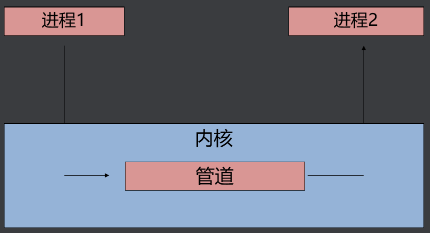
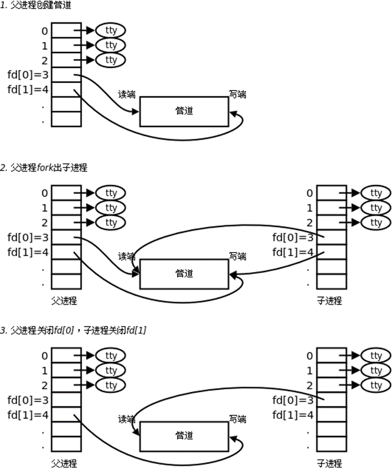

## 一、进程间通信的方式

进程间通信就是进程和进程之间交换信息。

#### 1、常用通信方式

- 无名管道（pipe）
- 有名管道 （fifo）
- 信号（signal）
- 共享内存(mmap)
- 套接字（socket）

#### 2、过时的IPC通信方式

- System V IPC
- 共享内存（share memory）
- 消息队列（message queue）
- 信号灯集（semaphore set）

## 二、无名管道

#### 1、原理

>int pipe(int pfd[2]); 成功：0；失败：-1，设置errno
>
>pfd[0] 为读描述符
>
>pfd[1] 为写描述符

#### 2、注意事项

- 只能用于亲缘关系的进程间通信（父子进程，兄弟进程）
- 管道通信是单工的，一端读，一端写（程序实现设计好）。
-  数据自己读不能自己写
-  管道可以用于大于2个进程共享

#### 3、读写特性

- 读管道
  - 管道中有数据，read返回实际读到的字节数
  - 管道中无数据
    -  管道写端被全部关闭，read返回0 (好像读到文件结尾)
    - 写端没有全部被关闭，read阻塞等待(不久的将来可能有数据递达，此时会让出cpu)
- 写管道
  - 管道读端全部被关闭， 进程异常终止(也可使用捕捉SIGPIPE信号，使进程不终止)
  - 管道读端没有全部关闭
    - 管道已满，write阻塞。（管道大小64K）
    - 管道未满，write将数据写入，并返回实际写入的字节数

