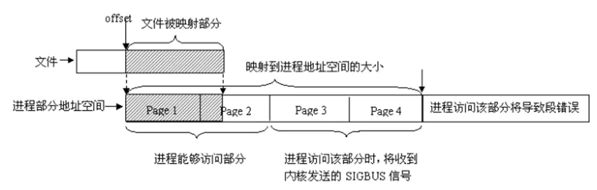

## 一、进程间通信的方式

进程间通信就是进程和进程之间交换信息。

#### 1、常用通信方式

- 无名管道（pipe）
- 有名管道 （fifo）
- 信号（signal）
- 共享内存(mmap)
- 套接字（socket）

#### 2、过时的IPC通信方式

- System V IPC
- 共享内存（share memory）
- 消息队列（message queue）
- 信号灯集（semaphore set）

## 二、无名管道

#### 1、原理


>int pipe(int pfd[2]); 成功：0；失败：-1，设置errno
>
>pfd[0] 为读描述符
>
>pfd[1] 为写描述符


#### 2、注意事项

- 只能用于亲缘关系的进程间通信（父子进程，兄弟进程）
- 管道通信是单工的，一端读，一端写（程序实现设计好）。
-  数据自己读不能自己写
-  管道可以用于大于2个进程共享

#### 3、读写特性

- 读管道
  - 管道中有数据，read返回实际读到的字节数
  - 管道中无数据
    -  管道写端被全部关闭，read返回0 (好像读到文件结尾)
    - 写端没有全部被关闭，read阻塞等待(不久的将来可能有数据递达，此时会让出cpu)
- 写管道
  - 管道读端全部被关闭， 进程异常终止(也可使用捕捉SIGPIPE信号，使进程不终止)
  - 管道读端没有全部关闭
    - 管道已满，write阻塞。（管道大小64K）
    - 管道未满，write将数据写入，并返回实际写入的字节数

## 三、有名管道（命名管道）

#### 1、创建管道

```c
#include <sys/types.h>
#include <sys/stat.h>
int mkfifo(const char *filename, mode_t mode);


open(const char *path, O_RDONLY);//1
open(const char *path, O_RDONLY | O_NONBLOCK);//2
open(const char *path, O_WRONLY);//3
open(const char *path, O_WRONLY | O_NONBLOCK);//4

```

#### 2、特点

- 有名管道可以使非亲缘的两个进程互相通信

- 通过路径名来操作，在文件系统中可见，但内容存放在内存中

- 文件IO来操作有名管道

- 遵循先进先出规则

- 不支持leek操作

- 单工读写

#### 3、注意事项

- 就是程序不能以O_RDWR(读写)模式打开FIFO文件进行读写操作，而其行为也未明确定义，因为如一个管道以读/写方式打开，进程可以读回自己的输出，同时我们通常使用FIFO只是为了单向的数据传递

- 第二个参数中的选项O_NONBLOCK，选项O_NONBLOCK表示非阻塞，加上这个选项后，表示open调用是非阻塞的，如果没有这个选项，则表示open调用是阻塞的

- 对于以只读方式（O_RDONLY）打开的FIFO文件，如果open调用是阻塞的（即第二个参数为O_RDONLY），除非有一个进程以写方式打开同一个FIFO，否则它不会返回；如果open调用是非阻塞的的（即第二个参数为O_RDONLY | O_NONBLOCK），则即使没有其他进程以写方式打开同一个FIFO文件，open调用将成功并立即返回。 

- 对于以只写方式（O_WRONLY）打开的FIFO文件，如果open调用是阻塞的（即第二个参数为O_WRONLY），open调用将被阻塞，直到有一个进程以只读方式打开同一个FIFO文件为止；如果open调用是非阻塞的（即第二个参数为O_WRONLY | O_NONBLOCK），open总会立即返回，但如果没有其他进程以只读方式打开同一个FIFO文件，open调用将返回-1，并且FIFO也不会被打开。 

- 数据完整性,如果有多个进程写同一个管道，使用O_WRONLY方式打开管道，如果写入的数据长度小于等于PIPE_BUF（4K），那么或者写入全部字节，或者一个字节都不写入，系统就可以确保数据决不会交错在一起。


## 四、内存映射

#### 1、概念

使一个磁盘文件与内存中的一个缓冲区相映射，进程可以像访问普通内存一样对文件进行访问，不必再调用read,write

**mmap()的优点**：

实现了用户空间和内核空间的高效交互方式


#### 2、创建映射

```c
void *mmap(void *addr, size_t length, int prot, int flags, int fd, off_t offset);
```

功能：创建共享内存映射

函数返回值：成功返回创建的映射区首地址，失败返回MAP_FAILED（ ((void *) -1) ），设置errno值

**参数说明**：

- addr：指定要映射的内存地址，一般设置为 NULL 让操作系统自动选择合适的内存地址。

- length：必须>0。映射地址空间的字节数，它从被映射文件开头 offset 个字节开始算起。

- prot：指定共享内存的访问权限。可取如下几个值的可选：PROT_READ（可读）, PROT_WRITE（可写）, PROT_EXEC（可执行）, PROT_NONE（不可访问）。

- flags：由以下几个常值指定：MAP_SHARED（共享的） MAP_PRIVATE（私有的）, MAP_FIXED（表示必须使用 start 参数作为开始地址，如果失败不进行修正），其中，MAP_SHARED , MAP_PRIVATE必选其一，而 MAP_FIXED 则不推荐使用。MAP_ANONYMOUS（匿名映射，用于血缘关系进程间通信）

- fd：表示要映射的文件句柄。如果匿名映射写-1。

- offset：表示映射文件的偏移量，一般设置为0 ，表示从文件头部开始映射。

**注意事项**：

- 创建映射区的过程中，隐含着一次对映射文件的读操作，将文件内容读取到映射区。
- 当MAP_SHARED时，要求：映射区的权限应 <=文件打开的权限(出于对映射区的保护)，如果不满足报非法参数（Invalid argument）错误。
- 当MAP_PRIVATE时，mmap中的权限是对内存的限制，只需要文件有读权限即可，操作只在内存有效，不会写到物理磁盘，且不能在进程间共享。
- 映射区的释放与文件关闭无关，只要映射建立成功，文件可以立即关闭。
- 用于映射的文件大小必须>0，当映射文件大小为0时，指定非0大小创建映射区，访问映射地址会报总线错误，指定0大小创建映射区，报非法参数错误（Invalid argument）
- 文件偏移量必须为0或者4K的整数倍（不是会报非法参数Invalid argument错误）
- mmap创建映射区出错概率非常高，一定要检查返回值，确保映射区建立成功再进行后续操作
- 映射大小可以大于文件大小，但只能访问文件page的内存地址，否则报总线错误 ，超出映射的内存大小报段错误




#### 3、mmap()映射的种类

- 基于文件的映射
- 匿名映射（适用于具有亲缘关系的进程之间）

#### 4、释放内存的映射

```c
int munmap(void *addr, size_t length);
```

- 返回值：成功返回0，失败返回-1，并设置errno值

**函数参数**：

- addr：调用mmap函数成功返回的映射区首地址
- length：映射区大小（即：mmap函数的第二个参数）

## 五、System V 共享内存

#### 1、IPC的key


#### 2、ftok函数

```c
key_t  ftok(const char *path,  int id);
```

其中参数path是指定的文件名，这个文件必须是存在的而且可以访问的。id是子序号，它是一个8bit的整数。即范围是0~255。当函数执行成功，则会返回key_t键值，否则返回-1。在一般的UNIX中，通常是将文件的索引节点取出，然后在前面加上子序号就得到key_t的值

#### 3、system V 共享内存使用步骤

- 创建/打开共享内存

- 映射共享内存，即把指定的共享内存映射到进程的地址空间用于访问

- 读写共享内存

- 撤销共享内存映射

- 删除共享内存对象

>查看共享内存命令ipcs

**共享内存创建 – shmget**：

```c
void  *shmat(int shmid, const void *shmaddr, int shmflg);
```

- 第二个参数一般写NULL，表示自动映射

- 第三参数一般写0 ，表示可读写

**共享内存映射**:

```c
void  *shmat(int shmid, const void *shmaddr, int shmflg);
```

- 第二个参数一般写NULL，表示自动映射
- 第三参数一般写0 ，表示可读写

**共享内存撤销**:

```c
int  shmdt(void *shmaddr);
```

- 撤销后，内存地址不可再访问

**共享内存控制**:

```c
int  shmctl(int shmid, int cmd, struct shmid_ds *buf);
shmctl(shmid, IPC_RMID, NULL); //删除共享内存
```


