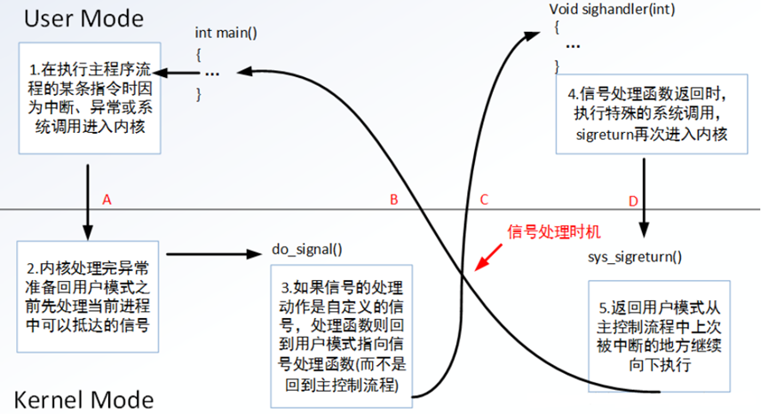

## 一、什么是信号

#### 1、概念

信号是在软件层次上对中断机制的一种模拟，是一种异步通信方式 ，所有信号的产生及处理全部都是由内核完成的。

#### 2、信号的产生

- 按键产生

- 系统调用函数产生（比如raise， kill）

- 硬件异常

- 命令行产生 （kill）

- 软件条件（比如被0除，访问非法内存等）

#### 3、信号处理方式

- 缺省方式

- 忽略信号

- 捕捉信号

**常用信号**：

| 信号名  | 含义                                                         | 默认操作 |
| :------ | ------------------------------------------------------------ | -------- |
| SIGHUP  | 该信号在用户终端关闭时产生，通常是发给和该   终端关联的会话内的所有进程 | 终止     |
| SIGINT  | 该信号在用户键入INTR字符(Ctrl-C)时产生，内   核发送此信号送到当前终端的所有前台进程 | 终止     |
| SIGQUIT | 该信号和SIGINT类似，但由QUIT字符(通常是   Ctrl-\)来产生      | 终止     |
| SIGILL  | 该信号在一个进程企图执行一条非法指令时产生                   | 终止     |
| SIGSEV  | 该信号在非法访问内存时产生，如野指针、缓   冲区溢出          | 终止     |
| SIGPIPE | 当进程往一个没有读端的管道中写入时产生，代   表“管道断裂”    | 终止     |

| 信号名    | 含义                                                         | 默认操作 |
| --------- | ------------------------------------------------------------ | -------- |
| SIGKILL   | 该信号用来结束进程，并且不能被捕捉和忽略                     | 终止     |
| SIGSTOP   | 该信号用于暂停进程，并且不能被捕捉和忽略                     | 暂停进程 |
| SIGTSTP   | 该信号用于暂停进程，用户可键入SUSP字符(   通常是Ctrl-Z)发出这个信号 | 暂停进程 |
| SIGCONT   | 该信号让进程进入运行态                                       | 继续运行 |
| SIGALRM   | 该信号用于通知进程定时器时间已到                             | 终止     |
| SIGUSR1/2 | 该信号保留给用户程序使用                                     | 终止     |
| SIGCHLD   | 是子进程状态改变发给父进程的。                               | 忽略     |

**信号命令**：

>kill [-signal] pid
>
>killall [-u  user | prog]

**信号函数**：

```c
int kill（pid_t pid, int signum）
```

- 功能：发送信号
- 参数

>pid:  > 0:发送信号给指定进程
>
>​       = 0：发送信号给跟调用kill函数的那个进程处于同一进程组的进程。
>
>​       < -1: 取绝对值，发送信号给该绝对值所对应的进程组的所有组员。
>
>​       = -1：发送信号给，有权限发送的所有进程。
>
> signum：待发送的信号

```c
int  raise(int sig);  // 给自己发信号，等价于kill(getpid(), signo);
```


## 二、定时器函数

#### 1、alarm

```c
unsigned int alarm(unsigned int seconds);
```

>功能：定时发送SIGALRM给当前进程
>
>参数：seconds：定时秒数
>
>返回值：上次定时剩余时间。

#### 2、ualarm （循环发送）

```c
ualarm （循环发送）
useconds_t ualarm(useconds_t usecs, useconds_t interval);
```

以useconds为单位，第一个参数为第一次产生时间，第二个参数为间隔产生

#### 3、setitimer

```c
int setitimer(int which, const struct itimerval *new_value, struct itimerval *old_value);
```

功能：定时的发送alarm信号

参数：

>which： ITIMER_REAL：以逝去时间递减。发送SIGALRM信号
>
>ITIMER_VIRTUAL: 计算进程（用户模式）执行的时间。 发送SIGVTALRM信号
>
>ITIMER_PROF: 进程在用户模式（即程序执行时）和核心模式（即进程调度用时）均计算时间。 发送SIGPROF信号
>
>new_value：  负责设定 timout 时间                  
>
>old_value：   存放旧的timeout值，一般指定为NULL
>
>struct itimerval {
>
>struct timeval it_interval;  // 闹钟触发周期
>
>struct timeval it_value;    // 闹钟触发时间
>
>};
>
>struct timeval {
>
>​    time_t      tv_sec;         /* seconds */
>
>​    suseconds_t tv_usec;        /* microseconds */
>
>};

## 三、信号捕捉




**信号捕捉过程：**

- 定义新的信号的执行函数handle。

- 使用signal/sigaction 函数，把自定义的handle和指定的信号相关联。

**signal函数**：

```c
typedef void (*sighandler_t)(int);
sighandler_t  signal(int signum, sighandler_t handler);
```

>功能：捕捉信号执行自定义函数
>
>返回值：成功时返回原先的信号处理函数，失败时返回SIG_ERR
>
>参数：
>
> signo 要设置的信号类型
>
> handler 指定的信号处理函数: SIG_DFL代表缺省方式; SIG_IGN 代表忽略信号;  
>
>系统建议使用sigaction函数，因为signal在不同类unix系统的行为不完全一样。

**sigaction函数：**

```c
int sigaction(int signum, const struct sigaction *act,struct sigaction *oldact);
struct sigaction {
    void (*sa_handler)(int);
    void (*sa_sigaction)(int, siginfo_t *, void *);
    sigset_t sa_mask;
    int sa_flags;
    void (*sa_restorer)(void);
}

```

>参数：
>
>signum：处理的信号
>
>act,oldact: 处理信号的新行为和旧的行为，是一个sigaction结构体。
>
>sigaction结构体成员定义如下：
>
>sa_handler： 是一个函数指针，其含义与 signal 函数中的信号处理函数类似
>
>sa_sigaction： 另一个信号处理函数，它有三个参数，可以获得关于信号的更详细的信息。
>
>sa_flags参考值如下：
>
>SA_SIGINFO：使用 sa_sigaction 成员而不是 sa_handler 作为信号处理函数
>
>SA_RESTART：使被信号打断的系统调用自动重新发起。
>
>SA_RESETHAND：信号处理之后重新设置为默认的处理方式。
>
>SA_NODEFER：使对信号的屏蔽无效，即在信号处理函数执行期间仍能发出这个信号。
>
>re_restorer：是一个已经废弃的数据域

## 四、定时器的实现

使用SIGCHLD信号实现回收子进程，SIGCHLD的产生条件：

- 子进程终止时

- 子进程接收到SIGSTOP信号停止时

- 子进程处在停止态，接受到SIGCONT后唤醒时

## 五、信号集及信号阻塞

#### 1、什么是信号阻塞

有时候不希望在接到信号时就立即停止当前执行，去处理信号，同时也不希望忽略该信号，而是延时一段时间去调用信号处理函数。这种情况可以通过阻塞信号实现。


**信号的状态**：

信号递达（Delivery ）：实际信号执行的处理过程(3种状态：忽略，执行默认动作，捕获)

信号未决（Pending）：从产生到递达之间的状态

#### 2、信号集操作函数

```c
sigset_t set;  自定义信号集。  是一个32bit  64bit  128bit的数组。

sigemptyset(sigset_t *set);	清空信号集

sigfillset(sigset_t *set);	全部置1

sigaddset(sigset_t *set, int signum);	将一个信号添加到集合中

sigdelset(sigset_t *set, int signum);	将一个信号从集合中移除

sigismember（const sigset_t *set，int signum); 判断一个信号是否在集合中。
```

>设定对信号集内的信号的处理方式(阻塞或不阻塞)

```c
#include <signal.h>
int sigprocmask( int how, const sigset_t *restrict set, sigset_t *restrict oset );
```

>返回值：若成功则返回0，若出错则返回-1
>
>首先，若oset是非空指针，那么进程的当前信号屏蔽字通过oset返回。
>
>其次，若set是一个非空指针，则参数how指示如何修改当前信号屏蔽字。
>
>how可选用的值：（注意，不能阻塞SIGKILL和SIGSTOP信号）
>
>SIG_BLOCK ：   把参数set中的信号添加到信号屏蔽字中
>
>SIG_UNBLOCK： 从信号屏蔽字中删除参数set中的信号
>
>SIG_SETMASK： 把信号屏蔽字设置为参数set中的信号

```c
int pause(void);
```

> 进程一直阻塞，直到被信号中断，返回值：-1 并设置errno为EINTR 
>
>函数行为：
>
>1如果信号的默认处理动作是终止进程，则进程终止，pause函数么有机会返回。
>
>2如果信号的默认处理动作是忽略，进程继续处于挂起状态，pause函数不返回
>
>3 如果信号的处理动作是捕捉，则调用完信号处理函数之后，pause返回-1。
>
>4 pause收到的信号如果被屏蔽，那么pause就不能被唤醒 

```c
int sigsuspend(const sigset_t *sigmask);
```

>功能：将进程的屏蔽字替换为由参数sigmask给出的信号集，然后挂起进程的执行
>
>参数：
>
>sigmask：希望屏蔽的信号