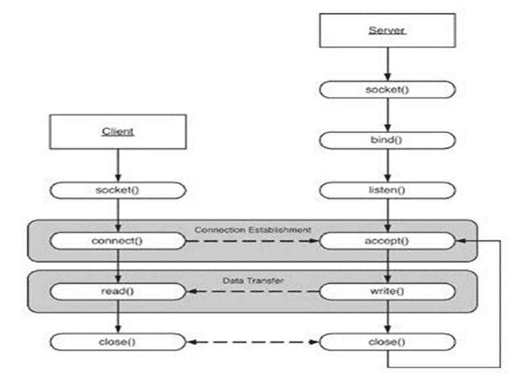
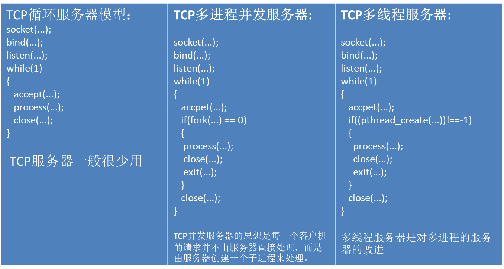
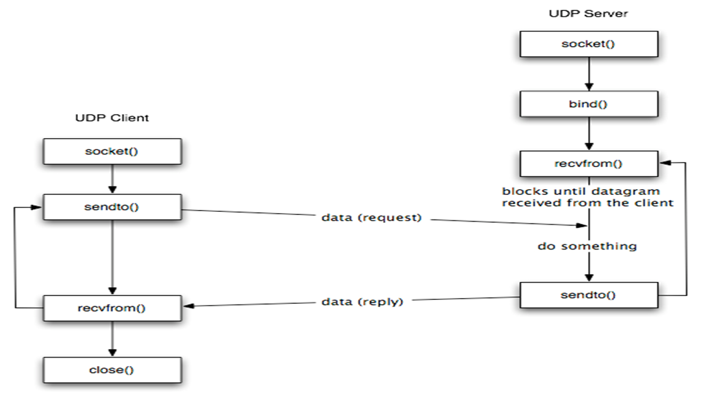
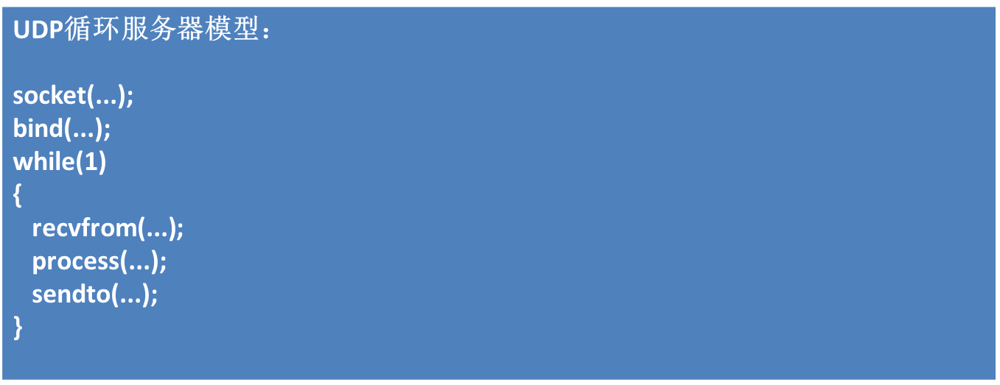

## 一、网络编程预备知识

- socket
- IP地址
- 端口号
- 字节序

### （一）socket

- 是一个编程接口
- 是一种特殊的文件描述符 (everything in Unix is a file)
- 并不仅限于TCP/IP协议
- 面向连接 (Transmission Control Protocol - TCP/IP)
- 无连接 (User Datagram Protocol -UDP 和 Inter-network Packet Exchange - IPX)

### （二）socket类型

#### 1、流式套接字(SOCK_STREAM)

提供了一个面向连接、可靠的数据传输服务，数据无差错、无重复的发送且按发送顺序接收。内设置流量控制，避免数据流淹没慢的接收方。数据被看作是字节流，无长度限制。

#### 2、数据报套接字(SOCK_DGRAM)

提供无连接服务。数据包以独立数据包的形式被发送，不提供无差错保证，数据可能丢失或重复，顺序发送，可能乱序接收。

#### 3、原始套接字(SOCK_RAW)

可以对较低层次协议如IP、ICMP直接访问。

### （三）socket的位置


### （四）IP地址

IP地址是Internet中主机的标识：

- Internet中的主机要与别的机器通信必须具有一个IP地址
- IP地址为32位（IPv4）或者128位（IPv6）
- 每个数据包都必须携带目的IP地址和源IP地址，路由器依靠此信息为数据包选择路由

表示形式：常用点分形式，如202.38.64.10，最后都会转换为一个32位的无符号整数

### （五）端口号

为了区分一台主机接收到的数据包应该转交给哪个进程来进行处理，使用端口号来区别

TCP端口号与UDP端口号独立

端口号一般由IANA (Internet Assigned Numbers Authority) 管理

- 众所周知端口：1~1023（1~255之间为众所周知端口，256~1023端口通常由UNIX系统占用）

- 注册端口：1024~49150

- 动态或私有端口：49151~65535

### （六）字节序

不同类型CPU的主机中，内存存储多字节整数序列有两种方法，称为主机字节序(HBO)：

- 小端序（little-endian） - 低序字节存储在低地址

将低字节存储在起始地址，称为“Little-Endian”字节序，Intel、AMD等采用的是这种方式；

- 大端序（big-endian）- 高序字节存储在低地址

将高字节存储在起始地址，称为“Big-Endian”字节序，由ARM、Motorola等所采用

- 网络中传输的数据必须按网络字节序，即大端字节序

在大部分PC机上，当应用进程将整数送入socket前，需要转化成网络字节序；当应用进程从socket取出整数后，要转化成小端字节序（原因？）


- 网络字节序(NBO - Network Byte Order)

使用统一的字节顺序，避免兼容性问题

- 主机字节序(HBO - Host Byte Order)

不同的机器HBO是不一样的，这与CPU的设计有关，Motorola 68K系列、ARM系列，HBO与NBO是一致的，Intel X86系列，HBO与NBO不一致


- 大端(Big-Endian):字节的高位在内存中放在存储单元的起始位置


- 小端(Little-Endian):与大端相反

### （七）字节序转换函数

把给定系统所采用的字节序称为主机字节序。为了避免不同类别主机之间在数据交换时由于对于字节序的不同而导致的差错，引入了网络字节序。

主机字节序到网络字节序：

- u_long htonl (u_long hostlong);

- u_short htons (u_short short);

网络字节序到主机字节序

- u_long ntohl (u_long hostlong);

- u_short ntohs (u_short short);

### （八）IP地址的转换

- inet_aton( )

将strptr所指的字符串转换成32位的网络字节序二进制值

```c
#include <arpa/inet.h>

int inet_aton(const char *strptr, struct in_addr *addrptr);
```

- inet_addr( )

功能同上，返回转换后的地址。

```c
int_addr_t inet_addr(const char *strptr);
```

•inet_ntoa( )

将32位网络字节序二进制地址转换成点分十进制的字符串。

```c
char *inet_ntoa(stuct in_addr inaddr);
```

- inet_pton()

将IPV4/IPV6的地址转换成binary格式

```c
int inet_pton(int af, const char *src, void *dst);
```

## 二、TCP/IP网络编程

- 预备知识
- 系统调用
- TCP编程/UDP编程 API
- 网络封包格式和IP，TCP头
- TCP握手过程
- I/O模型和服务器模型
- 网络调试和协议分析—wireshark和tcpdump 使用

### （一）网络编程相关API

- socket()　创建套接字
- bind()　绑定本机地址和端口
- connect()　建立连接
- listen()　设置监听端口
- accept()　接受TCP连接
- recv(), read(), recvfrom()　数据接收
- send(), write(), sendto()　数据发送
- close(), shutdown()　关闭套接字

#### 1、socket()

```c
int socket (int domain, int type, int protocol);
domain 是地址族：
    PF_INET  // internet 协议
    PF_UNIX // unix internal协议
    PF_NS      // Xerox NS协议
    PF_IMPLINK  // Interface Message协议

type：  // 套接字类型
    SOCK_STREAM   // 流式套接字
    SOCK_DGRAM    // 数据报套接字
    SOCK_RAW         //  原始套接字

protocol 参数通常置为0

```

**地址相关数据结构**：

- 通用地址结构

```c
  struct sockaddr
  {    
       u_short  sa_family;    // 地址族, AF_xxx
       char  sa_data[14];     // 14字节协议地址
  };

```

- Internet协议地址结构

```c
  struct sockaddr_in
  {           
       u_short sin_family;      // 地址族, AF_INET，2 bytes
       u_short sin_port;      // 端口，2 bytes
       struct in_addr sin_addr;  // IPV4地址，4 bytes 	
       char sin_zero[8];        // 8 bytes unused，作为填充
  }; 

```

- IPv4地址结构

```c
// internet address  
struct in_addr
{
     in_addr_t  s_addr;            // u32 network address 
};

```

#### 2、bind()

```c
int bind (int sockfd, struct sockaddr* addr, int addrLen);
sockfd //由socket() 调用返回

addr //是指向 sockaddr_in 结构的指针，包含本机IP 地址和端口号
	struct sockaddr_in
		u_short sin_family // protocol family
		u_short sin_port     // port number
		struct in_addr  sin_addr  //IP address (32-bits)

addrLen : sizeof (struct sockaddr_in)

```

**地址结构的一般用法**：

- 定义一个struct sockaddr_in类型的变量并清空

```c
struct sockaddr_in myaddr;

memset(&myaddr, 0, sizeof(myaddr));
```

- 填充地址信息

```c
myaddr.sin_family = PF_INET;
myaddr.sin_port = htons(8888); 
myaddr.sin_addr.s_addr = inet_addr(“192.168.1.100”);
```

- 将该变量强制转换为struct sockaddr类型在函数中使用

```c
bind(listenfd, (struct sockaddr*)(&myaddr), sizeof(myaddr));
```

**地址转换函数**:

- unsigned long inet_addr(char *address);

  address是以’\0’结尾的点分IPv4字符串。该函数返回32位的地址。如果字符串包含的不是合法的IP地址，则函数返回-1。例如：

```c
struct in_addr addr；
addr.s_addr = inet_addr(" 192.168.1.100 ");
```

- char* inet_ntoa(struct in_addr address);

  address是IPv4地址结构，函数返回一指向包含点分IP地址的静态存储区字符指针。如果错误则函数返回NULL

#### 3、connect()

```c
int connect(int sockfd, struct sockaddr *serv_addr, int addrlen); //返回值：0 或 -1

//头文件：
#include <sys/types.h>
#include <sys/socket.h>  
sockfd : //socket返回的文件描述符
serv_addr : //服务器端的地址信息  
addrlen : serv_addr的长度 

```

connect()是客户端使用的系统调用

#### 4、listen()

```c
int listen (int sockfd, int backlog);
sockfd: //监听连接的套接字
backlog //指定了正在等待连接的最大队列长度，它的作用在于处理可能同时出现的几个连接请求。
       //DoS(拒绝服务)攻击即利用了这个原理，非法的连接占用了全部的连接数，造成正常的连接请求被拒绝。
       //返回值： 0 或 -1

```

完成listen()调用后，socket变成了监听socket(listening socket)

#### 5、accept()

```c
int accept(int sockfd, struct sockaddr *addr, socklen_t *addrlen) ; // 返回值：已建立好连接的套接字或-1

// 头文件
#include <sys/types.h>
#include <sys/socket.h>  
sockfd : //监听套接字 
addr : //对方地址
addrlen：//地址长度
```

listen()和accept()是TCP服务器端使用的函数

#### 6、send()

```c
ssize_t  send(int  socket,  const  void  *buffer,  size_t  length, int flags);
// 返回值：
// 成功：实际发送的字节数
// 失败：-1, 并设置errno
// 头文件：
#include <sys/socket.h>
buffer : //发送缓冲区首地址
length : //发送的字节数
flags : //发送方式（通常为0）

```

#### 7、recv()

```c
ssize_t  recv(int  socket,  const  void  *buffer,  size_t  length, int flags);
// 返回值：
// 成功：实际接收的字节数
// 失败：-1, 并设置errno
// 头文件：
#include <sys/socket.h>
buffer : //发送缓冲区首地址
length : //发送的字节数
flags : //接收方式（通常为0）

```

#### 8、read()/write()

```c
ssize_t read(int fd, void *buf, size_t count);
ssize_t write(int fd, const void *buf, size_t count);
```

read()和write()经常会代替recv()和send()，通常情况下，看程序员的偏好

使用read()/write()和recv()/send()时最好统一

#### 9、sendto()，recvfrom()

```c
ssize_t sendto(int socket, void *message, size_t length, int flags, struct sockaddr *dest_addr, socklen_t dest_len);

ssize_t recvfrom(int socket, void *buffer, size_t length, int flags, struct sockaddr *address, socklen_t *address_len);
```

这两个函数一般在使用UDP协议时使用

#### 10、close()

```c
int close(int sockfd); //关闭双向通讯
```

#### 11、shutdown()

```c
int shutdown(int sockfd, int howto);
```

TCP连接是双向的(是可读写的)，当我们使用close时,会把读写通道都关闭，有时侯我们希望只关闭一个方向，这个时候我们可以使用shutdown

针对不同的howto，系统回采取不同的关闭方式

shutdown()的howto参数:

>•howto = 0
>
>关闭读通道，但是可以继续往套接字写数据。
>
>•howto = 1
>
>和上面相反，关闭写通道。只能从套接字读取数据。 
>
>•howto = 2
>
>关闭读写通道，和close()一样

### （二）TCP编程API





### （三）UDP编程API






