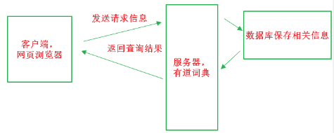
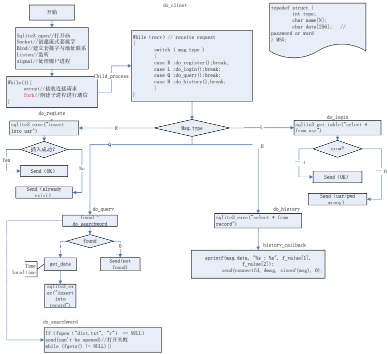

## 一、功能

- 在线英英词典

- 项目功能描述

- 用户注册和登录验证

- 服务器端将用户信息和历史记录保存在数据库中。客户端输入用户名和密码，服务器端在数据库中查找、匹配，返回结果

- 单词在线翻译

- 根据客户端输入的单词在字典文件中搜索

- 历史记录查询

- 项目分析

## 二、流程

- 项目流程

- 定义数据库中表的结构

- 定义消息结构体

- 分析服务器端和客户端流程

- 编码实现

## 三、流程图分析

### （一）有道词典功能分析图

### （二）服务器流程分析图

### （三）客户端流程分析图

