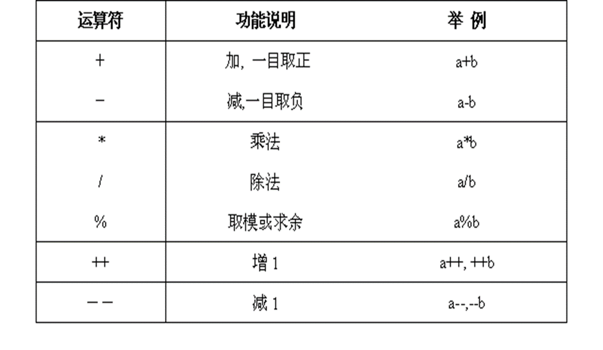
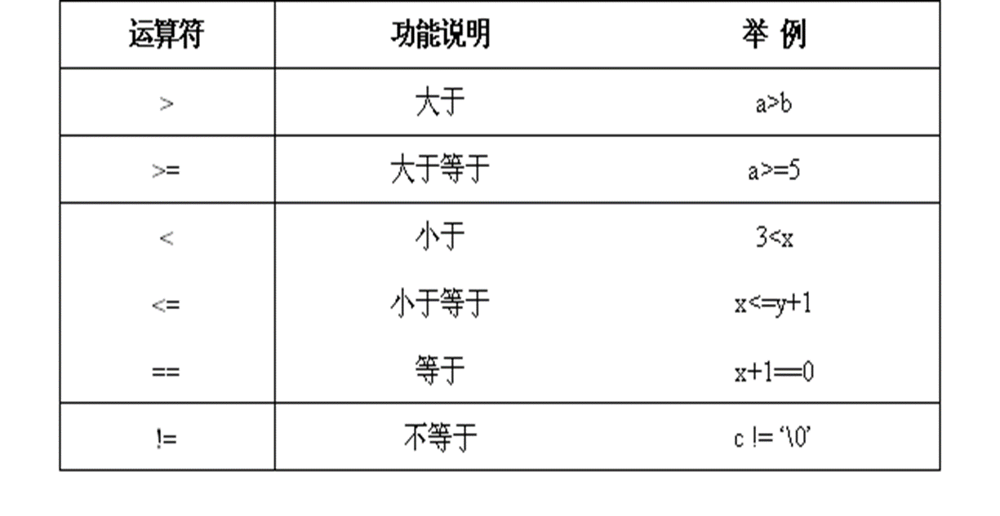
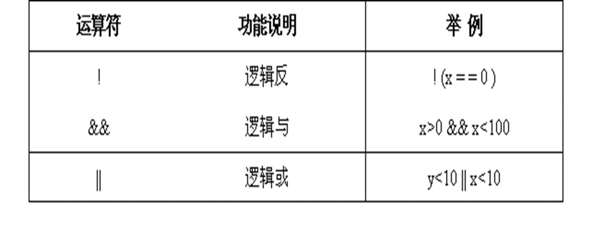
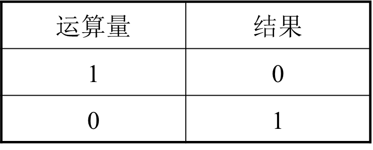
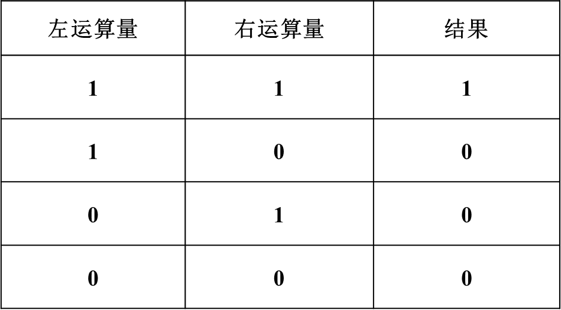
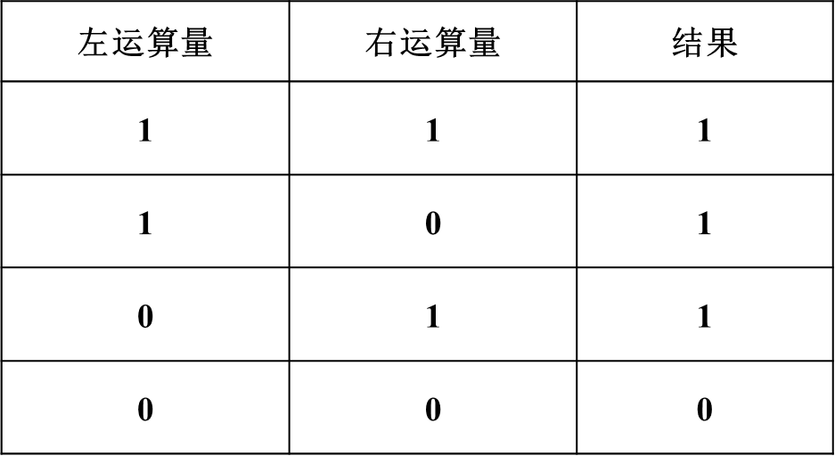

## 一、运算符内容

- 算术运算符
- 关系运算符
- 逻辑运算符

## 二、算术运算符

C提供的算术运算符:+，-，*，/，%，++，如下:

**注意**：float/double不能取余 

例一：

```c
#include <stdio.h>

int main(int argc, char *argv[]) {

    int a=15, b=8, c;

    c = a + b;
    printf("c=%d\n", c);
    c = a - b;
    printf("c=%d\n", c);
    c = a * b;
    printf("c=%d\n", c);
    c = a / b;
    printf("c=%d\n", c);
    c = a % b;
    printf("c=%d\n", c);

    return 0;
}
```

例二：

```c
#include <stdio.h>

int main(int argc, char *argv[]) {

    int x=5, y=9, z;
    z = ++x;
    printf("z=%d x=%d\n", z, x); // 6 6
    z = x++;
    printf("z=%d x=%d \n", z, x); // 6 7
    z = --x;
    printf("z=%d x=%d\n", z, x); // 6 6
    z = x--;
    printf("z=%d x=%d\n", z, x); // 6 5
    z = ++x + y++; // 6 + 9 = 15  x=6 y=10
    printf("z=%d\n", z); // 15 
    z = --x + y++; // 5 + 10 = 15 x=5 y=11
    printf("z=%d\n", z); // 15
    z = ++x + y--; // 6 + 11 = 17 x=6 y=10
    printf("z=%d\n", z); // 17

    return 0;

}
```

## 三、关系运算符

例一：
```c
#include <stdio.h>

int main(int argc, char *argv[]) {

    int a=5, b=6, c;

    c = a > (b-1);
    printf("c=%d\n", c); // 0

    c = (a+1) == b;
    printf("c=%d\n", c); // 1

    c = a >= (b-2);
    printf("c=%d\n", c); // 1

    return 0;

}
```

上述的值可用于布尔值判断：

```c
#include <stdio.h>

int main(int argc, char *argv[]) {

    int a=5, b=6;

    if (a > (b-1))
        printf("true\n");
    else
        printf("false\n"); // false

    return 0;

}

```

## 四、逻辑运算符

c语言的逻辑运算符如下：



包含：

- 逻辑反
- 逻辑与
- 逻辑或

### 1、逻辑反（逻辑非）

逻辑非“!”运算符的运算律如下：


例如：

```c
int  k=8;

! ( k ==0)        结果值为1

! ((k-8) == 0)   结果值为0

! (k<= 0)         结果值为1
```

### 2、逻辑与

逻辑与“&&”运算符的运算规律如下：短路特性-逢0截止

### 3、逻辑或

逻辑或“||”运算符的运算规律如下：短路-逢1截止


### 4、示例

- 示例1

```c
#include <stdio.h>

int main(int argc, char *argv[]) {

    int a=5, b=6;

    if (! (a > (b-1)))
        printf("false\n"); //false
    else
        printf("true\n");

    return 0;

}
```

- 示例2

