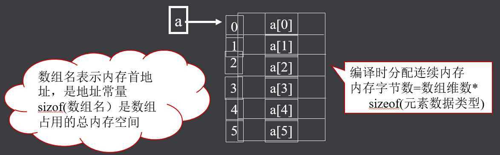
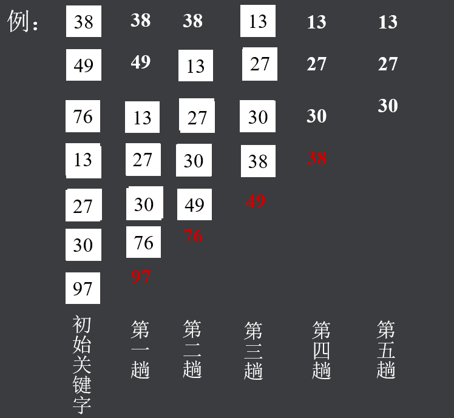
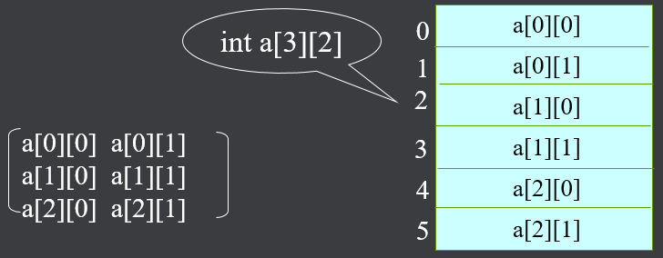
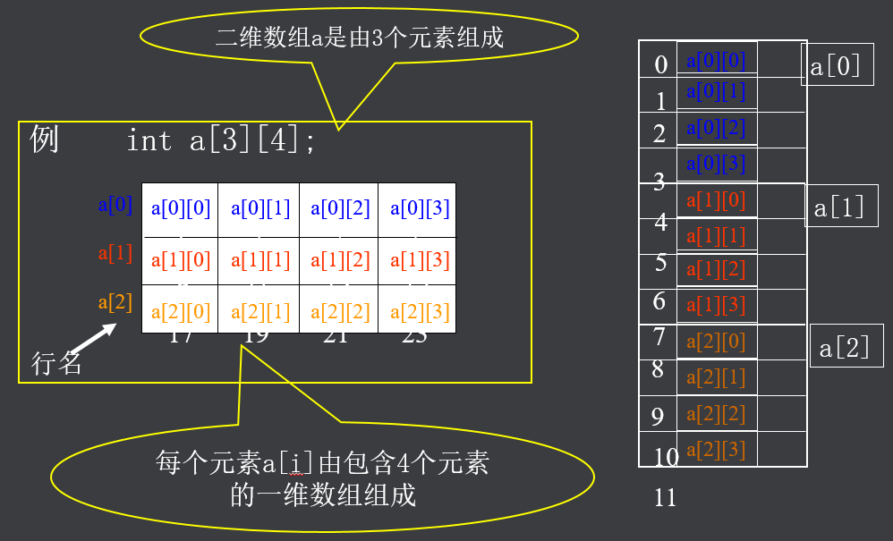
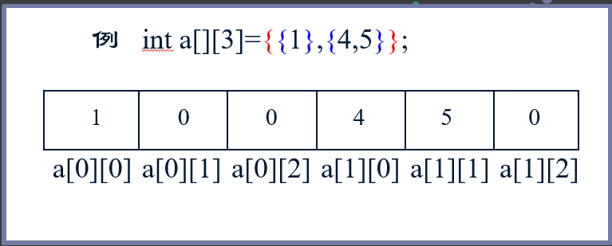
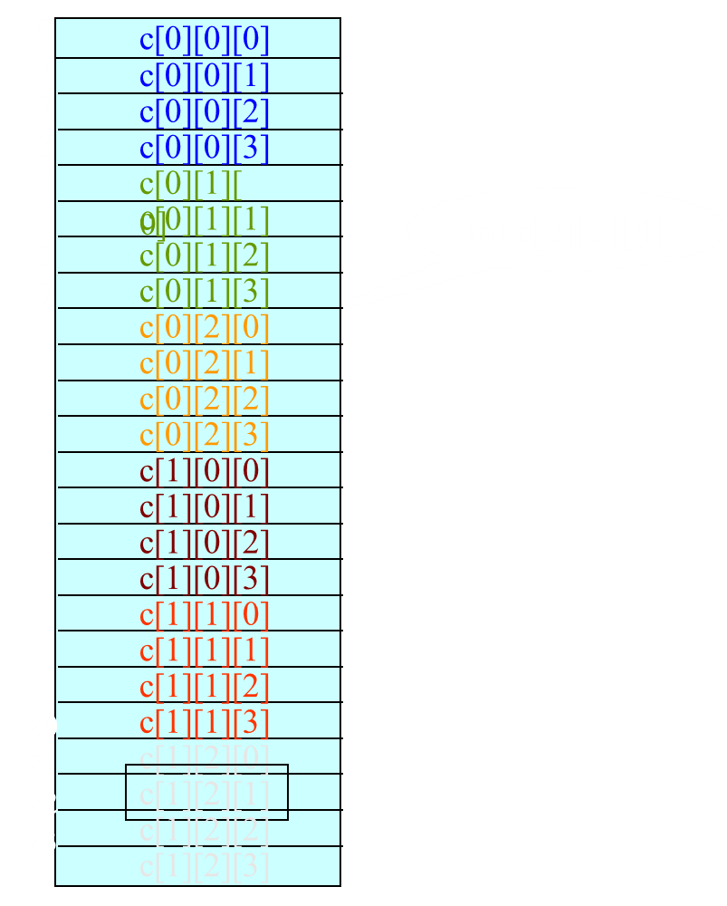

## 一、概述

- 一维数组
- 多维数组
- 字符数组
- 字符串

## 二、一维数组

### （一）数组概述

- 构造数据类型之一

- 数组是具有一定顺序关系的若干个变量的集合，组成数组的各个变量称为数组的元素

- 数组中各元素的数据类型要求相同,用数组名和下标确定。数组可以是一维的，也可以是多维的

### （二）一维数组的定义

所谓一维数组是指只有一个下标的数组。它在计算机的内存中是连续存储的。C语言中，一维数组的说明一般形式如下：

><存储类型>  <数据类型 >  <数组名>[<表达式>] 

例如：int a[6]



**注意**：

- lC语言对数组不作越界检查

>int a[5]; a[5] = 10

- 关于用变量定义数组维数

>int i = 15; int a[i]

### （三）一维数组的引用

- 数组必须先定义，后使用

- 只能逐个引用数组元素，不能一次引用整个数组

- 数组元素表示形式：数组名[下标]

其中，下标可以是常量或整型表达式。

```c
#include <stdio.h>

int main(int argc, char *argv[]) {

    int a[] = {1, 2, 3, 4, 5};

    // printf("%d\n", a);  error

    for(int i = 1; i < 5; i++ ) {
        printf("%d\n", a[i]);
    }

    return 0;

}
```

### （四）一维数组的初始化

初始化方式：在定义数组时，为数组元素赋初值

> int a[5]={1,2,3,4,5};

说明：

- 数组不初始化，其元素值为随机数

- 对static数组元素不赋初值，系统会自动赋以0值

- 只给部分数组元素赋初值（其余元素为0）

#### 1、数组不初始化，其元素值为随机数

```c
#include <stdio.h>

int main(int argc, char *argv[]) {

    int a[5] = {};

    for(int i = 0; i < 5; i++) {

        printf("%d-%d\n", i, a[i]);

    }

    return 0;

}
/*
0--1210312096
1-134513963
2-1
3--1075583164
4--1075583156
*/
```

#### 2、对static数组元素不赋初值，系统会自动赋以0值

```c
#include <stdio.h>

int main(int argc, char *argv[]) {

    static int a[5];

    for(int i = 0; i < 5; i++) {

        printf("%d-%d\n", i, a[i]);

    }

    return 0;

}
/*
0-0
1-0
2-0
3-0
4-0
*/
```

#### 3、只给部分数组元素赋初值 

```c
#include <stdio.h>

int main(int argc, char *argv[]) {

    int a[5] = {};
    int b[5] = {1,2,3};

    for(int i = 0; i < 5; i++) {

        printf("a数组-%d-%d\n", i, a[i]);

    }

    for(int i = 0; i < 5; i++) {

        printf("b数组-%d-%d\n", i, b[i]);

    }

    return 0;

}
/*
a数组-0-0
a数组-1-0
a数组-2-0
a数组-3-0
a数组-4-0

b数组-0-1
b数组-1-2
b数组-2-3
b数组-3-0
b数组-4-0
*/
```

### （五）程序举例

冒泡排序：

>它重复地走访过要排序的数列，一次比较两个元素，如果顺序错误就交换。走访数列的工作是重复地进行直到没有再需要交换，也就是说该数列已经排序完成。



代码：

```c
#include <stdio.h>

int main(int argc, char *argv[]) {

    int a[] = {38, 49, 76, 13, 27, 30, 97};
    int i, j, n, temp;

    n = sizeof(a) / sizeof(int);

    for(i = 0; i < n-1; i++) {

        for(j = 0; j <= n-1-i; j++ ) {

            if(a[j] > a[j+1]) {

                temp = a[j];
                a[j] = a[j+1];
                a[j+1] = temp;

            }

        }

    }

    for(i = 0; i < n-1; i++) {

        printf("%d\n", a[i]);

    }

    return 0;

}
```

## 二、多维数组

### （一）二维数组

#### 1、概述

> 数据类型　数组名\[常量表达式\]\[常量表达式\]

例如：

> int a\[3\]\[4\]
>
> float b\[2\]\[5\]

元素个数：行数 * 列数

**注意**：声明时列数不能省略，行数可以

二维数组的存放顺序是按照行序优先，因为内存是一维的



#### 2、理解


#### 3、元素的引用

- 形式：数组名\[下标\]\[下标\]

- 二维数组元素的初始化

>分行初始化
>
>按元素排列顺序初始化



### （二）多维数组

具有两个或两个以上下标的数组称为多维数组，如：int c\[2\]\[3\]\[4\]


### （三）程序举例

#### 1、打印杨辉三角

打印杨辉三角的前十行

>1
>
>1   1
>
>1   2   1
>
>1   3   3   1
>
>1   4   6   4   1
>
>1   5   10  10  5   1
>
>​        ....

代码：

```c
#include <stdio.h>

/*

思路：
1、打印正方形
2、打印出一半（col <= row）

1 0
1 1 0
1 2 1

*/

int main(int argc, char *argv[]) {


    int row, col;
    int triangle[10][10] = {{0}};

    for(row = 0; row < 10; row++) {

        triangle[row][0] = 1; // 第一列设置为1

        for(col = 1; col <= row ; col++) {

            triangle[row][col] = triangle[row-1][col-1] + triangle[row-1][col];

        }

    }

    for(row = 0; row < 10; row++) {

        for(col = 0; col <= row; col++) {

                printf("%d\t",triangle[row][col]);


        }

        putchar('\n');
    }

    return 0;

}
```

#### 2、求数组元素最大值

有一个3×4的矩阵，要求输出其中值最大的元素的值，以及它的行号和列号。

