## 一、内容概述

- 什么是指针
- 指针运算
- 指针与数组
- 指针与二维数组
- 字符指针与字符串
- 指针数组
- 多级指针
- void指针与const

## 二、什么是指针

### （一）指针概念

C程序设计中使用指针可以：

- 使程序简洁、紧凑、高效

- 有效地表示复杂的数据结构

- 动态分配内存

- 得到多于一个的函数返回值

**地址和变量**：

在计算机内存中，每一个字节单元，都有一个编号，称为地址。

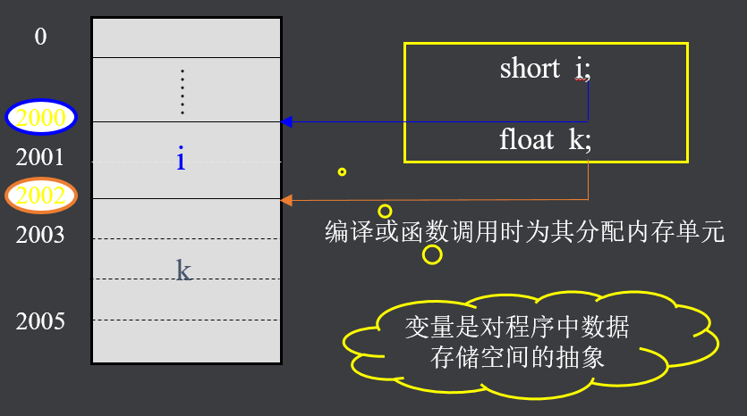

在C语言中，内存单元的地址称为指针，专门用来存放地址的变量，称为指针变量。在不影响理解的情况中，有时对地址、指针和指针变量不区分，通称指针。

### （二）指针变量

**指针变量的说明**：

一般形式如下：

<存储类型>   <数据类型>   * <指针变量名> ; 

例如，char  *pName ;

指针的存储类型是指针变量本身的存储类型。

指针说明时指定的数据类型不是指针变量本身的数据类型，而是指针目标的数据类型。简称为指针的数据类型

**指针初始化**：

指针在说明的同时， 也可以被赋予初值，称为指针的初始化

   一般形式是：

<存储类型>  <数据类型>  *<指针变量名> = <地址量> ; 

​       例如：int  x,  *px=&x;

​       在上面语句中，把变量x的地址作为初值赋予了刚说明的int型指针px。

```c
int x = 126;   //int x; x = -126;

int *px = &x; //int *  px; px = &x;
```
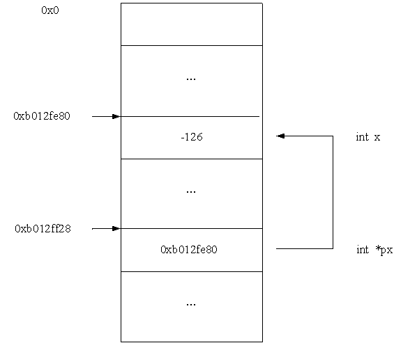

指针指向的内存区域中的数据称为指针的目标，如果它指向的区域是程序中的一个变量的内存空间， 则这个变量称为指针的目标变量。 简称为指针的目标。

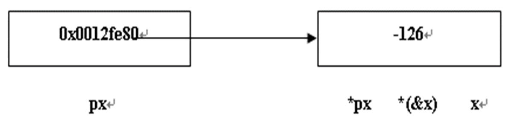

引入指针要注意程序中的px、*px 和 &px 三种表示方法的不同意义。设px为一个指针，则:

- px  — 指针变量， 它的内容是地址量

- *px — 指针所指向的对象， 它的内容是数据

- &px — 指针变量占用的存储区域的地址，是个常量

**指针赋值**：

指针的赋值运算指的是通过赋值运算符向指针变量送一个地址值。

向一个指针变量赋值时，送的值必须是地址常量或指针变量，不能是普通的整数(除了赋零以外)

指针赋值运算常见的有以下几种形式:

把一个普通变量的地址赋给一个具有相同数据类型的指针 

```c
int x=-126,  *px;
px=&x;
```

把一个已有地址值的指针变量赋给具有相同数据类型的另一个指针变量.例如:

```c
float  a, *px, *py; 
px = &a;
py = px;
```

把一个数组的地址赋给具有相同数据类型的指针。例如:

```c
int  a[20],  *pa;
pa = a;   //等价 pa = &a[0]
```

**示例**：

```c
#include <stdio.h>

int main(int argc, char *argv[]) {

    int x = -126;
    int * p;
    p = &x;

    printf("x=%d,x=%d\n", x, *p);
    printf("p=%p\n",p);
    printf("&p=%p\n", &p);

    return 0;

}
/*
x=-126,x=-126
p=0xbfcfe424
&p=0xbfcfe428
*/
```

## 三、指针运算

### （一）指针运算符

指针运算是以指针变量所存放的地址量作为运算量而进行的运算

指针运算的实质就是地址的计算

指针运算的种类是有限的，它只能进行赋值运算、算术运算和关系运算

指针的算术运算见下表：

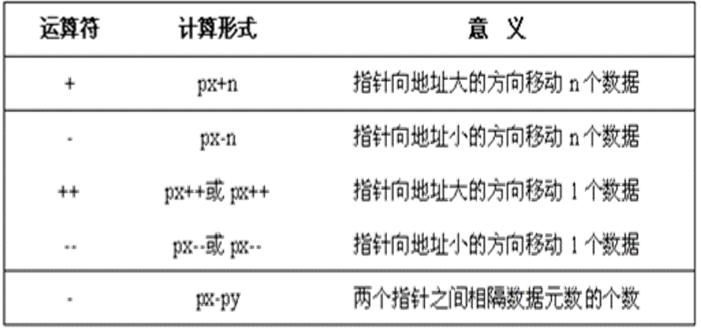

#### 1、px+n px-n

指针加减一个n的运算:px + n  px - n

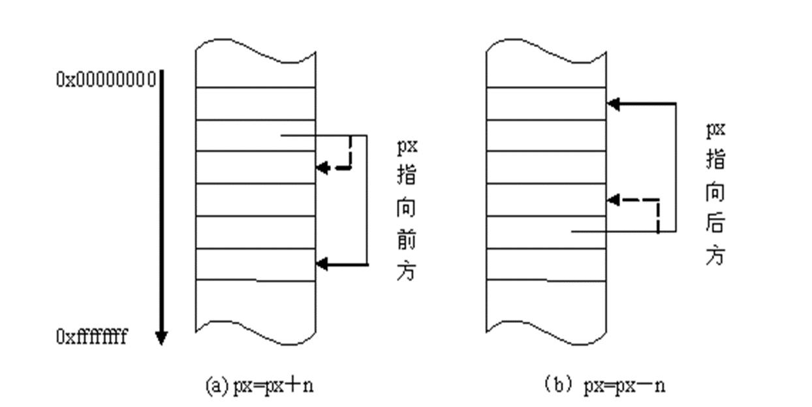

**注意**：

>不同数据类型的两个指针实行加减整数运算是无意义的
>
>- px+n表示的实际位置的地址量是：
>
>​       (px) + sizeof(px的类型) * n
>
>- px-n表示的实际位置的地址量是：
>
>​       (px) - sizeof(px的类型) * n

```c
#include <stdio.h>

int main(int argc, char *argv[]) {

    int a = 10;
    int * p;
    p = &a;

    printf("p-2=%p, p=%p, p+2=%p\n", p-2, p, p+2); // p-2=0xbfc6f55c, p=0xbfc6f564, p+2=0xbfc6f56c

    return 0;

}
```

#### 2、px-py

两指针相减运算：

px-py 运算的结果是两指针指向的地址位置之间相隔数据的个数，因此两指针相减不是两指针持有的地址值相减的结果。

两指针相减的结果值不是地址量，而是一个整数值，表示两指针之间相隔数据的个数。

```c
#include <stdio.h>

int main(int argc, char *argv[]) {

    int a[5] = {10, 2, 5, 56, 80};

    int * p, * q;

    p = a; // &a[0];
    q = &a[3];

    printf("%p %p\n", p, q); // 0xbfcde808 0xbfcde814
    printf("%d %d\n", *p, *q); // 10 56
    printf("q-p=%d\n", q-p); // q-p=3

    return 0;

}
```

#### 3、p++  p--  ++p  --p

 指针加一、减一运算：px++,  ++px,  px--,  --px

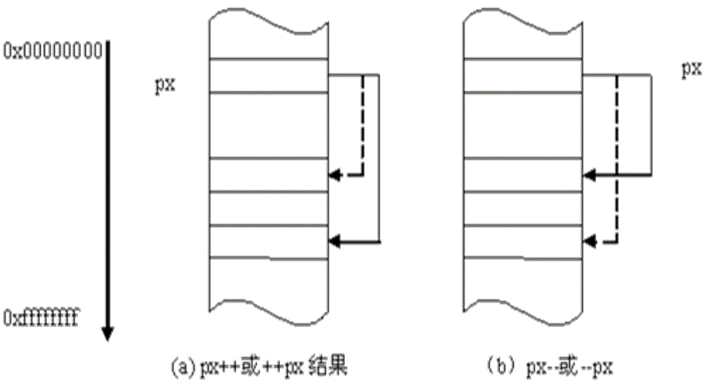

```c
#include <stdio.h>

int main(int argc, char *argv[]) {

    int a[5] = {10, 2, 5, 56, 80};

    int *p = NULL, *q;

    printf("%d %p\n", p, p); // 0 (nil)

    p = a; // &a[0];
    q = p++;

    printf("%p %p\n", p, q); // 0xbfcee30c 0xbfcee308
    printf("%d %d\n", *p, *q); // 2 10

    return 0;

}
```

### （二）关系运算符

指针的关系运算符：

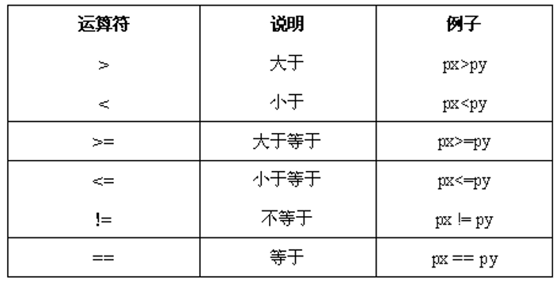

指针关系运算：

- 两指针之间的关系运算表示它们指向的地址位置之间的关系。指向地址大的指针大于指向地址小的指针。

- 指针与一般整数变量之间的关系运算没有意义。但可以和零进行等于或不等于的关系运算，判断指针是否为空。

```c
#include <stdio.h>

int main(int argc, char *argv[]) {

    int a[] = {5, 8, 7, 6, 2, 7, 3};
    int y, * p = &a[1];

    y = (*--p)++;

    printf("%d\n", y); // 5
    printf("%d\n", a[0]); // 6

    return 0;

}

```

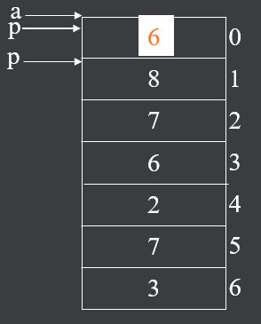

需要注意指针的当前值：

```c
#include <stdio.h>

int main(int argc, char *argv[]) {

    int i, * p, a[7];
    p = a;

    for (i = 0; i < 7; i++) {
        scanf("%d", p++);
    }
    puts("");

    p = a;
    for (i = 0; i < 7; i++) {
        printf("%d\n", *p);
        p++;
    }

    return 0;

}
```
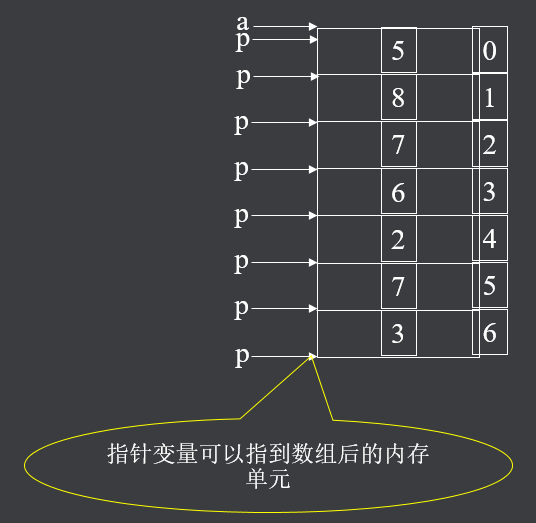

## 四、指针与数组

在C语言中，数组的指针是指数组在内存中的起始地址，数组元素的地址是指数组元素在内存中的起始地址 

一维数组的数组名为一维数组的指针（起始地址） 

例如

>double   x[8];

因此，x为x数组的起始地址

设指针变量px的地址值等于数组指针x（即指针变量px指向数组的首元数），则：x[i] 、*(px+i)、*(x+i) 和px[i]具有完全相同的功能：访问数组第i+1个数组元素。

```c
#include <stdio.h>

int main(int argc, char *argv[]) {

    int a[] = {1, 6, 9, 12, 89, 23, 52};

    int *p, i, n;

    p = a;
    n = sizeof(a) / sizeof(int);

    for(i = 0; i < n; i++) {

        printf("%d %d %d %d\n", a[i], *(p+i), *(a+i), p[i]);

    }
    
    return 0;

}
/*

1 1 1 1
6 6 6 6
9 9 9 9
12 12 12 12
89 89 89 89
23 23 23 23
52 52 52 52

*/
```
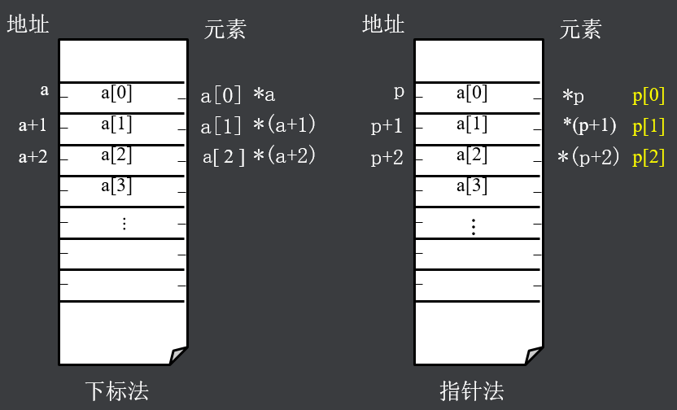

**注意**：

- 指针变量和数组在访问数组中元素时，一定条件下其使用方法具有相同的形式，因为指针变量和数组名都是地址量

- 但指针变量和数组的指针（或叫数组名）在本质上不同，指针变量是地址变量，而数组的指针是地址常量

例1：

>int  a[]={1,2,3,4,5,6,7,8,9,10}, *p = a, i;数组元素地址的正确表示是：B
>
>（A）&(a+1)  （B）a++  （C）&p  D）&p[i]
>
>
>
>数组名是地址常量
>
>p++,p--     (对)
>
>a++,a--     (错)
>
>a+1, *(a+2) (对)

例2：

编写一个函数，将整形数组中n个数按反序存放

```c
#include <stdio.h>

int main(int argc, char *argv[]) {

    int a[] = {1, 6, 9, 12, 89, 23, 52};

    int *p, *q, t, n;

    p = a;
    n = sizeof(a) / sizeof(int);
    q = &a[n-1];

    while(p <= q) {

        t = *p;
        *p = *q;
        *q = t;
        p++;
        q--;

    }

    for(t = 0; t < n; t++) {

        printf("%d\t", a[t]);

    }
    puts("");

}
```

## 五、指针与二维数组

### （一）一级指针

多维数组就是具有两个或两个以上下标的数组，在C语言中，二维数组的元素连续存储，按行优先存。

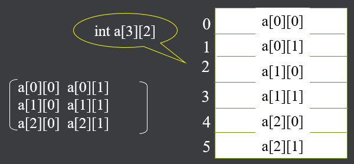

编程实现，使用一级指针遍历二维数组：

```c
#include <stdio.h>

int main(int argc, char *argv[]) {

    int a[3][3] = {{1, 2, 3}, {6, 9, 0}, {7, 5, 12}};
    int *p, i, n;

    n = sizeof(a) / sizeof(int);

    p = a[0]; // &a[0][0]

    printf("%p %p %d %d\n", p, p+1, *p, *(p+1)); // 0xbfa524e8 0xbfa524ec 1 2
    printf("%p %p\n", a, a+1); // 0xbfa524e8 0xbfa524f4

    for (i = 0; i < n; i++) {

        printf("%d ", *(p+i)); // 1 2 3 6 9 0 7 5 12

    }
    puts("");

    return 0;


}
```

可把二维数组看作由多个一维数组组成：

- 比如int a[3][3]，含有三个元素：a[0]、a[1]、a[2]

- 元素a[0]、a[1]、a[2]都是一维数组名

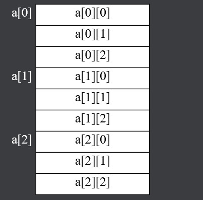

### （二）行指针

二维数组名代表数组的起始地址，数组名加1，是移动一行元素。因此，二维数组名常被称为行地址。

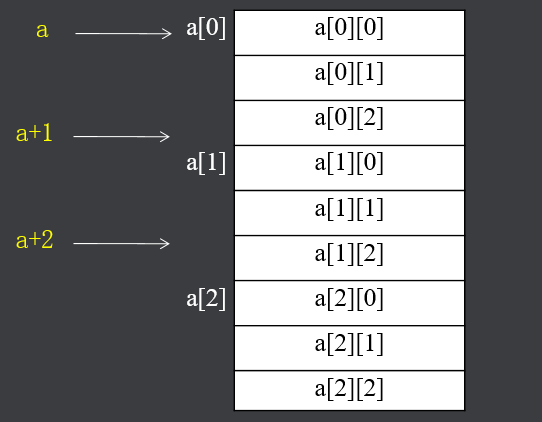

行指针（数组指针）

存储行地址的指针变量，叫做行指针变量。形式如下：

><存储类型>   <数据类型>   (*<指针变量名>)[表达式] ; 

例如，int a\[2\]\[3\];  int (*p)[3];

方括号中的常量表达式表示指针加1，移动几个数据。

当用行指针操作二维数组时，表达式一般写成1行的元素个数，即列数。

编程实现，使用行级指针遍历二维数组：

```c
#include <stdio.h>


int main(int argc, char *argv[]) {

    int a[3][3] = {{1, 2, 3}, {6, 9, 0}, {7, 5, 12}};

    int (*p)[3], i, j, row, col;

    p = a;

    row = sizeof(a) / sizeof(a[0]);
    col = sizeof(a[0]) / sizeof(int);

    printf("%d %d\n", row, col);

    printf("%p %p\n", a[0], &a[0][0]); // a[0]存放的内容就是 a[0][0] 的地址, 所以下面就是 *(*(p+i)+j)

    for (i = 0; i < row; i++) {

        for (j = 0; j < col; j++) {

            printf("%d %d %d %d", a[i][j], p[i][j], *(*(p+i)+j), *(*(a+i)+j));

        }

        puts("");

    }


    return 0;

}
```

## 六、字符指针与字符串

C语言通过使用字符数组来处理字符串

通常，我们把char数据类型的指针变量称为字符指针变量。字符指针变量与字符数组有着密切关系，它也被用来处理字符串。

初始化字符指针是把内存中字符串的首地址赋予指针，并不是把该字符串复制到指针中

>char  str[] = “Hello World”;
>
>char  *p = str;

在C编程中，当一个字符指针指向一个字符串常量时，不能修改指针指向的对象的值

>char  *  p = “Hello World”; 
>
>*p = ‘h’;    //  错误， 字符串常量不能修改

示例：不利用任何字符串函数，编程实现字符串连接函数的功能

