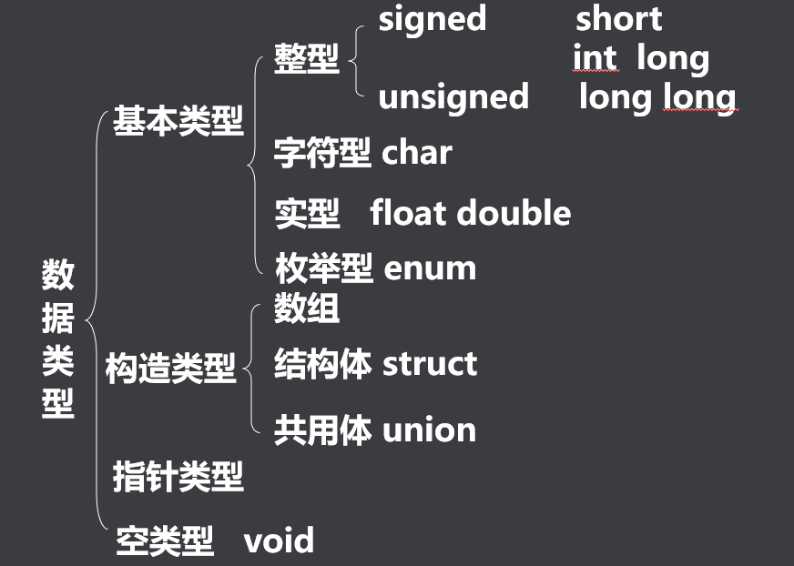
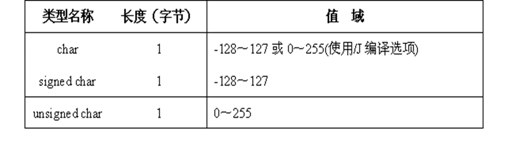
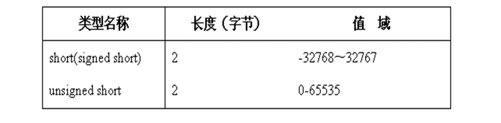
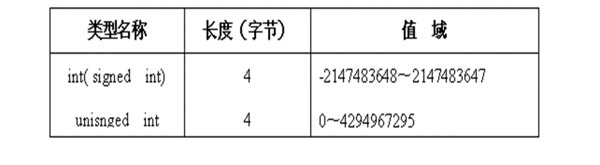
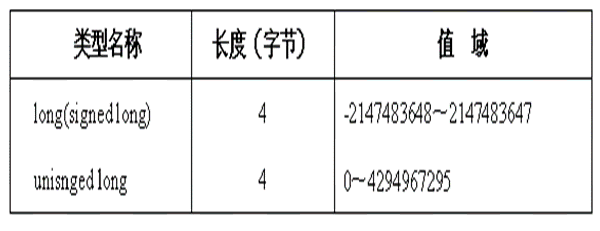

## 一、数据类型的分类


## 二、基本数据类型
- 逻辑类型。只有两个量true和false，表示逻辑真值和逻辑假值。
- 整数类型。包括char, short, int和long。
- 浮点类型。包括float和double。
- void类型。主要用于说明不返回值的函数或指向任一类型的指针等。

### 1、逻辑类型
**bool类型   <stdbool.h> _Bool基本类型**
非零(true)
零(false)
查看头文件的位置，可以通过预处理命令获取：
```shell
 linux@linux:~ gcc -E 04.bool_test.c -o bool_test.i
```
查看`bool_test.i`文件内容即可。

### 2、整数类型
- char类型

使用char数据类型的变量需要特别注意，防止数据超出值域，思考下列几个语句：
> char   c1= 128;       //出错，数据越界(-128)
char   c1= 129;       //出错，数据越界(-127)
unsigned char  c2= -1;  //出错，数据越界(255)
> 
- short类型

- int类型

- long类型


