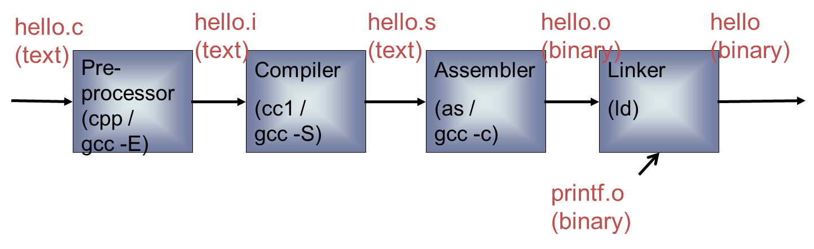

## 一、内容概述

- GCC编译器
- GDB调试工具

**GNU工具**

- 编译工具：把一个源程序编译为一个可执行程序
- 调试工具：能对执行程序进行源码或汇编级调试
- 软件工程工具：用于协助多人开发或大型软件项目的管理，如make、CVS、Subvision
- 其他工具：用于把多个目标文件链接成可执行文件的链接器，或者用作格式转换的工具。

**部分相关资源**

- http://www.gnu.org/
- http://gcc.gnu.org/
- http://www.kernel.org/
- http://www.linux.org/
- http://www.linuxdevices.com/
- http://sourceforge.net/index.php

## 二、GCC编译器

### （一）GCC简介

- 全称为GNU CC ，GNU项目中符合ANSI C标准的编译系统   
- 编译如C、C++、Object C、Java、Fortran、Pascal、Modula-3和Ada等多种语言
- GCC是可以在多种硬体平台上编译出可执行程序的超级编译器，其执行效率与一般的编译器相比平均效率要高20%~30%
- 一个交叉平台编译器 ，适合在嵌入式领域的开发编译 

#### 1、gcc所支持后缀名解释 

>–.c  C原始程序
>
>–.C/.cc/.cxx  C++原始程序
>
>–.m  Objective-C原始程序
>
>–.i  已经过预处理的C原始程序
>
>–.ii  已经过预处理的C++原始程序
>
>–.s/.S  汇编语言原始程序
>
>–.h  预处理文件(头文件)
>
>–.o  目标文件
>
>–.a/.so  编译后的库文件

#### 2、编译器的主要组件

- 分析器：分析器将源语言程序代码转换为汇编语言。因为要从一种格式转换为另一种格式（C到汇编），所以分析器需要知道目标机器的汇编语言。
- 汇编器：汇编器将汇编语言代码转换为CPU可以执行字节码。
- 链接器：链接器将汇编器生成的单独的目标文件组合成可执行的应用程序。链接器需要知道这种目标格式以便工作。
- 标准C库：核心的C函数都有一个主要的C库来提供。如果在应用程序中用到了C库中的函数，这个库就会通过链接器和源代码连接来生成最终的可执行程序。

#### 3、GCC的基本用法和选项 

GCC最基本的用法是：gcc \[options\]\[filenames\] 

>•-c，只编译，不连接成为可执行文件，编译器只是由输入的.c等源代码文件生成.o为后缀的目标文件，通常用于编译不包含主程序的子程序文件。 
>
>•-o output_filename，确定输出文件的名称为output_filename，同时这个名称不能和源文件同名。如果不给出这个选项，gcc就给出预设的可执行文件a.out。
>
>•-g，产生符号调试工具(GNU的gdb)所必要的符号资讯，要想对源代码进行调试，我们就必须加入这个选项。 
>
>•-O，对程序进行优化编译、连接，采用这个选项，整个源代码会在编译、连接过程中进行优化处理，这样产生的可执行文件的执行效率可以提高，但是，编译、连接的速度就相应地要慢一些。
>
>•-O2，比-O更好的优化编译、连接，当然整个编译、连接过程会更慢。
>
>•-I  dirname，将dirname所指出的目录加入到程序头文件目录列表中，是在预编译过程中使用的参数。
>
>•-L  dirname，将dirname所指出的目录加入到程序函数档案库文件的目录列表中，是在链接过程中使用的参数。

#### 4、GCC的错误类型及对策

- 第一类∶C语法错误 
  错误信息∶文件source.c中第n行有语法错误(syntex errror)。有些情况下，一个很简单的语法错误，gcc会给出一大堆错误，我们最主要的是要保持清醒的头脑，不要被其吓倒，必要的时候再参考一下C语言的基本教材。 
- 第二类∶头文件错误 
  错误信息∶找不到头文件head.h(Can not find include file head.h)。这类错误是源代码文件中的包含头文件有问题，可能的原因有头文件名错误、指定的头文件所在目录名错误等，也可能是错误地使用了双引号和尖括号。 
- 第三类∶档案库错误 
  错误信息∶链接程序找不到所需的函数库（ld: -lm: No such file or directory )。这类错误是与目标文件相连接的函数库有错误，可能的原因是函数库名错误、指定的函数库所在目录名称错误等，检查的方法是使用find命令在可能的目录中寻找相应的函数库名，确定档案库及目录的名称并修改程序中及编译选项中的名称。 
- 第四类∶未定义符号 
  错误信息∶有未定义的符号(Undefined symbol)。这类错误是在连接过程中出现的，可能有两种原因∶一是使用者自己定义的函数或者全局变量所在源代码文件，没有被编译、连接，或者干脆还没有定义，这需要使用者根据实际情况修改源程序，给出全局变量或者函数的定义体；二是未定义的符号是一个标准的库函数，在源程序中使用了该库函数，而连接过程中还没有给定相应的函数库的名称，或者是该档案库的目录名称有问题，这时需要使用档案库维护命令ar检查我们需要的库函数到底位于哪一个函数库中，确定之后，修改gcc连接选项中的-l和-L项。 

### （二）GCC使用

#### 1、案例

```c
#include <stdio.h>

int main(int argc, char *argv[]) {

    printf("hello world!\n");

}
```

>编译：
>
>```c
>$ gcc -o test 01.gcc_test.
>```
>
>执行：
>
>```c
>$ ./test
>```
>
>查看详细执行信息：
>
>```c
>$ gcc -v -o test 01.gcc_test.c
>```

#### 2、GCC编译过程

GCC的编译流程分为四个步骤:

- 预处理(Pre-Processing) 
- 编译(Compiling)
- 汇编(Assembling)
- 链接(Linking)


**hello的演变过程**：



**生成预处理代码**：

```shell
$ gcc -E 01.gcc_test.c -o test.i
```

`test.i`比`01.gcc_test.c`增加了很多内容，主要是放在系统提供的include文件中的

**生成汇编代码**：

检查语法错误,并生成汇编文件

```shell
$ gcc -S 01.gcc_test.c -o test.s
```

**生成目标代码**：

- 方法一 用gcc直接从C源代码中生成目标代码

```shell
$ gcc -c test.s -o test.o
```

- 方法二 用汇编器从汇编代码生成目标代码

```shell
$ as test.s -o test.o
```

**生成可执行程序**

将目标程序链接库资源，生成可执行程序

```shell
$ gcc test.s -o test
$ ./test
```

## 三、GDB调试工具

首先使用gcc对`01.gcc_test.c`进行编译，注意一定要加上选项`-g`

 ```shell
$ gcc -g 01.gcc_test.c -o test
$ gdb test
GNU gdb (Ubuntu 7.11.1-0ubuntu1~16.5) 7.11.1
Copyright (C) 2016 Free Software Foundation, Inc.
License GPLv3+: GNU GPL version 3 or later <http://gnu.org/licenses/gpl.html>
This is free software: you are free to change and redistribute it.
There is NO WARRANTY, to the extent permitted by law.  Type "show copying"
and "show warranty" for details.
This GDB was configured as "i686-linux-gnu".
Type "show configuration" for configuration details.
For bug reporting instructions, please see:
<http://www.gnu.org/software/gdb/bugs/>.
Find the GDB manual and other documentation resources online at:
<http://www.gnu.org/software/gdb/documentation/>.
For help, type "help".
Type "apropos word" to search for commands related to "word"...
Reading symbols from test...done.
(gdb) 
 ```

**gdb调试流程**：

>•查看文件
>
>–(gdb) l
>
>•设置断点 
>
>–(gdb) b 6
>
>•查看断点情况 
>
>–(gdb) info b
>
>•运行代码 
>
>–(gdb) r
>
>•查看变量值
>
>  (gdb) p n
>
>•单步运行 
>
>  (gdb) n
>
>  (gdb) s
>
>•恢复程序运行 
>
>  (gdb) c
>
>•帮助 
>
>  (gdb) help [command] 

**注意**：

- 在gcc编译选项中一定要加入`-g`。

- 只有在代码处于“运行”或“暂停”状态时才能查看变量值。

- 设置断点后程序在指定行之前停止 

- 运行被调试程序，设置所有的能影响该程序的参数和变量。

- 保证被调试程序在指定的条件下停止运行。

- 当被调试程序停止时，让开发工程师检查发生了什么。

- 根据每次调试器的提示信息来做响应的改变，以便修正某个错误引起的问题